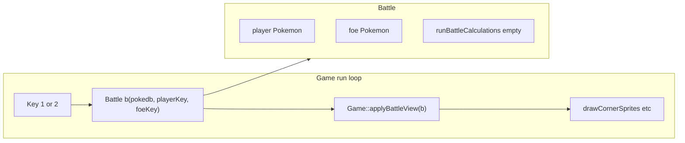

# Battle class initialization and calculation stub

## Current state

- [`include/game.h`](include/game.h) declares `class Battle` with constructor/destructor and private `initBattleView` (lines 151–159).
- [`src/battle.cpp`](src/battle.cpp) implements `Battle` but uses identifiers that only exist on `Game` (`pokedb`, `showMainSpriteAndStats_`, `cornerBL_`, etc.), so this does not match valid C++ for a standalone `Battle` class.
- [`src/game.cpp`](src/game.cpp) constructs a temporary `Battle("Charmander", "Squirtle")` on keypress but never passes `json`/`Game` context; [`battleViewTwoSpecies`](include/game.h) is still declared on `Game` while **no implementation** exists in `game.cpp` (dead API).

## Target design

- **`Battle`** owns battle participants: two `Pokemon` members (`player_`, `foe_`), constructed in the **constructor** from `json& pokedb` and two species keys (same data the old UI code loaded via `Pokemon(pokedb, key)`).
- **Empty calculation hook**: add a public method with an empty body, e.g. `void runBattleCalculations();` (name can be adjusted to taste: `resolveTurn`, `processBattleStep`). Document in a one-line comment that turn/damage logic will live here later.
- **Rendering stays on `Game`**: add `void Game::applyBattleView(const Battle& battle)` (or similar name) that:
  - Sets `showMainSpriteAndStats_ = false`, clears `displayText_`, calls `destroyPokemonSprite()`, reloads corner textures from `battle.player().backSpritePath()` and `battle.foe().frontSpritePath()` (mirroring the logic currently duplicated in [`battle.cpp`](src/battle.cpp) lines 18–24).
  - Uses `try/catch` like today; on failure, restore `showMainSpriteAndStats_ = true` and set `displayText_` to the error message.
- **Wire key handler** in [`src/game.cpp`](src/game.cpp): replace `Battle("Charmander", "Squirtle")` with `Battle b(pokedb, "Charmander", "Squirtle"); applyBattleView(b);` and restore the key **2** branch similarly.

## File changes

| File | Action |
|------|--------|
| [`include/battle.h`](include/battle.h) | **Create**: `#include "game.h"` (safe: [`game.h`](include/game.h) does not include `battle.h`, so no include cycle). Declare `Battle` with `json&` + keys constructor, `const Pokemon& player() const` / `foe() const`, `void runBattleCalculations();`, default destructor. |
| [`src/battle.cpp`](src/battle.cpp) | **Replace**: include `battle.h` only; implement constructor with member initializer list for both `Pokemon`s; implement empty `runBattleCalculations() {}`; remove all `Game` member access. |
| [`include/game.h`](include/game.h) | Remove the inline `Battle` class block; remove private `battleViewTwoSpecies` (or replace with `applyBattleView(const Battle&)` **public** on `Game` if you want the UI callable from outside—implementation can stay private if only `run()` uses it). |
| [`src/game.cpp`](src/game.cpp) | `#include "battle.h"`; implement `Game::applyBattleView` using the former `initBattleView` body; update key handlers. |

## Build

No Makefile change: [`Makefile`](Makefile) already compiles all `src/*.cpp`.

## Optional follow-ups (out of scope unless you want them in the same change)

- Call `runBattleCalculations()` from a future input handler or fixed timestep—not required for this task.
- If `Pokemon` ever becomes non-copyable, switch `Battle` to `std::optional<Pokemon>` or `std::unique_ptr<Pokemon>`; current codebase appears to use `Pokemon` as a regular value type.
