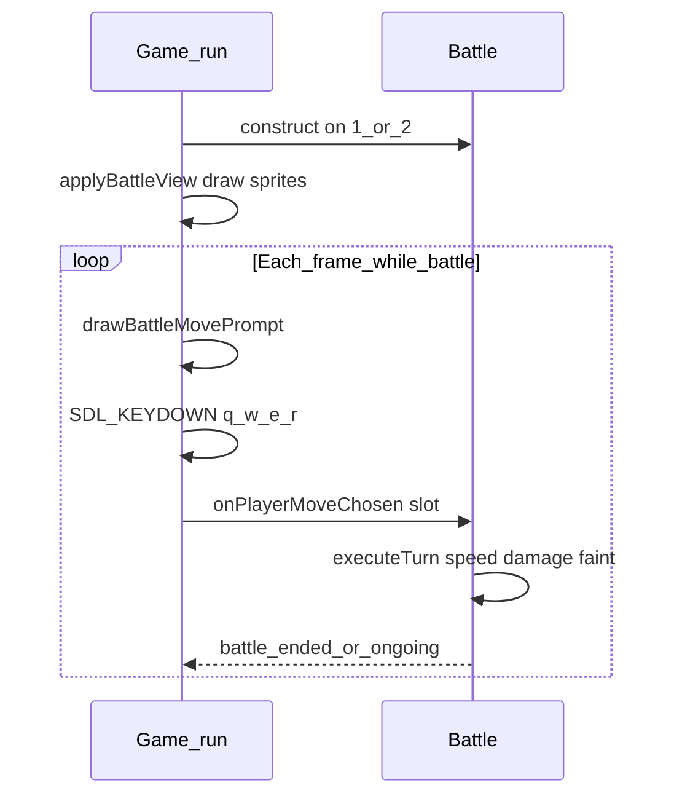

# Battle engine + Q/W/E/R move prompt

## Constraints from your codebase

- [`src/battle.cpp`](src/battle.cpp) is **not valid C++** today (empty `while()`, incomplete `do`/`while`, `Battle` constructor with a broken loop). This must be fixed before anything else.
- There is **no `level` field** on [`Pokemon`](include/game.h); [`PokemonStats`](include/game.h) has `hp`, `atk`, `def`, `spAtk`, `spDef`, `spd`. Use **base stats + IVs** (or bases only) for a simplified damage formula consistent with the commented stub in `battle.cpp`.
- **Do not block inside `Battle`**: a `while` battle loop would freeze SDL. The **main loop in [`Game::run`](src/game.cpp)** must remain the only place that polls events; each keypress advances one logical step.

## Architecture

- **Owns battle data + HP**: extend [`Battle`](include/battle.h) with runtime HP (and optionally max HP) for player and foe, initialized in the constructor from species data (e.g. `maxHp = max(1, bases().hp)` or a small formula using IVs if you want).
- **Turn execution** (replaces the commented steps in [`battle.cpp`](src/battle.cpp) lines 17–24): single method, e.g. `Battle::executeTurn(int playerMoveSlot)` (name up to you) that:
  1. Ignores input if slot is empty or `slot >= moves().size()` (optional: still log “invalid”).
  2. Chooses **foe move** (simplest: uniform random among foe’s available moves).
  3. **Speed**: compare combined speed (e.g. `bases().spd + ivs().spd`); faster Pokémon acts first; tie-break fixed (e.g. player first).
  4. For each attack in order: **damage** using move power, category (Physical vs Special vs Status — status moves can deal 0 damage for now), attacker/defender atk or spAtk vs def or spDef from [`MoveTemplate`](include/game.h) / [`Pokemon`](include/game.h).
  5. **Faint**: if HP ≤ 0, mark side as unable to continue; **battle over** if a side has no Pokémon left (for now, single mon each = battle ends when one faints).
- **Hooks you asked for**:
  - **Log**: `std::cout` (or `std::cerr` for errors) when a move is chosen and when damage is applied.
  - **Stub**: e.g. `void Battle::onPlayerMoveChosen(int slot);` called at the start of `executeTurn` (can be empty or only log) so future rules stay centralized.

## UI: white text “prompt box” and Q/W/E/R

- **State in [`Game`](include/game.h)**: e.g. `std::optional<Battle> activeBattle_` or `std::unique_ptr<Battle>` plus a `bool inBattle_` (or derive `inBattle_` from `activeBattle_.has_value()`). When **1** or **2** is pressed, construct `Battle`, call existing [`applyBattleView`](src/game.cpp), set active battle.
- **Drawing** (in [`src/game.cpp`](src/game.cpp)):
  - Add a private helper, e.g. `drawBattleMovePrompt(const Battle& b)`, called when `inBattle_` after `drawCornerSprites()` and **before** `SDL_RenderPresent`.
  - **Box**: `SDL_RenderFillRect` with a dark fill (e.g. RGB 20,20,20), then `SDL_RenderDrawRect` (or four `SDL_RenderDrawLine`s) with **white** for the border; position anchored to logical resolution (see `kLogicalWidth` / `kLogicalHeight` in [`game.cpp`](src/game.cpp)).
  - **Text**: reuse [`Game::renderText`](src/game.cpp) with **white** `SDL_Color`. Four lines, e.g.  
    `[Q] Tackle` / `[W] --` / … using `battle.player().moves()` — for index `i in 0..3`, if `i < moves.size()` use `moves[i].name`, else `"--"`.
- **Input**: in the same `SDL_KEYDOWN` handler, when `inBattle_`, handle `SDLK_q` → slot 0, `SDLK_w` → 1, `SDLK_e` → 2, `SDLK_r` → 3. Use `event.key.repeat == 0` to avoid repeat spam.
- **Escape**: add `SDLK_ESCAPE` to clear active battle and return to the title `displayText_` / `showMainSpriteAndStats_` menu (recommended so you can exit without quitting the app).

## Files to touch

| File | Changes |
|------|--------|
| [`include/battle.h`](include/battle.h) | Valid constructor; runtime HP fields; `executeTurn` / `onPlayerMoveChosen`; helpers for `battleEnded`, `playerWon` or return `enum class`; remove or replace invalid `runBattle()` if you fold logic into `executeTurn`. |
| [`src/battle.cpp`](src/battle.cpp) | Remove broken loops from constructor; implement HP init, damage helper (can start from your commented formula without `level`, e.g. use constant level factor 50 or omit level term), `executeTurn`, random foe move, faint checks; keep code readable. |
| [`include/game.h`](include/game.h) | `std::optional<Battle>` or `unique_ptr`; `void drawBattleMovePrompt(const Battle&)`; `void clearBattle()` or inline in run; forward declare `Battle` remains OK. |
| [`src/game.cpp`](src/game.cpp) | Battle lifecycle, `drawBattleMovePrompt`, key routing for Q/W/E/R and Escape; when `inBattle_`, still draw corners + prompt (do **not** use only `showMainSpriteAndStats_` for the prompt—either a new flag `showBattleMovePrompt_` or simply `if (activeBattle_) drawBattleMovePrompt(*activeBattle_)`). |

## Edge cases

- **Fewer than 4 moves**: show `--` for missing slots (indices ≥ `moves().size()`).
- **Status moves**: `power == 0` → no HP damage (or minimal stub).
- **Both faint same “frame”**: define order (e.g. resolve first attacker’s KO before second hit).

## Testing

- Run app: menu → **1** or **2** → see four lines with correct names/`--` and white text in the box.
- Press **Q**–**R** with valid moves: console logs + HP decreases / battle ends when HP hits 0.
- **Esc** returns to menu.
