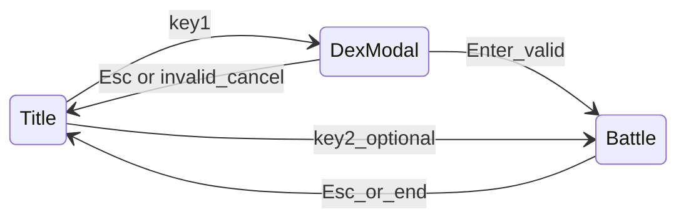

# Battle prompt, graphics-driven JSON, and dex debug modal

## 1. Smaller battle prompt height

**Current:** [`kBattlePromptBoxH = 240`](src/game.cpp) in the anonymous namespace; [`drawBattleMovePrompt`](src/game.cpp) draws “Last turn:”, up to 8 log lines, then Q–R moves.

**Change:**

- Reduce `kBattlePromptBoxH` to a smaller value (target **~140–160** px) so the bottom panel sits lower and exposes more of the player back sprite (Charmander).
- Tighten vertical usage: lower `kMaxTurnLines` (e.g. **3–4**) so the log does not force a tall box; optional small spacer between log block and move lines.
- **Re-check** [`drawBattleHealthBars`](src/game.cpp): player bar Y uses `kLogicalHeight - kBattlePromptBoxH - kTextMargin - 40`. After shrinking the prompt, verify the bar still sits above the panel without overlapping sprites; adjust the **`- 40`** offset if needed.

No API changes required beyond constants/layout in [`src/game.cpp`](src/game.cpp).

---

## 2. Add all Pokémon from `Graphics/Pokemon` to `monster.json` with typings and sprites

**Source of truth (per your paths):**

- Front: [`src/Graphics/Pokemon/Front`](src/Graphics/Pokemon/Front) (`*.png`)
- Back: [`src/Graphics/Pokemon/Back`](src/Graphics/Pokemon/Back) (`*.png`)

**Approach (recommended):**

1. **Pairing rule:** For each `Front/FOO.png`, require `Back/FOO.png` with the **same stem** (`FOO`). If one side is missing, log a warning and skip or only include fully paired species (choose one policy and stick to it—**skip unpaired** is safest).

2. **Species key:** Map filename stem to JSON key the same way as today (e.g. `CHARMANDER.png` → species key `"Charmander"`): title-case words split on `_` if needed, matching [`Pokemon` constructor](src/pokemon.cpp) which looks up `data["Pokemon"][key]`.

3. **Types + Pokédex number:** Maintain a **single metadata source** so typings stay maintainable:
   - Add something like [`tools/pokemon_species_meta.json`](tools/pokemon_species_meta.json) (or Python dict inside a script) mapping **canonical species name** → `{ "pokedexNum": <int>, "type": ["fire"] }` for every stem you expect from filenames.
   - **Practical option:** Ship a **large static map** (e.g. national-dex style) for common names, and for any filename stem not found, emit a **clear warning** and either skip the species or assign a safe default (e.g. `["normal"]`) until metadata is added—document this in a short comment at the top of the generator.

4. **Automation:** Add a small **Python script** under `tools/` (e.g. `tools/sync_pokemon_from_graphics.py`) that:
   - Scans Front/Back, builds the list of paired species.
   - Merges **MoveCatalog** and existing hand-tuned fields as needed.
   - Writes/updates the `"Pokemon"` object in [`src/monster.json`](src/monster.json) (or outputs a fragment you paste—prefer **full automated write** with a backup comment in the script README).

5. **Per-species gameplay fields:** Reuse the same **moves** pattern as existing entries ([`monster.json`](src/monster.json)): e.g. default `["tackle", "growl"]` for new species until you specialize, so battles do not break.

6. **Paths:** Keep `spriteFront` / `spriteBack` as **project-relative** strings like today (`src/Graphics/Pokemon/Front/FOO.png`) so [`loadIntoTexture`](src/game.cpp) and [`Pokemon::loadFromSpecies`](src/pokemon.cpp) keep working.

**Note:** The repo snapshot may not list PNGs in search tools if assets are gitignored or unsynced; implementation should run the script **on your machine** where `Front`/`Back` are populated.

---

## 3. Main menu key 1: debug popup for dex number (player = choice, foe = random)

**Goal:** On the **title screen**, pressing **1** opens a **small in-game debug panel** (not a native OS form—SDL has no portable numeric-only dialog). User enters an integer from **1** to **max Pokédex** (max = maximum `pokedexNum` across all species in [`src/monster.json`](src/monster.json) after sync).

**Behavior:**

1. **State:** Add something like `debugDexEntryActive_` (and a string buffer `debugDexInput_`) on [`Game`](include/game.h), or an enum `TitleSubState { Normal, DexDebug }`.

2. **When `debugDexEntryActive_` is true:**
   - **Do not** start the old fixed `Charmander` vs `Squirtle` battle on key 1.
   - Draw a **small centered panel** (dark fill, white border, white text): title e.g. `Debug: Pokédex # (1–N)`, show current `debugDexInput_`, hint `Enter confirm · Esc cancel`.
   - **Input:** Digits `0–9` append to buffer (with a reasonable max length, e.g. 3–4 digits); **Backspace** deletes; **Enter** confirms; **Esc** cancels and returns to normal menu.
   - **Validation:** Parse integer; if `< 1` or `> maxPokedex` or no species with that `pokedexNum`, show inline error text and keep modal open (or flash message once).

3. **Resolve species keys:** Add helpers on `Game` (private) that scan `pokedb["Pokemon"]`:
   - `int maxPokedexNum() const` — max of all `pokedexNum`.
   - `std::optional<std::string> speciesKeyForPokedexNum(int n) const` — first species whose `pokedexNum == n` (if duplicates exist, pick deterministic first or document tie-break).

4. **Start battle:** On valid Enter:
   - `playerKey = speciesKeyForPokedexNum(chosen)`.
   - `foeDex = random(1, maxPokedex)` then `foeKey = speciesKeyForPokedexNum(foeDex)` — if lookup fails (gap in dex), **reroll** or pick random **existing** species key from JSON (implementation should avoid nullptr battle—prefer **resample until valid**).

5. **Construct:** `activeBattle_ = std::make_unique<Battle>(pokedb, playerKey, foeKey);` then [`applyBattleView`](src/game.cpp).

6. **Menu copy:** Update [`displayText_`](src/game.cpp) on the title screen to describe: **1** = debug dex picker (testing), **2** = keep existing quick match (or clarify in text).

7. **SDL:** Use `SDL_StartTextInput()` / `SDL_StopTextInput()` while the modal is open if using `SDL_TEXTINPUT` for Unicode digits, **or** handle `SDL_KEYDOWN` for `SDLK_0`…`SDLK_9` and keypad only—latter avoids IME issues and is enough for digits.

---

## Architecture sketch

---

## Files to touch (summary)

| Area | Files |
|------|--------|
| Prompt height / layout | [`src/game.cpp`](src/game.cpp) |
| Dex modal + key routing | [`include/game.h`](include/game.h), [`src/game.cpp`](src/game.cpp) |
| `maxPokedex` / lookup | [`src/game.cpp`](src/game.cpp) (or small helper `.cpp` if you prefer) |
| JSON + graphics sync | [`src/monster.json`](src/monster.json), new [`tools/sync_pokemon_from_graphics.py`](tools/sync_pokemon_from_graphics.py), new [`tools/pokemon_species_meta.json`](tools/pokemon_species_meta.json) (or equivalent) |

---

## Testing checklist

- Prompt is visibly shorter; player sprite (back) is less covered.
- After running the sync script, every paired Front/Back PNG has a `Pokemon` entry with `type`, `pokedexNum`, and sprite paths; game loads without JSON errors.
- Title: **1** opens modal; valid dex starts battle with correct player/foe sprites; **Esc** exits modal; invalid dex shows error without crashing.
