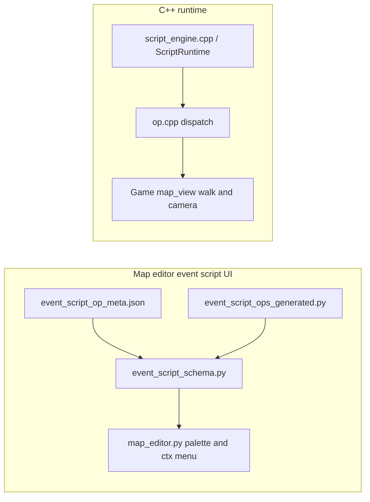

# Blocking movement and camera opcodes (with full map / event editor coverage)

## Goal and acceptance criteria

- **Runtime:** [`ScriptRuntime`](include/script_engine.h) continues to run `script_1` (or legacy `actions`) **in order**. **Player movement opcodes are always blocking:** the interpreter does not advance `pc` until the scripted move reaches the target tile (or fails deterministically—see edge cases). `show_message` and `wait_frames` keep their existing yield semantics.
- **Opcodes (initial scope):** `walk_to_coords` `{x,y}`, `run_to_coords` `{x,y}` (faster segment timing than walk), `face_north` / `face_south` / `face_east` / `face_west` (no args, or empty args), `move_camera` `{direction, steps, speed?}`, `camera_zoom_in`, `camera_zoom_out`. Reuse or align with existing [`set_player_facing`](src/script_engine.cpp) / `mapPlayerFacingRow_` where sensible.
- **Engine integration:** Reuse [`requestPlayerMoveOnMap_`](src/map_view.cpp) / walk commit path for cardinal steps; add a **script-owned path driver** (e.g. greedy cardinal steps toward `(x,y)` in map-local or world space matching [`warp_player`](src/script_engine.cpp) coordinate rules). Extend [`shouldAutoChainMapWalk_`](src/map_view.cpp) / input handling so **WASD does not steal** scripted blocking walks (same spirit as `playerLocked`—either set lock for the duration or a dedicated `mapScriptBlockingWalk_` flag checked beside `playerLocked`).
- **Tick order:** [`tickMapScript_`](src/map_view.cpp) runs **before** [`tickMapPlayerWalk_`](src/game.cpp) today—blocking ops must **Yield** with `pc` unchanged until segments complete; optionally nudge the next segment **after** walk tick in a small helper to avoid off-by-one-frame issues.
- **Camera:** Today there is **no zoom** in C++—add minimal state (e.g. scale or effective viewport tweak) applied only in map/world draw paths, clamped to safe bounds. `move_camera` applies **integer tile** offsets with optional per-step delay (`speed` as ms-per-step or frames-per-step—pick one, document in meta).
- **Map editor / event editor (your iteration):** Every opcode that exists in C++ **must**:
  1. Appear in [`tools/event_script_op_meta.json`](tools/event_script_op_meta.json) with **`label`**, **`description`**, **`status`: `implemented`**, **`default_args`**, **`args_help`** (no empty documentation for shipped ops).
  2. Be included in the **ordered** list emitted by [`tools/extract_map_script_ops.py`](tools/extract_map_script_ops.py) (today it scans `if (op == "...")` in [`src/script_engine.cpp`](src/script_engine.cpp)—**if dispatch moves to [`src/op.cpp`](src/op.cpp)**, update the extractor to scan the file(s) that contain those string literals, or keep thin `if (op == kOpX)` shims in `script_engine.cpp` so the tool keeps working).
  3. Regenerate [`tools/event_script_ops_generated.py`](tools/event_script_ops_generated.py) so [`tools/event_script_schema.py`](tools/event_script_schema.py) builds [`EVENT_ACTION_DEFS`](tools/event_script_schema.py) → **middle palette column** and **“Add step” submenu** in [`tools/map_editor.py`](tools/map_editor.py) automatically include the new ops.
  4. Update [`docs/event_script_ops.md`](docs/event_script_ops.md) MVP table (human summary) for each opcode, including **blocking** behavior and coordinate space.
  5. Update [`docs/tools_doc.md`](docs/tools_doc.md) (extractor + editor data flow) and [`docs/source_doc.md`](docs/source_doc.md) (new/changed C++ symbols) per repo rules.
- **Tracker:** Add/advance a **FEATURE** in [`docs/tracker.md`](docs/tracker.md) before substantive implementation; reference its `ID` in change notes.

## Architecture (concise)

## Files to touch (expected)

- New: [`include/op.h`](include/op.h), [`src/op.cpp`](src/op.cpp) — opcode string constants / dispatch entry from `ScriptRuntime::stepFrame` (or called from it); **keep a single source of truth** for op strings consumed by Python.
- [`src/script_engine.cpp`](src/script_engine.cpp) / [`include/script_engine.h`](include/script_engine.h) — optional fields for “blocking move/camera in progress”; delegate heavy logic to `Game` via new callbacks or a small `ScriptMapHooks` struct to avoid circular deps.
- [`include/game.h`](include/game.h), [`src/map_view.cpp`](src/map_view.cpp) — path driver, camera/zoom fields, input suppression during scripted blocking moves, `wireMapScriptCallbacks_` wiring.
- [`Makefile`](Makefile) — only if explicit source list is used elsewhere (current wildcard picks up `op.cpp` automatically).
- Tools/docs: [`tools/extract_map_script_ops.py`](tools/extract_map_script_ops.py), [`tools/event_script_op_meta.json`](tools/event_script_op_meta.json), [`docs/event_script_ops.md`](docs/event_script_ops.md), [`docs/tools_doc.md`](docs/tools_doc.md), [`docs/source_doc.md`](docs/source_doc.md), [`docs/tracker.md`](docs/tracker.md).

## Risks, edge cases, verification

- **Unreachable target:** stop scripted walk at first blocked step; advance `pc` with documented behavior (fail-soft: end move early vs treat as script error—pick one and document in meta + `event_script_ops.md`).
- **World vs map tiles:** match [`warp_player`](src/script_engine.cpp) / [`warpPlayerViaWorldLayoutIfPresent_`](src/map_view.cpp) conventions.
- **Concurrent walk:** [`tryStartNearbyMapScript_`](src/map_view.cpp) already blocks when `mapPlayerWalkActive_`; keep that invariant for scripted starts.
- **Performance (thread-specialist / perf agent):** path is **single-threaded**; avoid per-frame allocations in the hot walk tick; cap path steps per opcode execution if needed (document). Delegate a **post-implementation** pass to the performance-optimization agent for walk + camera hot paths if profiling shows issues.
- **QA (qa-ram-performance):** after implementation, run the QA checklist on allocation in the script step loop and unbounded script state.

## Verification checklist (implementation phase)

- `python3 tools/extract_map_script_ops.py` succeeds; `python3 tools/map_editor.py` (smoke) loads schema without `FileNotFoundError`.
- In the **event script editor** modal: new ops appear in the **palette**, **documentation pane** shows meta text, **context menu → Add step** lists them (default tree from [`default_menu_tree_from_ops`](tools/event_script_ctx_menu.py)); if a user later adds a **custom** `eventScriptEditor.contextMenu` in [`tools/map_editor_config.json`](tools/map_editor_config.json), document that they must add matching `add:<opcode>` entries themselves—or ship an updated example tree in `docs/event_script_ops.md`.
- Build C++ target; manual map viewer script with ordered `walk_to_coords` → `show_message` proves blocking order.

## Assumption

- Ambiguous earlier note **“do not move*”** is **not** a separate opcode unless you confirm a name and semantics; blocking walks already imply no script advance during motion. If you want a literal `hold_position` / `lock_player` alias, add it as a follow-up FEATURE.
