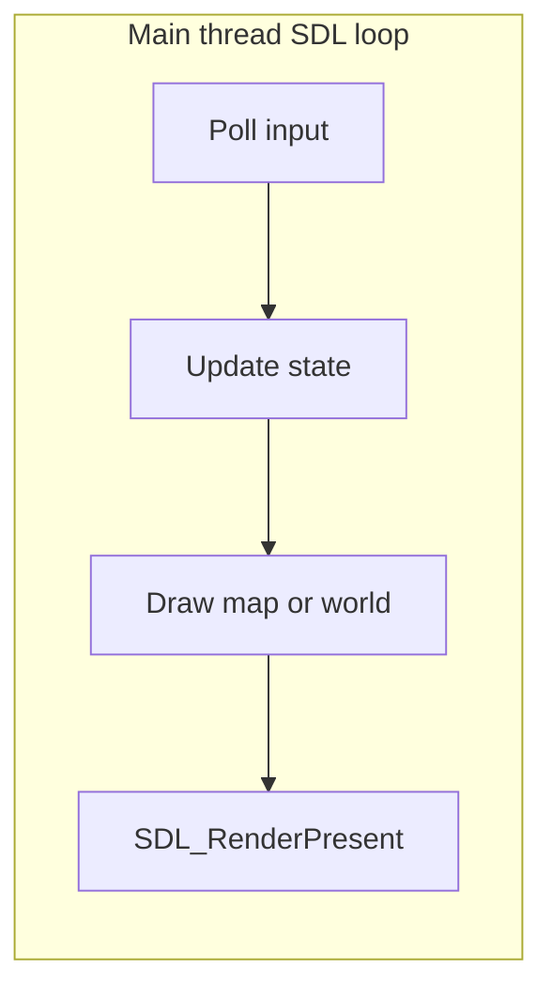

# Documentation refresh and safe performance review

## Context from the repo

- **Concurrency:** Active [`src/`](src/) and [`include/`](include/) use **no** `std::mutex`, `std::thread`, or atomics. The runtime is an **SDL single-threaded loop** ([`Game::run`](src/game.cpp) → render → `SDL_RenderPresent` → `SDL_Delay(1)`). Parallelism exists only in **Python** via `ThreadPoolExecutor` in [`tools/sync_pokemon_from_graphics.py`](tools/sync_pokemon_from_graphics.py), where futures are consumed sequentially on the main thread (no shared mutable dict writes from workers).
- **Documentation drift:** [`docs/source_doc.md`](docs/source_doc.md) lists the same logical files **multiple times** (e.g. `include/map_data.h` appears at lines ~38 and ~358; `src/map_view.cpp` / `src/map_data.cpp` also repeat). “Latest version” here is best interpreted as **one accurate, deduplicated section per source file** plus alignment with current headers/implementation.
- **Hot paths:** Per-frame work centers on [`Game::drawMapView_`](src/map_view.cpp) / [`Game::drawWorldLayoutView_`](src/map_view.cpp). World tiles call a lambda that **linearly scans** [`worldLayoutInstances_`](src/map_view.cpp) for every drawn cell (two passes: below- and over-player). That is **algorithmically O(visibleCells × instances × layers)**—acceptable for small layouts; worth noting for profiling before any structural change.

## 1. Tracker (before implementation)

Add **two** tracker entries in [`docs/tracker.md`](docs/tracker.md) (per workspace logging rules), reference their IDs in commits/PRs:

| ID (proposed) | TYPE | Purpose |
|----------------|------|---------|
| e.g. `IMPROVEMENT-DOC-001` | IMPROVEMENT | Refresh and deduplicate `source_doc.md` / `tools_doc.md`; reconcile `event_script_ops.md` if opcode pipeline changed |
| e.g. `IMPROVEMENT-PERF-001` | IMPROVEMENT | Small, single-threaded overhead reductions; **no** new render threads |

## 2. Documentation update (“latest”)

**[`docs/source_doc.md`](docs/source_doc.md)**

- Build a checklist from [`include/*.h`](include/) and [`src/*.cpp`](src/) (exclude `backups/`).
- **Merge duplicate `FILE:` blocks** into a single canonical section per path; fold unique NOTES/FUNCTION entries from duplicates into that section (preserve tracker IDs like `FEATURE-MAP-049`, `BUG-MAP-026` where they document behavior).
- Re-read public structs/methods in [`include/game.h`](include/game.h), [`include/map_data.h`](include/map_data.h), [`include/script_engine.h`](include/script_engine.h), [`include/op.h`](include/op.h), [`include/battle.h`](include/battle.h), [`include/perf_stats.h`](include/perf_stats.h) and ensure PURPOSE/KEY COMPONENTS match.
- Keep strict **label/value indentation** (4 spaces under labels, 8 for list items) per [Documentation-Rule](.cursor/rules/Documentation-Rule.mdc).

**[`docs/tools_doc.md`](docs/tools_doc.md)**

- Confirm every **non-backup** script under [`tools/*.py`](tools/) is represented or explicitly deferred (e.g. generated [`tools/event_script_ops_generated.py`](tools/event_script_ops_generated.py) is usually covered under `extract_map_script_ops.py`—state that clearly if no standalone TOOL entry).
- Update NOTES/USAGE if CLI flags, config keys, or outputs changed since the doc was written.

**[`docs/event_script_ops.md`](docs/event_script_ops.md)** (if opcodes or meta changed)

- If any opcode work is in scope, follow the repo’s opcode workflow ([`.cursor/skills/event-script-opcode-docs/SKILL.md`](.cursor/skills/event-script-opcode-docs/SKILL.md)); otherwise **touch only if** `event_script_op_meta.json` / generated Python / C++ dispatch disagree with this file.

## 3. Performance and overhead (QA + thread specialist)

**Deliberately out of scope for “simple + safe”:** adding worker threads or async tasks around **SDL rendering or texture upload** (SDL textures/renderer are not generally safe across threads; this is the main **race/deadlock** avoidance principle).

**Candidate changes (evidence-first, smallest first)**

1. **Per-frame string churn (LOW–MEDIUM):** [`drawMapView_`](src/map_view.cpp) builds `hintStr` with multiple concatenations every frame (~2256–2259). Similar patterns may exist in [`drawWorldLayoutView_`](src/map_view.cpp) / overlays. **Mitigation:** reuse a member scratch `std::string` and `clear` + `append` / `fmt`-style composition, or only rebuild when **dirty** (camera tile, zoom, map name, grid flag, dimensions changed). **Risk:** low; **validation:** compare hint text before/after; profile allocation count if desired.
2. **World instance scan (MEDIUM, layout-size dependent):** the inner loop over `worldLayoutInstances_` per cell. **Only if** profiling shows cost: precompute a **sparse** structure at layout load (e.g. map from `(wx,wy)` to instance index, or a coarse grid of covering instances) so each cell touches **one** instance in the common non-overlapping case. **Trade-off:** memory and load-time work vs draw time—document in source_doc if implemented.
3. **`SDL_Delay(1)` in [`Game::run`](src/game.cpp):** adds a **fixed ~1 ms** floor to the frame loop. **Do not remove blindly** without vsync/frame limit strategy; note in plan as optional follow-up with FPS cap or `SDL_RENDERER_PRESENTVSYNC` behavior check.
4. **[`PerfSampler::update`](src/perf_stats.cpp):** already throttled (~250 ms); no change unless profiling shows `task_info` / `/proc` reads as hot (unlikely).

**Python tool:** [`sync_pokemon_from_graphics.py`](tools/sync_pokemon_from_graphics.py)—keep **main-thread aggregation** of results; do not move `save_cache` / JSON mutation into workers without locks (would reintroduce races). Optional: cap `max_workers` via env flag (documentation + tools_doc) if memory spikes on huge batches.

## 4. Acceptance criteria

- **Docs:** One coherent `FILE:` section per primary source file; no contradictory duplicate entries; `tools_doc.md` matches current tools behavior; tracker entries at **DONE** (or **REVIEW**) with IDs referenced where the repo convention expects.
- **Perf:** No new threads/mutexes in C++/SDL path; changes are localized, behavior-preserving for gameplay; hints/overlays still correct.
- **Verification:** Release build + manual smoke (map viewer, world viewer, battle path if touched); optional Instruments/heap allocation sample on macOS for hint-string change.

## 5. Risks and mitigations

| Risk | Mitigation |
|------|------------|
| Doc merge drops a NOTE | Diff duplicate sections side-by-side before deleting |
| “Dirty” hint omits updates | Unit-test or manual checklist of toggles that change hint |
| World precompute wrong for overlapping nodes | Only implement with tests using `world_layout.json` edge cases; otherwise skip |
