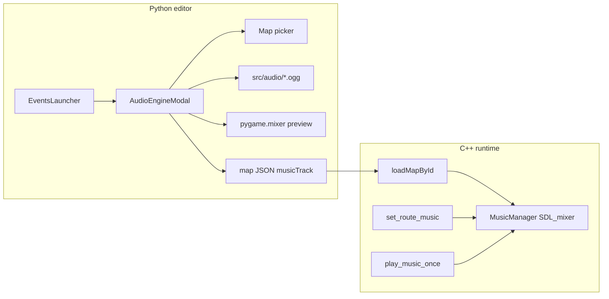
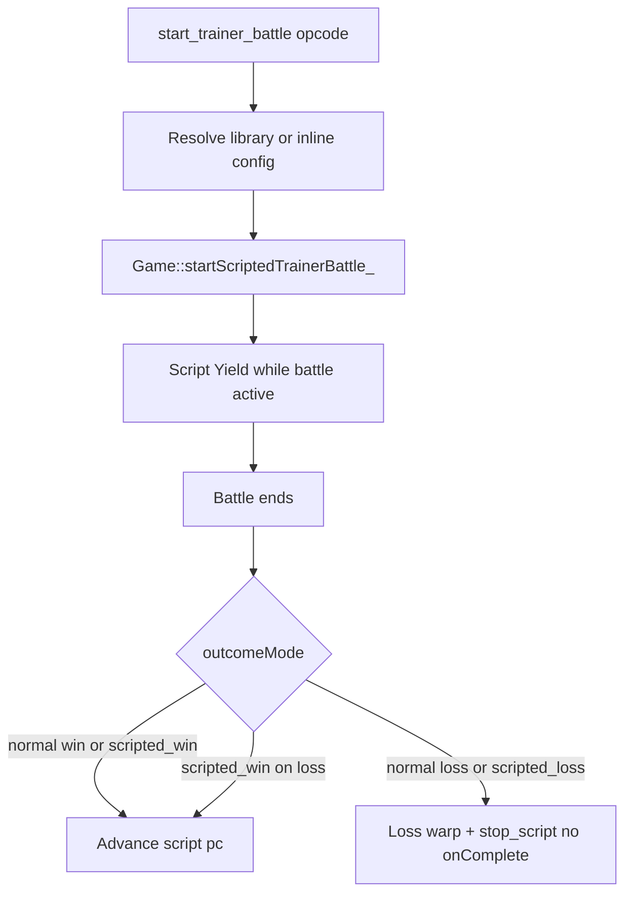

# Event editor, help, wild maps, and audio engine

## Clarifications captured (user decisions)

| # | Request | Decision |
|---|---------|------------|
| 1 | Double-click opens modal | **Script action/block row** in block editor → [`EventActionModal`](tools/event_action_modal.py) |
| 2 | Text spacing | **Audit all UI-Standard modals** |
| 3 | Delete subflow | Permanent delete from script with confirm; **“Don’t ask again”** on dialog + **Prefs** in Event Engine; persisted in `eventEngine` config |
| 4 | Help docs | **Merge modes into one tab** + **grouped Contents TOC** + **global search** across all topics |
| 5 | Wild map select | **Mirror Event Engine** — pick any map, edit its wild data **without** switching main editor map |
| 6 | Audio engine | **Full stack** + **pygame preview** in editor; tracks in `src/audio/*.ogg`; map field `musicTrack`; opcodes **`set_route_music`** (track + `fadeMs`) and **`play_music_once`** |
| 7 | Start trainer battle | **1–2 foe trainers**, each **1–6 Pokémon** (min 1); **library + inline** config; **Battle Editor** + rich action modal; **blocking script** with **3 outcome modes**; player uses **runtime party** (stub until party system exists) |
| 8 | Loss warp (battle) | **Opcode `lossWarp` > map `healPoint` > global default**; ends script early (**no onComplete**); event **re-triggerable** |
| 9 | Events launcher | **2-column** layout for 5 apps (Engine, Wild, Audio, Battle, Help) |

---

## 0. Planning rule tweak

[`/.cursor/skills/planning-rule/SKILL.md`](.cursor/skills/planning-rule/SKILL.md) already has “no cap” on questions. Strengthen wording per user request:

- Rename section to **“Clarifying questions (unlimited)”**
- Add explicit line: *Ask as many clarifying questions as possible until requirements are unambiguous; never self-limit to two questions.*

No behavior change beyond clearer guidance.

---

## 1. Double-click block → action modal

**File:** [`tools/event_engine_modal.py`](tools/event_engine_modal.py)

- Reuse existing double-click threshold pattern from [`map_editor.py`](tools/map_editor.py) (`LIST_CLICK_DOUBLE = 0.45`).
- Add state: `_block_dbl_prev_time`, `_block_dbl_prev_path`.
- In `_md_block_panel`, when LMB hits a non-`end` row:
  - If same `path` and `now - prev < LIST_CLICK_DOUBLE` → `event_action_modal.open_for(self, active_flow, path)` (after `_commit_arg_edit()`).
  - Else record click time/path (single-click behavior unchanged: select + drag prep).

**Acceptance:** Double-clicking `warp_player` (or any block) opens the Edit modal shown in your screenshot; single-click still selects/drags.

---

## 2. Modal text spacing (all modals)

**Root cause (from screenshot):** [`event_action_modal.py`](tools/event_action_modal.py) `_draw_fields` uses tight vertical rhythm (`field_h = lh + 6`, help at `sy + lh + 4`, only `lh + 10` between groups). Help text shares the field column (`body.x + 120`) and sits too close to inputs.

**Approach:** Extend [`tools/modal_text.py`](tools/modal_text.py) with shared form-layout constants/helpers:

```python
FORM_LABEL_COL_W = 100
FORM_FIELD_H_MIN = lh + 10
FORM_HELP_GAP = 6          # below field row
FORM_ROW_GAP = 14          # before next label
FORM_SECTION_TOP = 8
```

- Add `form_label_x`, `form_field_rect(body, y, ...)`, `form_help_y(field_rect)` helpers.
- Refactor [`event_action_modal.py`](tools/event_action_modal.py) first (primary bug).
- Audit and align the same metrics in:
  - [`event_trigger_modal.py`](tools/event_trigger_modal.py)
  - [`flag_registry_modal.py`](tools/flag_registry_modal.py)
  - [`wild_encounter_modal.py`](tools/wild_encounter_modal.py) (inline step/weight fields)
  - [`event_sprite_modal.py`](tools/event_sprite_modal.py)
  - [`event_place_modal.py`](tools/event_place_modal.py)
  - [`event_doc_popout_modal.py`](tools/event_doc_popout_modal.py)
  - [`events_launcher_modal.py`](tools/events_launcher_modal.py) (when expanded to 2-column)
  - [`event_engine_modal.py`](tools/event_engine_modal.py) (search boxes / rename fields if cramped)
  - New audio + battle modals

**Acceptance:** Help lines never touch field borders; first row not clipped by body clip; consistent spacing at ~420px and ~560px modal widths.

---

## 3. Delete subflow (RMB tab) + skip-confirm prefs

**File:** [`tools/event_engine_modal.py`](tools/event_engine_modal.py)

- Extend `_open_tab_ctx()` for `name != "main"`:
  - Add **“Delete subflow”** → `tab:delete:{name}` (distinct from **Close Tab**).
- Implement `_delete_subflow(name)`:
  - Unless `eventEngine.skipSubflowDeleteConfirm` → show inline confirm overlay (Save/Cancel + **“Don’t ask again”** checkbox).
  - Remove key from `flows`, `open_tabs`, `collapsed` keys; switch active tab if needed; `script_dirty = True`.
- Add **Prefs** button in Event Engine header (near Flags):
  - Small panel with checkbox **“Skip subflow delete confirmation”** bound to `skipSubflowDeleteConfirm` in config (`_load_config` / `_save_config`).
- Wire `tab:delete` in `_run_tab_ctx_action`.

**Acceptance:** RMB subflow tab → Delete subflow removes it from persisted `subflows` on save; main flow undeletable; skip pref works from both confirm dialog and Prefs.

---

## 4. Help: grouped TOC, consolidated modes tab, global search

**File:** [`tools/map_editor.py`](tools/map_editor.py)

### Tab consolidation (A + B)

- Replace separate tabs `paint`, `walk`, `transparent`, `over_player` with one tab: **`editing_modes` / “Editing modes”**.
- `_help_build_lines("editing_modes")` contains four `head` subsections (Paint, Walk, Transparent, Over-player) using existing copy.
- Update `HELP_GUIDE_TABS` and home TOC to **grouped structure**:

```
Editing modes  → editing_modes
  Paint / Walk / Transparent / Over-player (anchors within tab)
Map & exits    → map_meta
Events         → events
World          → world
Keys           → keys
Script opcodes → script_ops
Settings       → settings
```

- Home **Contents** renders grouped headings + indented TOC links (modes as one group with one primary link).

### Global search (C)

- Add `help_search: str` + `help_search_focus` + search box in help overlay (below tab bar).
- Build a one-time-per-draw **search index** from all `_help_build_lines(tab_id)` segments (`tab_id`, `head`, `body` text).
- When query non-empty: show result list (tab + snippet); click sets `help_tab`, `help_scroll_y` / `_help_pending_scroll_to` to jump.
- Keep keyboard: Esc clears search when focused.

**Acceptance:** Fewer mode tabs; Contents is navigable; typing “flood” finds Paint content; clicking result opens Editing modes at the right section.

---

## 5. Wild editor map picker (independent scope)

**Files:** [`tools/wild_encounter_modal.py`](tools/wild_encounter_modal.py), [`tools/map_editor.py`](tools/map_editor.py) (read/write helpers)

- Add session state to wild modal: `sel_map_id`, `wild_dirty`, buffered `wild_encounter`, `wild_patches`, `wild_global_encounters`, map dimensions for thumbnail.
- Add compact **Maps** picker (search + list) — pattern from [`event_engine_modal._draw_map_panel`](tools/event_engine_modal.py) — in modal header/left strip.
- New helpers on `MapEditor`:
  - `read_map_wild_session(map_id) -> dict` (grid, patches, globals, w, h)
  - `write_map_wild_session(map_id, session) -> bool` (merge into map JSON only wild fields)
- On map switch: flush dirty buffer, load selected map wild data **without** `try_load_map_by_id` / changing `ed.map_id`.
- Mini-map/thumbnail uses selected map’s tile data (load thumbnail surface for `sel_map_id`).

**Acceptance:** Wild editor can edit `route_2` wild tables while main editor still shows `Cherry_Town`; save writes only the selected map’s wild JSON.

---

## 6. Audio Engine (editor + runtime + event opcodes)



### Data & assets

- Create [`src/audio/`](src/audio/) (`.gitkeep` + short README).
- Add optional `musicTrack: string` to map JSON (stem, no extension).
- Parse in [`include/map_data.h`](include/map_data.h) / [`src/map_data.cpp`](src/map_data.cpp) → `MapData::musicTrack`.

### C++ runtime

- **Dependency:** `sdl2_mixer` — update [`Makefile`](Makefile) (`brew install sdl2_mixer`, link flags).
- New [`include/music_manager.h`](include/music_manager.h) + [`src/music_manager.cpp`](src/music_manager.cpp):
  - `playRouteMusic(track, fadeMs)` — looping BGM
  - `playOnce(track)` — one-shot, no loop
  - Crossfade between route tracks when `fadeMs > 0`
- Integrate in [`src/game.cpp`](src/game.cpp) / map load path: after `loadMapForView_`, if `musicTrack` non-empty, start route music.
- New opcodes in [`src/op.cpp`](src/op.cpp) + dispatch in script engine:
  - `set_route_music` — args: `track` (string), `fadeMs` (int, default 0)
  - `play_music_once` — args: `track` (string)

### Python editor

- New [`tools/audio_engine_modal.py`](tools/audio_engine_modal.py) (UI-Standard):
  - Map picker (same independent-scope pattern as wild editor)
  - Track list from `src/audio/*.ogg` stems
  - **Play / Stop** preview via `pygame.mixer` (init on open, quit on close)
  - Assign selected track to `musicTrack` on selected map; save map JSON
- Add 4th button **Audio Engine** and 5th **Battle Editor** to [`tools/events_launcher_modal.py`](tools/events_launcher_modal.py).
- **2-column button layout** in wider launcher panel (min width increased); order: Event Engine | Wild · Audio | Battle · Help (or similar 2×3 grid with Close unchanged).
- Wire draw/input in [`tools/map_editor.py`](tools/map_editor.py).
- Each new modal that has a Help button passes `back_to="audio"` / `back_to="battle"` to `_open_help_overlay()`; add the corresponding `elif back == "audio"` / `elif back == "battle"` branches to the back-button handler at `map_editor.py:8229`.

### Event Engine integration

- Add opcodes to [`tools/event_script_op_meta.json`](tools/event_script_op_meta.json) (category e.g. **Audio**).
- Run `python3 tools/extract_map_script_ops.py` to regen Python/C++ opcode lists.
- [`event_action_modal.py`](tools/event_action_modal.py): `set_route_music.track` and `play_music_once.track` → dropdown of `src/audio` stems (like subflow picker).
- Extend [`tools/validate_map_events.py`](tools/validate_map_events.py): warn if `musicTrack` or opcode track references missing file.

---

## 7. Start trainer battle (Battle Editor + opcode + runtime)

### Existing foundation

- C++ already has 1v1 [`Battle`](include/battle.h) + overworld wild battles via [`Game::startOverworldWildBattle_`](src/game.cpp) (map frozen, script blocked while `overworldBattleActive_`).
- Backgrounds loaded from [`src/battle.json`](src/battle.json) (`id` + `file`); damage uses hardcoded **level 50** in [`battle.cpp`](src/battle.cpp) — must become per-Pokémon level.
- No trainer parties, no battle music, no script opcode yet.

### Battle data model (library + inline)

Reusable definitions under `src/maps/scripts/_library/battles/<id>.json`:

```json
{
  "id": "rival_route2",
  "music": "battle_rival",
  "background": "example",
  "outcomeMode": "normal",
  "scriptedLossTurns": 0,
  "trainers": [
    {
      "party": [
        { "species": "Charmander", "level": 12 },
        { "species": "Pidgey", "level": 10 }
      ]
    }
  ]
}
```

Opcode **`start_trainer_battle`** args:

| Arg | Type | Purpose |
|-----|------|---------|
| `battleId` | string (optional) | Load library battle as base |
| `music` | string (optional) | Override BGM stem (`src/audio/`) |
| `background` | string (optional) | Override `battle.json` background id |
| `outcomeMode` | string | `normal` \| `scripted_win` \| `scripted_loss` (default `normal`) |
| `scriptedLossTurns` | int | Turns before scripted-loss one-shots (only when `scripted_loss`) |
| `trainers` | array (optional) | Inline 1–2 trainers, each `party` of 1–6 `{species, level}` — overrides library party |
| `lossWarp` | object (optional) | `{mapId, x, y}` — highest-priority loss destination |

**Loss warp resolution** (new runtime feature — does not exist today):

1. Opcode `lossWarp` args (if set)
2. Else map JSON `healPoint: {mapId, x, y}` on the **current** map
3. Else global default in [`src/overworld_view.json`](src/overworld_view.json) (e.g. `defaultHealPoint`)

On loss warp: warp player, **abort script** (equivalent to `stop_script` — no `onComplete`, **clearedFlag not set**), so the player can **re-trigger the same event** and try again.

Validation: 1–2 trainers; each party length 1–6; species keys exist in pokedb; background id in `battle.json`; music file exists; lossWarp/healPoint map ids exist.

### Outcome modes (script continuation)

Script **pauses** (`ScriptStepResult::Yield`) until battle ends. After battle, behavior depends on `outcomeMode`:

| Mode | Label (editor) | On win | On loss |
|------|----------------|--------|---------|
| `normal` | Normal battle | Script continues | **Loss warp** + script abort (re-triggerable) |
| `scripted_win` | Scripted win | Script continues | Script continues |
| `scripted_loss` | Scripted loss | **Loss warp** + script abort | **Loss warp** + script abort |

**Scripted loss mechanics:** After `scriptedLossTurns` player turns, foe AI attacks become **guaranteed one-hit KOs** against the player's active Pokémon. If the player party has multiple members, **all** foe attacks remain one-shot after the counter (forces swift defeat). Counter shown only when mode = `scripted_loss`.

### Trainer / party runtime (C++)

Extend battle system incrementally (not full double-battle 2v2 in v1):

- **Player side:** runtime party from `Game` (stub: `[playerSpeciesKey_]` until party save system exists). When active Pokémon faints, **send out next party member**; loss only when **entire party** is fainted (standard rotation).
- **Foe side:** 1–2 trainers **sequentially** — defeat all Pokémon in trainer 1's party, then trainer 2 sends out (if present). Within one trainer: standard send-out rotation when active foe faints (up to 6).
- **Per-Pokémon level:** pass `level` into `Battle` / damage formula (replace `kBattleLevel` constant).
- **Background:** set `debugBattleBgIndex_` (or dedicated field) from battle args before `applyBattleView`.
- **Music:** call `MusicManager::playBattleMusic(track, fadeMs)` on battle start; restore route music on `endOverworldBattle_`.

New `Game::startScriptedTrainerBattle_(TrainerBattleConfig)`; opcode handler in [`src/op.cpp`](src/op.cpp) + yield loop in [`src/map_view.cpp`](src/map_view.cpp) (same pattern as `walk_to_coords`).

**Active-battle flag disambiguation:** `activeBattle_` (`unique_ptr<Battle>`, `game.h:193`) is shared by wild and debug battles. Add a dedicated `bool scriptedTrainerBattleActive_ = false` to `Game` (mirrors `overworldBattleActive_`). Guards in `tickMapScript_()` and key handlers check this flag to avoid the wild-battle code path consuming scripted-battle input.

**Loss warp abort mechanism:** `tickMapScript_()` today unconditionally calls `applyMapScriptCompletion_()` when `mapScript_->finished`. For a loss warp we must skip it (no clearedFlag, no onComplete). Implementation: add `bool mapScriptWasBattleLoss_ = false` to `Game`; set it to `true` inside the loss handler before calling `rt.stopScript()`; in `tickMapScript_()` skip `applyMapScriptCompletion_()` when the flag is set, then clear it.



### Python editor

**Battle Editor** (5th Events launcher button, alongside Audio Engine):

- New [`tools/battle_editor_modal.py`](tools/battle_editor_modal.py) (UI-Standard)
- List/create/edit `_library/battles/*.json`
- Per battle: music picker (`src/audio`), background picker (`battle.json` ids), outcome mode dropdown, scripted-loss turns field
- Trainer slots (1–2): party table with species picker (reuse wild-editor species list) + level per row (1–6 mon each, min 1)

**Event Engine integration:**

- Opcode in palette (category **Battle**)
- [`event_action_modal.py`](tools/event_action_modal.py): rich editor for `start_trainer_battle`
  - Pick library `battleId` OR edit inline trainers
  - Dropdown: Normal / Scripted win / Scripted loss
  - Conditional `scriptedLossTurns` field
  - Pickers for music, background, per-party species/level rows

### Automated / manual verification (battle)

- Validator: battleId exists, party bounds, species/background/music refs
- Unit test: library battle JSON round-trip + opcode args merge (inline overrides library)
- Manual: Battle Editor save → Event Engine pick battle → playtest normal win/loss + scripted modes

---

## Tracker, docs, tests

Log **seven entries** in [`docs/tracker.md`](docs/tracker.md) before implementation:

| ID | Title |
|----|-------|
| FEATURE-MAP-082 | Double-click block opens action modal |
| FEATURE-MAP-083 | Modal form spacing audit (all modals) |
| FEATURE-MAP-084 | Delete subflow + skip-confirm prefs |
| FEATURE-MAP-085 | Help TOC consolidation + global search |
| FEATURE-MAP-086 | Wild editor independent map picker |
| FEATURE-MAP-087 | Audio Engine + route music + opcodes |
| FEATURE-MAP-088 | Trainer battle opcode + Battle Editor + outcome modes |

Update [`docs/source_doc.md`](docs/source_doc.md) and [`docs/tools_doc.md`](docs/tools_doc.md) for all touched files. Follow [`event-script-opcode-docs` skill](.cursor/skills/event-script-opcode-docs/SKILL.md) for new opcodes.

### Automated tests

- `tests/test_event_engine_helpers.py` or new `tests/test_help_search.py` — help index matches tab count
- `tests/test_map_music.py` — map JSON `musicTrack` round-trip (Python read/write)
- `tests/test_audio_opcodes.py` — meta defaults + validator track reference
- Existing `tests/test_event_subflow_schema.py` — extend for delete-subflow document shape
- `make` / `python3 -m unittest discover -s tests`
- `python3 tools/extract_map_script_ops.py` + `python3 tools/validate_map_events.py`

### Manual UI matrix

| Area | Checks |
|------|--------|
| Event Engine ~800×600 | Double-click block → modal; Prefs skip-confirm; delete subflow confirm |
| Action modal | warp_player fields + help not clipped (your screenshot case) |
| All modals | Spot-check trigger, wild, sprite, flag registry at small + large size |
| Help | Grouped Contents; global search “wild”; Editing modes subsections |
| Wild editor | Switch maps; save route_2; main map unchanged |
| Audio Engine | Preview play/stop; assign musicTrack; Event Engine `set_route_music` Pick list |
| Runtime | Load map with musicTrack; opcode changes music with fade |
| Battle Editor | Create library battle; assign music/bg/party; action modal outcome dropdown |
| Runtime battle | Normal loss warp; scripted win continues on loss; scripted loss one-shot after N turns |

---

## Primary files

| File | Changes |
|------|---------|
| [`.cursor/skills/planning-rule/SKILL.md`](.cursor/skills/planning-rule/SKILL.md) | Unlimited-questions wording |
| [`tools/event_engine_modal.py`](tools/event_engine_modal.py) | Dbl-click, delete subflow, prefs |
| [`tools/modal_text.py`](tools/modal_text.py) | Shared form layout metrics |
| [`tools/event_action_modal.py`](tools/event_action_modal.py) + other modals | Spacing audit; battle opcode UI |
| [`tools/map_editor.py`](tools/map_editor.py) | Help TOC/search; wild/audio helpers; wiring |
| [`tools/wild_encounter_modal.py`](tools/wild_encounter_modal.py) | Map picker session |
| [`tools/audio_engine_modal.py`](tools/audio_engine_modal.py) | **New** |
| [`tools/battle_editor_modal.py`](tools/battle_editor_modal.py) | **New** |
| [`tools/events_launcher_modal.py`](tools/events_launcher_modal.py) | Audio + Battle launcher buttons |
- [`include/map_data.h`](include/map_data.h), [`src/map_data.cpp`](src/map_data.cpp) | `musicTrack`, `healPoint` |
| [`src/overworld_view.json`](src/overworld_view.json) | `defaultHealPoint` global fallback |
| [`include/music_manager.h`](include/music_manager.h), [`src/music_manager.cpp`](src/music_manager.cpp) | **New** |
| [`include/battle.h`](include/battle.h), [`src/battle.cpp`](src/battle.cpp) | Per-level damage; party send-out |
| [`src/op.cpp`](src/op.cpp), [`src/game.cpp`](src/game.cpp), [`src/map_view.cpp`](src/map_view.cpp) | Music + trainer battle opcodes |
| [`Makefile`](Makefile) | SDL2_mixer |
| [`tools/event_script_schema.py`](tools/event_script_schema.py) | `list_library_battle_names()`, battle merge helpers |
| [`tools/event_script_op_meta.json`](tools/event_script_op_meta.json) | Audio + battle opcodes |
| `src/maps/scripts/_library/battles/` | **New** battle definition directory |

## Risks

- **SDL2_mixer** not installed on user machine → document `brew install sdl2_mixer` in tools_doc; graceful stderr if init fails.
- **Help search index size** — build lazily on first search keystroke, not every frame.
- **Wild/audio map buffers** — must flush on modal close to avoid data loss (mirror Event Engine `_flush_pending`).
- **Trainer battle scope** — sequential trainers + party send-out is substantial; true 2v2 double battles deferred unless requested later.
- **Player party stub** — runtime party API stubbed until full party persistence; document limitation in help + opcode docs.
- **Large scope** — implement in order 0→1→2→3→4→5→6→7 with tracker IDs referenced per area.
