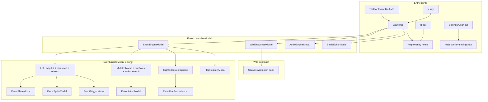

# Event Editor Full Rebuild Plan

## Context

[`tools/map_editor.py`](tools/map_editor.py) was lost and partially rebuilt ([BUG-MAP-065](docs/tracker.md)). Recovery artifacts exist (`event_engine_modal.py` ~2200 lines, 12 modal files, C++ runtime) but are **not trusted** — code was accidentally deleted and recovery may diverge from backup plans.

**Strategy:** Backup plans are the **source of truth**. **Rewrite Python modals from scratch** (recovery files = reference only). **Full C++ re-verification** of every runtime feature from plans (not audit-only). **Incremental ship** — each phase independently mergeable and tracker-updated before moving on.

---

## Confirmed decisions (from plan audit Q&A)

| Topic | Decision |
|-------|----------|
| Python rebuild | **True rewrite** — replace modal files from scratch; recovery = reference only |
| C++ scope | **Full re-verification** — treat every runtime feature as needing re-test; fix all gaps |
| Legacy workspace | **Remove** after Event Engine parity; placement via **mini-map + View in Map** |
| Mini-map | **Both** — clickable thumbnail in left panel (tiles + hulls, click sets anchor) **and** View in Map sub-modal for large maps |
| Toolbar Event btn | **Left-click → Events Launcher** |
| V key | **Also opens Events Launcher** (muscle memory preserved) |
| Battle scope | **Full** — editable Battle Editor UI **and** complete C++ runtime (party rotation, 2 trainers, scripted-loss AI, loss warp) |
| Undo/redo | **Yes — full scope** — script blocks, subflows, event CRUD, rename, trigger edits |
| Help/Settings UX | **Both buttons** — Help opens home tab; Settings/Gear opens Help on Settings tab directly |
| Delivery | **Incremental ship** — each phase DONE independently with passing tests |
| Map migration | **One-time script** — [`tools/migrate_map_events.py`](tools/migrate_map_events.py) run manually (normalize `script_1`, add default `trigger`, strip dead `interaction` keys) |
| Tracker | **Reopen FEATURE-MAP-064–088** to `IN_PROGRESS` during rebuild; add `REBUILD-NOTE: code rebuilt from backup plans after accidental deletion (BUG-MAP-065)`; mark `DONE` again when phase verified |
| Context menus | **Wire `event_script_ctx_menu.py` for both** — middle block panel **and** left events list (separate trees or shared tree with `when:` filtering) |
| Wild encounters | **Both** — WildEncounterModal **and** canvas wild patch painting on main map |

---

## Plan audit — issues found and resolved

### Contradictions fixed

1. **"Audit-only C++" vs user intent** — Original plan said "extend only if audit fails." User chose full re-verification. Phase 4 is now a dedicated C++ verification + gap-fix phase with engine smoke matrix.
2. **Phase 3 / Phase 4 split** — Subflow tabs and nested blocks are inseparable from the 3-panel UI. Merged into Phase 3 rewrite; Phase 4 focuses on C++ runtime verification.
3. **Phase 6 said "remove V key"** — User wants **V → Launcher**. Updated.
4. **Gear relabel to Help** — User wants **both Help and Settings buttons**. Gear stays; opens Settings tab; separate Help button/H key opens home.
5. **Undo deferred** — User wants full undo. Added to Phase 3 scope.
6. **Tracker FEATURE-MAP-096 umbrella only** — User wants **reopen 064–088** with rebuild note.

### Gaps added to plan

- **`tools/migrate_map_events.py`** — one-time migration script (Phase 1 create, Phase 6 run)
- **Event Engine undo/redo stacks** — separate from map tile undo (Z/R); use Ctrl+Z/Ctrl+Y or Z/Y when modal focused (define in Phase 3, document in help)
- **Mini-map rendering** — load thumbnail tile data for `ee_map_id`; draw 2×2 hulls; click-to-place selected event anchor
- **Context menu dual wiring** — events list menu ids (`ev:copy`, `ev:delete`, etc.) + block menu ids (`step:delete`, `add:<op>`, etc.) in one or two JSON trees
- **Incremental ship gate** — each phase ends with: automated commands pass + manual matrix for that phase only + tracker status update

### Remaining risks (accepted)

- **Scope** — Full battle C++ + from-scratch Event Engine + undo is multi-week; mitigated by incremental phases
- **Recovery confusion** — Rewriting from scratch may duplicate working recovery code; acceptable per user choice
- **Player party stub** — C++ may still stub player party until save system exists; document in help; not a rebuild blocker
- **2v2 double battles** — Still deferred per original FEATURE-MAP-088 plan

---

## Target architecture



---

## Phase 0 — Audit, tracker reopen, gap matrix

**Before any code changes:**

1. Reopen affected tracker entries **FEATURE-MAP-064 through FEATURE-MAP-088** (and **IMPROVEMENT-MAP-094**) to `IN_PROGRESS`.
2. Add to each entry:
   ```
   REBUILD-NOTE: Python editor code rebuilt from backup plans after accidental
   deletion (BUG-MAP-065). Prior DONE status reflected recovery artifacts, not
   verified parity with plans.
   ```
3. Run gap matrix and record results in tracker:

| Check | Command |
|-------|---------|
| Opcode meta ↔ op.cpp | `python3 tools/extract_map_script_ops.py` |
| Map-viewer handlers | `python3 tools/audit_event_script_ops.py` |
| Schema round-trip | `python3 -m unittest tests.test_event_subflow_schema -v` |
| C++ build | `make` |
| UI Standard compliance | Manual checklist per modal |

**Phase 0 DONE when:** gap matrix documented; tracker entries reopened; no code changes yet.

---

## Phase 1 — Data foundation + migration script

Rewrite from scratch (reference recovery only):

- [`tools/event_script_schema.py`](tools/event_script_schema.py) — `document_to_steps`, `steps_to_document`, `steps_to_tree`/`tree_to_steps`, `resolveControlFlow`, subflow/battle helpers
- Tooling: [`event_script_op_meta.json`](tools/event_script_op_meta.json), [`extract_map_script_ops.py`](tools/extract_map_script_ops.py), [`validate_map_events.py`](tools/validate_map_events.py)
- **New:** [`tools/migrate_map_events.py`](tools/migrate_map_events.py)
  - Normalize `actions` → `script_1` array shape
  - Add `trigger: {type: interact}` where missing
  - Remove obsolete `interaction` keys
  - Dry-run mode + `--write` flag
  - Document in [`docs/tools_doc.md`](docs/tools_doc.md)

C++ contracts to verify in Phase 4 (document expected behavior here):

- [`ScriptRuntime::loadDocument`](src/script_engine.cpp) — `script_1`, `subflows`, legacy `actions`
- [`MapData`](include/map_data.h) — events, `musicTrack`, `healPoint`
- [`GameState`](src/game_state.cpp) — flags, debounced save, crash flush

**Phase 1 DONE when:** schema/tests pass; migration script dry-run clean on `src/maps/`.

### Phase 1 implementation checklist (ready to apply in agent mode)

**1. Extend [`tools/event_script_schema.py`](tools/event_script_schema.py)** — append migration helpers:

- `TRIGGER_TYPES`, `default_event_trigger()`, `trigger_from_legacy_interaction()`
- `normalize_map_event(ev)` → `(copy, change_strings)`
- `migrate_script_document(doc, map_id)` → canonical doc via `document_to_flows` / `flows_to_document`; drop `actions`
- `script_documents_equal(a, b)` for dry-run diff

**2. New [`tools/migrate_map_events.py`](tools/migrate_map_events.py)**

- CLI: default dry-run; `--write` applies
- Scan `src/maps/*.json` (skip `maps_index.json`, `world_layout.json`)
- Per map: normalize each `events[]` entry; migrate linked script paths
- Per script: `migrate_script_document`; write only when JSON differs

**3. New [`tests/test_migrate_map_events.py`](tests/test_migrate_map_events.py)**

- `normalize_map_event`: interaction→trigger, default trigger, strip interaction
- `migrate_script_document`: actions-only → script_1; preserves subflows
- Dry-run integration on temp fixtures

**4. Update [`docs/tools_doc.md`](docs/tools_doc.md)** — `TOOL: tools/migrate_map_events.py` + schema NOTES for migration helpers

**5. Verify**

```bash
python3 -m unittest tests.test_migrate_map_events tests.test_event_subflow_schema -v
python3 tools/migrate_map_events.py          # dry-run
python3 tools/extract_map_script_ops.py
python3 tools/validate_map_events.py         # expect Maple_Town subflow error until content fixed
```

**Current repo content needing manual fix (outside migration scope):**

- `Maple_Town_event_1.json` calls `call_subflow` `my_subflow` — create library file or rename to `process`
- `Cherry_Town.json` wild patch with empty tier rows

---

## Phase 2 — Launcher, Help, Wild dual path

### Rewrite [`tools/events_launcher_modal.py`](tools/events_launcher_modal.py)

- UI-Standard; 2×3 button grid (Engine | Wild · Audio | Battle · Help)
- Back/Help on all child modals

### Help overlay ([`tools/map_editor.py`](tools/map_editor.py))

- Migrate settings into **Settings tab**; remove `settings_open` / `_draw_settings_overlay` ([IMPROVEMENT-MAP-094](docs/tracker.md))
- **Dual entry:** H / Help btn → home tab; Gear/Settings btn → settings tab
- Grouped Contents TOC + global search ([FEATURE-MAP-085](docs/tracker.md))
- Consolidated Editing modes tab
- Context-aware H from modals; `_open_help_overlay(tab, back_to)` close/reopen symmetry ([BUG-MAP-091](docs/tracker.md))

### Wild encounters — both paths

- [`tools/wild_encounter_modal.py`](tools/wild_encounter_modal.py) — independent map picker, species favorites
- **Keep** canvas wild patch painting on main map (FEATURE-MAP-050 pattern)
- Ensure map_editor wild helpers exist (`_wild_default_patch`, etc.)

**Phase 2 DONE when:** launcher opens all apps; Help/Settings dual buttons work; wild modal + canvas paint both functional.

---

## Phase 3 — Event Engine rewrite (largest phase)

**Replace [`tools/event_engine_modal.py`](tools/event_engine_modal.py) entirely** — write new file using [`wild_encounter_modal.py`](tools/wild_encounter_modal.py) + [UI-Standard-Rule](.cursor/rules/UI-Standard-Rule.mdc) as templates.

### Layout

```
┌─────────────────────────────────────────────────────────────────┐
│ · · · Event Engine · · ·          [Prefs][Flags][Help][←Back][X]│
├──────────────┬──────────────────────────────┬───────────────────┤
│ map search   │ subflow tabs + block editor  │ opcode docs       │
│ mini-map     │ + action search/favorites  │ (collapsible)     │
│ events list  │                              │                   │
└──────────────┴──────────────────────────────┴───────────────────┘
```

- 2 vertical + 1 horizontal splitters; persist fractions in `eventEngine` config
- Collapsible left column + doc panel ([FEATURE-MAP-081](docs/tracker.md))

### Left panel

- Map picker with independent session buffer
- **Mini-map:** thumbnail tiles + event hulls; **click sets selected event anchor** (clamp 2×2)
- Events list: CRUD, rename, unified delete, checkboxes
- **View in Map** sub-modal for precise placement on large maps ([`event_place_modal.py`](tools/event_place_modal.py))

### Middle panel (includes Power-Automate features)

- Subflow tab strip + library browser ([FEATURE-MAP-074](docs/tracker.md))
- Nested blocks: if_flag, repeat, if_var, region, comment, label
- Drag/drop; insert inside open blocks; reject orphan `end_*` drops
- Action search: collapsible categories, paired sort, favorites
- Subflow delete + skip-confirm prefs ([FEATURE-MAP-084](docs/tracker.md))
- Double-click → [`event_action_modal.py`](tools/event_action_modal.py) ([FEATURE-MAP-082](docs/tracker.md))

### Context menus — both panels

Wire [`tools/event_script_ctx_menu.py`](tools/event_script_ctx_menu.py):

- **Events list RMB** — tree with `when: row` / `when: no_row` for ev:* actions
- **Block panel RMB** — tree with step:* and add:* actions
- Config in `map_editor_config.json`; fallback to defaults on invalid JSON
- Cascading flyout rendering + hit tests in event_engine_modal

### Undo/redo (new — not in original backup plans)

- Stacks scoped to Event Engine session (separate from map tile Z/R)
- Checkpoints before: block edit, subflow change, event add/delete/rename, trigger save
- **Ctrl+Z / Ctrl+Y** when Event Engine focused (document in Help Keys tab)
- Cap depth ~50; clear on modal close or map switch

### Sub-modals (rewrite or verify UI-Standard)

[`event_action_modal.py`](tools/event_action_modal.py), [`event_trigger_modal.py`](tools/event_trigger_modal.py), [`event_sprite_modal.py`](tools/event_sprite_modal.py), [`event_place_modal.py`](tools/event_place_modal.py), [`event_doc_popout_modal.py`](tools/event_doc_popout_modal.py), [`flag_registry_modal.py`](tools/flag_registry_modal.py)

- Shared spacing via [`modal_text.py`](tools/modal_text.py) ([FEATURE-MAP-083](docs/tracker.md))
- Modal input isolation — no global map shortcuts leak

**Phase 3 DONE when:** Event Engine usable end-to-end; undo works; ctx menus both panels; mini-map + View in Map placement; manual matrix passes at 800×600.

---

## Phase 4 — C++ full runtime re-verification

Treat every feature from backup plans as **needs re-test**, not assumed working.

### Verification matrix (implement fixes for any failure)

| Feature | Source plan | Verify |
|---------|-------------|--------|
| Nested if_flag/repeat | 3-panel rework | Script with nested blocks in map viewer |
| call_subflow + library | Power-Automate | Named args → callee locals; return to caller |
| goto/label/stop_script | Power-Automate | Jump + early exit |
| set_var/if_var | Power-Automate | int/string/bool comparisons |
| Triggers + solid interact | Power-Automate | step_on once; interact blocks 2×2 |
| GameState persist + crash flush | Power-Automate | Flag survives restart |
| walk/run rail | UX + walk steps | direction+steps+faceFirst chaining |
| set_route_music / play_music_once | Enhancements | Map musicTrack + opcode fade |
| start_trainer_battle | Enhancements | All outcome modes |

### Walk/run ([FEATURE-MAP-071](docs/tracker.md))

- Confirm rail invariant in [`src/map_view.cpp`](src/map_view.cpp) — no greedy pathfinding

**Phase 4 DONE when:** engine smoke matrix passes; `make` + extractor + audit exit 0.

---

## Phase 5 — Satellites: Audio + Battle (full scope)

### Audio — rewrite/verify [`tools/audio_engine_modal.py`](tools/audio_engine_modal.py)

- Independent map picker; **`musicTrack`** key ([BUG-MAP-095](docs/tracker.md))
- pygame preview; C++ [`MusicManager`](src/music_manager.cpp)

### Battle Editor — rewrite [`tools/battle_editor_modal.py`](tools/battle_editor_modal.py)

- Full editable UI: music, background, outcome mode, scriptedLossTurns, 1–2 trainers, party rows (species picker + level)
- Rich `start_trainer_battle` in [`event_action_modal.py`](tools/event_action_modal.py)

### C++ battle — complete MVP ([FEATURE-MAP-088](docs/tracker.md))

- Multi-mon party send-out (player + foe)
- Sequential 2-trainer flow
- `scriptedLossTurns` OHKO AI after N player turns
- Loss warp: opcode → healPoint → global default; skip onComplete on loss

**Phase 5 DONE when:** Battle Editor saves editable battles; all three outcome modes pass engine smoke.

---

## Phase 6 — Legacy removal + migration + routing

1. Run `python3 tools/migrate_map_events.py --write` on repo maps (after backup)
2. **Remove** from [`tools/map_editor.py`](tools/map_editor.py):
   - `events_workspace_open`, `_toggle_events_workspace`, `_draw_events_workspace_overlay`, `_draw_events_list_panel`, canvas event hull path
3. **Unify entry:**
   - Event toolbar btn (LMB) → `events_launcher_modal.open_modal()`
   - **V key** → same launcher (rebind `toggle_events_workspace` → `open_events_launcher` or alias)
4. Input priority: Help → sub-modals → Event Engine → Launcher → Wild/Audio/Battle → map
5. Block map paint while any event modal open
6. Update help text for removed V workspace behavior

**Phase 6 DONE when:** no legacy workspace code remains; V and Event btn both open launcher; migrated maps load correctly.

---

## Phase 7 — Final verification + tracker close

### Automated (full suite)

```bash
make
python3 tools/extract_map_script_ops.py
python3 tools/audit_event_script_ops.py
python3 tools/validate_map_events.py
python3 tools/migrate_map_events.py --dry-run
python3 -m unittest discover -s tests -v
python3 -m ast tools/event_engine_modal.py
python3 -m ast tools/map_editor.py
```

### Manual UI matrix (800×600 + 1280×800)

| Area | Checks |
|------|--------|
| Entry | Event btn + V → Launcher; Help vs Settings buttons |
| Event Engine | Splitters, mini-map click, View in Map, undo Ctrl+Z/Y, ctx menus both panels |
| Subflows | Tabs, library, delete + skip confirm |
| Triggers | All 4 types; solid NPC in game |
| Wild | Modal map picker + canvas patch paint |
| Audio/Battle | Full edit flows |
| Help | Settings tab, global search, H context, Back restores modal |
| Regression | Map tile Z/R undo, overworld `#`, paint when modals closed |

### Tracker close

Mark **FEATURE-MAP-064–088** and **IMPROVEMENT-MAP-094** back to `DONE` with note:

```
REBUILD-VERIFIED: Rebuilt from backup plans; manual + automated matrix passed [date].
```

---

## Map-editor backup plans — scope

| Plan | In rebuild? |
|------|-------------|
| [`map_editor_help_overlay`](backups/cursor_plans_backup_20260708/map_editor_help_overlay_2ad0e4d3.plan.md) | Yes — Phase 2 foundation |
| [`map_editor_ui_scaling`](backups/cursor_plans_backup_20260708/map_editor_ui_scaling_7d9478e3.plan.md) | Yes — apply clamp/splitter math to all modals |
| [`map_editor_undo_redo`](backups/cursor_plans_backup_20260708/map_editor_undo_redo_8904772e.plan.md) | Partial — map tile undo stays; Event Engine undo is separate (Phase 3) |
| Tile layers, world workspace, save/open, advanced features, C++ viewer | No |

---

## Files to rewrite from scratch

| File | Phase |
|------|-------|
| [`tools/event_engine_modal.py`](tools/event_engine_modal.py) | 3 |
| [`tools/events_launcher_modal.py`](tools/events_launcher_modal.py) | 2 |
| [`tools/battle_editor_modal.py`](tools/battle_editor_modal.py) | 5 |
| [`tools/event_action_modal.py`](tools/event_action_modal.py) | 3 |
| [`tools/event_trigger_modal.py`](tools/event_trigger_modal.py) | 3 |
| [`tools/event_place_modal.py`](tools/event_place_modal.py) | 3 |
| [`tools/event_sprite_modal.py`](tools/event_sprite_modal.py) | 3 |
| [`tools/event_doc_popout_modal.py`](tools/event_doc_popout_modal.py) | 3 |
| [`tools/flag_registry_modal.py`](tools/flag_registry_modal.py) | 3 |
| [`tools/audio_engine_modal.py`](tools/audio_engine_modal.py) | 5 |
| [`tools/migrate_map_events.py`](tools/migrate_map_events.py) | 1 (new) |
| [`tools/map_editor.py`](tools/map_editor.py) | 2+6 (integration + legacy removal only) |

## C++ files to re-verify / extend

[`src/op.cpp`](src/op.cpp), [`src/map_view.cpp`](src/map_view.cpp), [`src/script_engine.cpp`](src/script_engine.cpp), [`src/game.cpp`](src/game.cpp), [`src/game_state.cpp`](src/game_state.cpp), [`src/battle.cpp`](src/battle.cpp), [`src/music_manager.cpp`](src/music_manager.cpp)

---

## Incremental ship gates (each phase)

Before marking a phase DONE:

1. Automated commands for that phase pass
2. Manual matrix rows for that phase pass
3. [`docs/tools_doc.md`](docs/tools_doc.md) / [`docs/source_doc.md`](docs/source_doc.md) updated
4. Affected tracker entries updated (IN_PROGRESS → DONE with REBUILD-VERIFIED when final)
