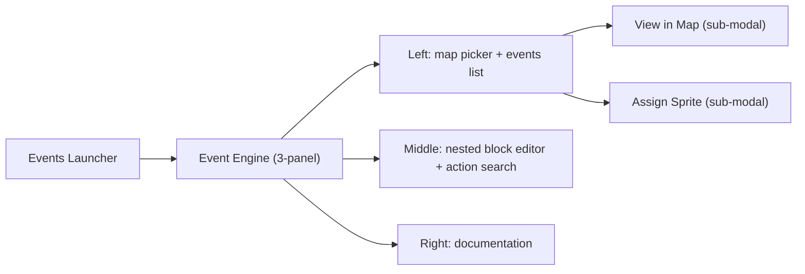

# Event Engine 3-Panel Rework

This is a large, multi-subsystem feature (C++ engine + Python tooling + editor UI). It is phased so engine/tooling land first (everything else depends on the new opcodes), then the UI. Each phase is independently testable.

## Confirmed decisions
- Keep the launcher; clicking **Event Engine** opens the new 3-panel modal. Remove only the floating `_draw_events_list_panel` popover.
- Map-selector scope is a **config toggle** (default: operate on the selected map's files independently; optional: also switch the main editor's loaded map).
- **Real** nested control flow in the engine (new opcodes), not visual-only.
- "View in Map" and "Assign Sprite" are **full UI-Standard modals**.
- Event delete: checkbox multi-select delete **and** single-selected delete.

## Architecture (data + runtime)
- Events: `events[]` in `src/maps/<map>.json`; each event's script is `src/maps/scripts/<map>/<event>.json` (`script_1` flat array of one-key objects).
- Runtime: flat `ScriptRuntime::pc` interpreter on `Game::mapScript_`; opcodes mutate `pc`; `unless_flag` does a relative jump (`++pc; if !flag pc += skip`).
- Nested editor model: parse flat list -> tree (if_flag/repeat are containers up to matching end marker) for display/editing; flatten DFS back to a flat list with end markers on save. On-disk + runtime stay flat-compatible.

## Phase 1 - Engine: nested control-flow opcodes (C++)
Files: [include/script_engine.h](include/script_engine.h), [src/script_engine.cpp](src/script_engine.cpp), [src/op.cpp](src/op.cpp).
- Add `ScriptLoopFrame { size_t bodyStartPc; int remaining; }` and `std::vector<ScriptLoopFrame> loopStack;` to `ScriptRuntime`; clear in `reset()`.
- New opcodes in `mapScriptDispatchOpcode` (in `src/op.cpp`, since the extractor scans this file):
  - `if_flag` (args `name`, `skip`): `++pc; if !truthyFlag(flags,name) pc += skip;` (skip = body action count, excludes `end_if`).
  - `end_if`: marker, `++pc`.
  - `repeat` (args `n`, `skip`): if `n<=0` jump past body via `skip`; else push `{pc+1, n}`, `++pc`.
  - `end_repeat`: if loopStack top `--remaining>0` set `pc=bodyStartPc` else pop and `++pc`.
- Add `resolveControlFlow()` called from `ScriptRuntime::loadDocument` after `actions` is built: stack-pair `if_flag/end_if` and `repeat/end_repeat`, write correct `args.skip` so hand-authored JSON and the editor never need manual counts. Validate balanced pairs (log + safe fallback on mismatch).
- `map_view.cpp`: no changes (pure control flow).
- Build with `make`.

## Phase 2 - Tooling sync (event-script-opcode-docs skill)
Files: [tools/event_script_op_meta.json](tools/event_script_op_meta.json), [tools/extract_map_script_ops.py](tools/extract_map_script_ops.py), [tools/event_script_ops_generated.py](tools/event_script_ops_generated.py), [tools/event_script_schema.py](tools/event_script_schema.py), [tools/event_script_opcode_docs.py](tools/event_script_opcode_docs.py), [tools/validate_map_events.py](tools/validate_map_events.py), [docs/event_script_ops.md](docs/event_script_ops.md).
- Add meta entries for the 4 new ops (label, status, category "Control flow" (new), description, default_args, args_help). Mark `if_flag`/`repeat` as containers via a new meta hint (e.g. `"block": "open"`, `"end": "end_if"`) so the editor knows pairing.
- Run `python3 tools/extract_map_script_ops.py` until exit 0 (C++/meta parity).
- `event_script_schema.py`: add `steps_to_document`/`document_to_steps` tree<->flat helpers (compute `skip`, emit end markers); add a nested-tree representation used by the editor; balanced-pair validation.
- `validate_map_events.py`: validate balanced `if_flag/end_if` and `repeat/end_repeat`; run to exit 0.
- Update `docs/event_script_ops.md` inventory + a "Control flow / nesting" section.

## Phase 3 - Event Engine modal shell: 3 panels + splitters (UI Standard)
File: [tools/event_engine_modal.py](tools/event_engine_modal.py) (rewrite body), reference [tools/wild_encounter_modal.py](tools/wild_encounter_modal.py) and [.cursor/rules/UI-Standard-Rule.mdc](.cursor/rules/UI-Standard-Rule.mdc).
- Keep UI-Standard chrome (title bar drag, BR/BL resize, persisted `_panel_override`, Help/Back/Close).
- Body split into 3 columns by 2 draggable vertical splitters (default 1/3 each, clamped to min widths). Left column further split by 1 draggable horizontal splitter (default half/half) into map-picker (top) and events-list (bottom).
- Persist splitter fractions in config; clamp every frame so nothing is clipped on shrink.

## Phase 4 - Left panel: map picker + events list + CRUD + context menu
File: [tools/event_engine_modal.py](tools/event_engine_modal.py), helpers in [tools/map_editor.py](tools/map_editor.py).
- Map picker (top-left): scrollable list of maps from `src/maps/*.json` with a text search box (filter by stem). Selecting a map loads its `events[]` into an Event Engine session buffer.
- Events list (bottom-left): rows for the selected map's events; scrollable. Per-row checkbox for multi-select. Buttons: Add, Copy, Paste, Delete-selected (single), Delete-checked (multi). Left-click selects + loads its script into the middle editor.
- New session model: Event Engine owns `ee_map_id`, `ee_events`, `ee_dirty` so it can edit a map other than the main editor's loaded map; save writes back to that map's JSON + script files. When scope toggle = follow main editor (Phase 9), reuse `self.map_events` and trigger main `load_map`.
- Right-click on an event row -> context menu: Copy, Paste, Delete, View in Map, Assign Sprite.

## Phase 5 - "View in Map" sub-modal (UI Standard)
File: new `tools/event_place_modal.py`, instantiated in `MapEditor.__init__`.
- Full-window UI-Standard modal that renders the selected map's tiles and existing event hulls; click a tile to set the event's `anchor` (reuse `_events_clamp_anchor`, `EVENT_FOOTPRINT_TILES`).
- Provide an arbitrary-map render context: if selected map == main loaded map use existing render; otherwise load that map's tile/render data into a read-only buffer for the modal (does not disturb the main session in independent mode).

## Phase 6 - "Assign Sprite" sub-modal (UI Standard)
File: new `tools/event_sprite_modal.py`.
- Wrap existing sprite-picking logic (`_open_event_script_sprite_picker`, `_apply_picked_sprite`, 4x4 character frame picker `_draw_events_character_frame_overlay`, facing) inside a UI-Standard modal; write `ev["sprite"]` for the selected event.

## Phase 7 - Middle panel: nested block editor + action search + favorites
File: [tools/map_editor.py](tools/map_editor.py) (extend `_draw_event_script_editor_modal` + handlers) or a dedicated drawer used by the modal.
- Render steps as draggable block cards; `if_flag`/`repeat` are containers that indent their child blocks (parsed via Phase 2 tree). Drag-drop reorders and moves blocks into/out of containers; end markers are implicit (managed by the tree).
- Right-click inside the middle panel only -> context menu: Copy, Paste, Add, Delete, Show Documentation (Show Documentation routes the focused opcode to the right panel).
- Action search (right edge of middle panel): search box + results grouped by category (existing `category` meta + new "Control flow"); a "Favorites" tab pinned at top. Favorite/unfavorite any opcode (star toggle); persist favorites in `map_editor_config.json` (`eventScriptEditor.favorites`). Drag actions from results into the block list.

## Phase 8 - Right panel: documentation
File: [tools/map_editor.py](tools/map_editor.py) doc builder (`_event_script_rebuild_doc_lines`, `event_script_opcode_docs.build_structured_doc_lines`).
- Render the structured opcode docs in the right column; updated by selection, hover, palette pin, or "Show Documentation". Wrap text to column width (reuse `_expand_visual_text_lines`) so nothing clips.

## Phase 9 - Settings toggle for map scope
File: [tools/map_editor.py](tools/map_editor.py) `_draw_help_settings_controls` + config.
- Add a toggle "Event Engine: selecting a map switches the main editor" (default OFF = independent). Persist as `eventEngine.selectSwitchesMainMap`. Wire Phase 4 behavior off this flag.

## Phase 10 - Remove popover; wire launcher -> new modal; input routing
File: [tools/map_editor.py](tools/map_editor.py), [tools/events_launcher_modal.py](tools/events_launcher_modal.py).
- Remove the floating `_draw_events_list_panel` rendering inside the Event Engine body (replaced by Phase 4). Keep the legacy `v` events workspace only if still desired (decide: route it through the new modal).
- Ensure run()-loop routing covers the new sub-modals (`event_place_modal`, `event_sprite_modal`) in wheel/motion/mousedown/up/keydown with correct priority (sub-modals above Event Engine; help overlay on top), and block map painting while any are open (extend existing `and not ..._modal.open` guards).

## Phase 11 - Docs, tracker, verification
- Tracker: log entries before substantive work and mark DONE after (per [.cursor/skills/planning-rule/SKILL.md](.cursor/skills/planning-rule/SKILL.md)) in [docs/tracker.md](docs/tracker.md): one FEATURE for the 3-panel rework, one FEATURE for nested opcodes, plus BUG entries for any clipping found.
- Docs: update [docs/source_doc.md](docs/source_doc.md) and [docs/tools_doc.md](docs/tools_doc.md) for all new files/methods and engine changes.
- Automated: `make`; `python3 tools/extract_map_script_ops.py` exit 0; `python3 tools/validate_map_events.py` exit 0; `python3 -c "import ast; ast.parse(open('tools/map_editor.py').read())"` and same for new modal files.
- Manual UI matrix (required): small window (~800x600) and typical size; drag/resize the modal and each splitter to extremes; scroll the map list, events list, block list, and action search; confirm no panel/list/menu/sub-modal is clipped (clamp to parent rects); verify RMB menus only trigger in their intended panels; verify Esc/Back priority with help overlay open; regression-check Wild Encounters modal and main tile editing still receive input correctly.
- Engine test: author a script with `if_flag`/`end_if` and `repeat`/`end_repeat` (including nested), run it in the map viewer, confirm correct skipping/looping and that `resolveControlFlow` fills `skip` correctly.