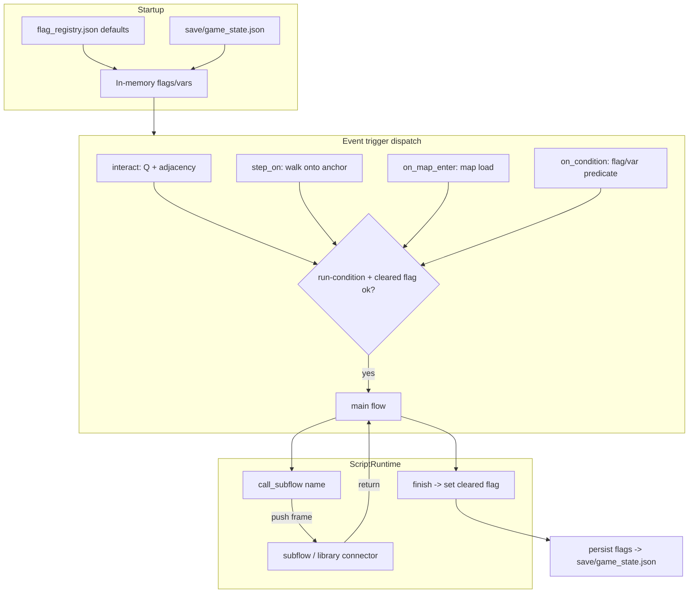

# Event Engine Power-Automate Overhaul

## Goal and acceptance criteria

A single comprehensive pass delivering editor UX + C++ runtime + tooling/docs. **Done when:**

1. **Subflows (subprocesses):** middle block panel has a tab strip (Main Flow + subflow tabs). A far-left menu button searches/opens subflows and the custom-connector library. Tab right-click menu: Close Tab, Close all but this, Close all, Rename, Save. Per-event subflows are stored in the event's script file; a global library of reusable "custom connectors" is callable across events. `call_subflow` runs one like a method (**accepts named arguments that become local variables in the callee**) and returns to the caller.
2. **Flow control:** `stop_script` (end early) and **`goto {label}` + `label {name}`** (jump to a named label and continue below it) work at runtime. The editor's `goto` arg is a dropdown of all labels available in the current flow.
3. **Regions + comments:** `region`/`end_region` (renamable, collapsible, nest) and `comment {text}` are no-op **organization-only** opcodes stored in the script and skipped by C++. Regions are purely for nesting/collapsing code; they have **no** effect on control flow or skipping.
4. **Action modal:** right-click/button "Open in modal" shows one labeled, type-aware field per arg plus a variable picker/creator (inline editing also still works). Per-event scratch variables via `set_var` / `if_var` (types: int/string/bool; comparisons `==, !=, <, >`).
5. **Documentation panel:** collapsible, searchable, readable, with a full-window pop-out modal (no text clipping).
6. **Map/event selector:** collapsible.
7. **Triggers + cleared flag:** event context menu "Change Trigger" supports interact (talk), step_on (walk-on), on_map_enter, on_condition. **interact (talk) events are solid** (block their 2x2 footprint so the player bumps into and faces them like a normal NPC); step_on events stay walkable. Engine auto-manages a per-event cleared flag; event JSON stores trigger type, optional run-condition, and set/clear-flags-on-complete. step_on fires once then is gated by the cleared flag.
8. **Persistent game state:** `save/game_state.json` loaded at startup, written on flag/var change (debounced) + on map change/warp + clean exit, **and flushed on crash** (signal/atexit handler). A debug toggle dumps clear/concise state into a `debug/` folder in the source tree. A central registry UI declares/edits flags & variables; C++ reads it at startup for defaults.
9. Read/write of flags works from both the editor and the C++ engine.
10. All tooling parity, validation, docs, and tracker rules satisfied; QA/perf/security review passes.

## Runtime call + trigger model

---

## Phase A — C++ runtime

### A1. Persistent game state + registry + crash safety
**Files:** [include/game.h](include/game.h), [src/game.cpp](src/game.cpp), new [include/game_state.h](include/game_state.h), new [src/game_state.cpp](src/game_state.cpp), new `save/game_state.json`, new `src/maps/scripts/flag_registry.json`.

- New `GameState` owning `std::map<string,bool> flags` and `std::map<string, Value> variables` (variables are runtime/scratch by spec, so persistence is flags-only; keep schema room but do not persist scratch vars).
- Load order: read `flag_registry.json` defaults, then overlay `save/game_state.json`.
- Save: `saveToDisk()` writes a compact, human-readable JSON (sorted keys) atomically (temp file + rename). Debounced "dirty" flag flushed on change; forced flush on map change/warp (`executePendingMapWarp_`) and clean shutdown.
- **Crash safety:** install `std::signal` handlers (SIGSEGV/SIGABRT/SIGINT/SIGTERM) + `std::atexit` that flush the current flags via an async-signal-tolerant minimal writer; guard re-entrancy. Document the limited safety of signal-context writes.
- **Debug option:** a toggle (config/env `EVENT_DEBUG_STATE=1`) that additionally writes timestamped dumps to `debug/state_dumps/` in the source tree (created if missing).

### A2. ScriptRuntime: subflows, flow control, vars, no-ops
**Files:** [include/script_engine.h](include/script_engine.h), [src/script_engine.cpp](src/script_engine.cpp), [src/op.cpp](src/op.cpp).

- Extend `ScriptRuntime`: `std::map<string, json> flows` (main + in-file subflows), `std::string activeFlow`, `std::vector<CallFrame> callStack` (flowName + return pc + **per-frame local variable scope**), recursion depth guard. `loadDocument` ingests `script_1` (main) and a `subflows` object; `resolveControlFlow` runs per flow.
- **Variable scoping:** each call frame owns a local variable scope; `call_subflow` seeds the callee's locals from its named args (method-like). `set_var`/`if_var` operate on the current frame's scope. Variables are scratch (not persisted); cross-flow/persistent state uses flags. Var types: int/string/bool with `==, !=, <, >`.
- **Per-flow label index:** at load, build a `label name -> pc` map per flow (alongside `resolveControlFlow`) so `goto` is O(1).
- Reference flags through `GameState` instead of the wiped per-run map: add `onReadFlag/onWriteFlag` callbacks (wired in [src/map_view.cpp](src/map_view.cpp) `wireMapScriptCallbacks_`) so `set_flag`/`clear_flag`/`if_flag`/`unless_flag` read/write persistent state and mark it dirty. Keep `flags` local fallback for headless tests.
- New opcodes in [src/op.cpp](src/op.cpp) `mapScriptDispatchOpcode` (must appear as `if (op == "...")` for the extractor):
  - `call_subflow {name, args?}` — resolve in-file subflow first, else library connector via `onLoadLibrarySubflow(name)`; push frame with locals seeded from `args`; switch `activeFlow`, `pc=0`; depth-guarded. On callee finish, pop frame and resume caller at return pc.
  - `stop_script` — finish whole script (clear callStack), unlock player (parallels `end_script`).
  - `label {name}` — no-op marker `++pc` (target for `goto`).
  - `goto {label}` — set `pc` to the label's index within the current flow (validated; unknown label is a no-op `++pc` + stub log).
  - `comment {text}` — no-op `++pc`.
  - `region {name}` / `end_region` — no-op `++pc`; organization-only markers for editor nesting (engine ignores; **not** control flow).
  - `set_var {name,value}` and `if_var {name,op,value}` / `end_if_var` — scratch variable set + conditional block (mirrors `if_flag` skip mechanism in `resolveControlFlow`).
- `resolveControlFlow` pairing extended to pair `if_var`/`end_if_var`; `region`/`end_region` and `label` are excluded from skip stamping (pure markers).

### A3. Event triggers + cleared flag
**Files:** [include/map_data.h](include/map_data.h), [src/map_data.cpp](src/map_data.cpp), [src/map_view.cpp](src/map_view.cpp).

- Extend `MapEventInstance` with parsed `trigger` (`type` + optional `condition`), `onComplete` (`setFlags`/`clearFlags`), and derived `clearedFlag` (default `"<id>_cleared"`).
- Parse these in `map_data.cpp` (currently `interaction` is dropped).
- **Solid talk events:** events with `trigger.type == interact` block their 2x2 footprint. Add the event footprint to the movement collision test (the `mapPlayerFootprintBlockedAt_` path used by `requestPlayerMoveOnMap_`), so the player bumps into and faces the NPC instead of walking through. `step_on` (and other) events remain walkable.
- Dispatch:
  - `interact`: keep `tryStartNearbyMapScript_` Q-path, but gate by run-condition + cleared flag.
  - `step_on`: hook into walk-completion (same site as wild-encounter `rollWildEncounterOnStep_`), fire when player footprint overlaps the event anchor; fire once then gated by cleared flag.
  - `on_map_enter`: evaluate after `loadMapForView_`/world load.
  - `on_condition`: evaluate on map enter and after any flag write.
- On natural script finish, set the cleared flag and apply `onComplete` set/clear, then mark state dirty (persist per A1).

---

## Phase B — Tooling sync (opcode-docs skill)
**Files:** [tools/event_script_op_meta.json](tools/event_script_op_meta.json), [tools/extract_map_script_ops.py](tools/extract_map_script_ops.py) (run it), [tools/audit_event_script_ops.py](tools/audit_event_script_ops.py), [tools/event_script_ops_generated.py](tools/event_script_ops_generated.py) (generated), [tools/event_script_schema.py](tools/event_script_schema.py), [tools/validate_map_events.py](tools/validate_map_events.py), [docs/event_script_ops.md](docs/event_script_ops.md).

- Add meta entries (label/status/category/description/default_args/args_help/required_params, plus `block`/`end` for `region`/`if_var`) for: `call_subflow`, `stop_script`, `goto`, `label`, `comment`, `region`, `end_region`, `set_var`, `if_var`, `end_if_var`. New categories: "Subflow / organization", "Variables".
- `extract_map_script_ops.py` exit 0 (meta ↔ op.cpp parity); `audit_event_script_ops.py` exit 0.
- `event_script_schema.py`: `steps_to_tree`/`tree_to_steps` handle region/if_var nesting (and `label` markers); document read/write round-trips the `subflows` object and event `trigger`/`onComplete` metadata; `validate_balanced` covers new block pairs and region balance; helper to enumerate labels in a flow (for the editor dropdown).
- `validate_map_events.py`: validate `trigger.type` enum, optional `condition` shape, `onComplete` arrays, `call_subflow` references resolve (in-file or library), and `goto` targets reference an existing `label` in the same flow.
- `docs/event_script_ops.md`: opcode inventory + sections for subflows/library, flow control, regions/comments, variables, triggers, and the save-state/registry model.

---

## Phase C — Editor UI ([tools/event_engine_modal.py](tools/event_engine_modal.py) + new sub-modals)

### C1. Subflow tabs + library browser
- Tab strip across the top of the middle block panel: Main Flow tab + one tab per open subflow. Far-left menu button opens a searchable picker for the event's subflows and the global connector library (open/create). Tab right-click menu: Close Tab / Close all but this / Close all / Rename / Save. Switching tabs swaps `self.tree` for that flow; track open tabs + active flow; persist nothing fragile (re-derive from file).
- Custom-connector library stored under `src/maps/scripts/_library/<name>.json`; editable as its own tab; `call_subflow` palette inserts a reference.

### C2. Regions + comments + labels
- Palette actions for `region`/`comment`/`label`; `_flatten` renders region as a collapsible, renamable container (reuse block-open nesting + a collapse toggle stored per path); comment rendered as a distinct non-action card; `label` rendered as a named anchor marker. Regions are organization-only (no control-flow effect).

### C3. Action modal (new [tools/event_action_modal.py](tools/event_action_modal.py))
- UI-Standard sub-modal opened from block context menu / button: one labeled, type-aware field per arg (from meta `args_help`/defaults), plus a variable picker/creator (lists registry flags + scratch vars, can create new). The `goto` opcode's `label` arg renders as a dropdown of all labels in the current flow (via the schema label-enumeration helper). `call_subflow` shows editable named-argument rows. Inline editing remains.

### C4. Documentation panel
- Make `_draw_doc_panel` collapsible (header toggle), add a search box that filters/highlights, add `doc_scroll` + wheel handling (currently clipped with no scroll), and a "Pop out" button opening a new full-window UI-Standard [tools/event_doc_popout_modal.py](tools/event_doc_popout_modal.py) (search + scroll + wrap to width).

### C5. Collapsible map/event selector
- Add collapse toggles for the left map picker and events list; `_relayout` honors collapsed sizes; clamp so nothing clips.

### C6. Trigger editor + cleared flag (new [tools/event_trigger_modal.py](tools/event_trigger_modal.py))
- Event context menu gains "Change Trigger"; modal edits trigger type, run-condition (flag/var predicate), and set/clear-flags-on-complete; shows the auto cleared flag. Writes back into the event JSON via `write_map_events`.

### C7. Flag/variable registry (new [tools/flag_registry_modal.py](tools/flag_registry_modal.py))
- UI to declare/list/rename flags & variables with initial values and descriptions; persists `flag_registry.json`. Picker in C3/C6 reads from it.

### C8. Input routing / map_editor wiring
**File:** [tools/map_editor.py](tools/map_editor.py) — instantiate and route input (priority order) for the new sub-modals; block map painting/hover while any is open; add config helpers as needed.

---

## Tracker + docs (repo rules)

Log **before** implementation in [docs/tracker.md](docs/tracker.md) (one responsibility each), e.g.:
- FEATURE-MAP-072 Persistent game-state save + crash safety + debug dumps
- FEATURE-MAP-073 Flag/variable registry (editor + C++ defaults)
- FEATURE-MAP-074 Subflows + custom-connector library + call_subflow
- FEATURE-MAP-075 Flow control: stop_script / goto + label
- FEATURE-MAP-076 Regions + comments + labels (no-op organization)
- FEATURE-MAP-077 Per-event scratch variables (set_var/if_var)
- FEATURE-MAP-078 Event triggers (interact/step_on/on_map_enter/on_condition) + auto cleared flag
- FEATURE-MAP-079 Action edit modal + variable picker
- FEATURE-MAP-080 Docs panel collapsible/search/pop-out + collapsible selector

Update [docs/source_doc.md](docs/source_doc.md) (C++ runtime, GameState, triggers) and [docs/tools_doc.md](docs/tools_doc.md) (new modals, schema, meta) after completion; reference IDs in substantive code comments.

---

## Verification

### Automated
- `make`
- `python3 tools/extract_map_script_ops.py` (exit 0)
- `python3 tools/audit_event_script_ops.py` (exit 0)
- `python3 tools/validate_map_events.py` (exit 0)
- `python3 -m unittest discover tests -v` (add tests: subflow call/return + named-arg locals + recursion guard, goto/label jump + unknown-label safety, region/comment/label no-op, if_var (int/string/bool comparisons), trigger gating + cleared flag, game_state load/save round-trip, registry defaults overlay)
- AST parse all touched/new Python modules.
- Small C++ check: call_subflow seeds locals + returns to caller; goto jumps to label; stop_script ends nested flow; flags persist across two script runs; cleared flag gates re-trigger.

### Manual UI matrix (Event Engine)
- Window ~800x600 and typical size; resize; scroll every list.
- Subflow tabs: open/close/rename/save, "close all but this", far-left library search; confirm tab strip not clipped.
- Regions collapse/expand/rename; comment renders as non-action; label renders as a marker.
- Action modal: per-arg fields, create + insert a variable; `goto` label dropdown lists current-flow labels; `call_subflow` named-arg rows.
- Docs: collapse, search, pop-out full-window, confirm no text cutoff.
- Collapsible map/event selector.
- Change Trigger modal for each trigger type; cleared flag shown.
- Registry modal: add/rename flag + variable with initial value.

### Manual engine matrix (map viewer)
- step_on event fires once, then gated by cleared flag after revisit.
- interact still works AND the talk event is solid (player bumps into it, cannot walk through); on_map_enter and on_condition fire when expected.
- call_subflow executes a library connector with named args and returns; goto jumps to a label; stop_script halts early.
- Persisted flag unlocks "more content" on a later visit; restart app and confirm state survives; kill process mid-run and confirm crash flush preserved state.

### QA / perf / security (/qa-ram-performance)
- Hot paths: trigger checks on walk completion and on_condition re-eval must be O(events), no per-frame disk I/O (debounce writes; cache library subflow JSON).
- Memory: bound subflow call depth; cache parsed library connectors; avoid copying large `actions` arrays per step (reference active flow).
- Security: atomic temp-file writes; reject `..` in subflow/library/script paths; validate registry/trigger inputs; signal-handler writer must avoid unsafe allocations where possible and be re-entrancy guarded.
- Regression: Wild Encounters modal, Help overlay Esc/Back priority, main tile painting while modals closed.