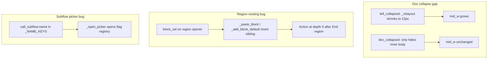

# Event Engine UI: collapse, nesting, palette, subflow picker

## Goal and acceptance criteria

| # | Request | Done when |
|---|---------|-----------|
| 1 | Doc panel collapses like map/events selector | Collapsing docs shrinks right column to ~22px strip, middle column expands; expand restores prior width; Pop still works |
| 2 | Collapsible action categories with indent | Each category header has caret; collapsed hides ops; visible ops indented one level under header |
| 3 | Paired palette order | Within each category, block openers appear immediately before their `end_*` counterpart (user choice: keep both visible) |
| 4 | Region/block nesting visible | Adding/pasting with an open block selected inserts **inside** `children`; nested rows indent +1 per depth; region/if/repeat all collapsible |
| 5 | Subflow picker lists subflows | `call_subflow` Pick lists in-file subflows + `_library` connectors, not flag/variable registry |

## Root causes (from codebase audit)



- **Doc panel:** [`event_engine_modal.py`](tools/event_engine_modal.py) `doc_collapsed` only zeroes inner rects in `_draw_doc_panel()` (~1168–1171); `_relayout()` has no `doc_collapsed` branch (unlike `left_collapsed` at ~633–650).
- **Nesting:** `_paste_block()` / `_add_block_default()` always use `(block_sel[:-1], block_sel[-1] + 1)` (~1628–1642) — sibling insert even when selection is an open block.
- **Subflow picker:** [`event_action_modal.py`](tools/event_action_modal.py) `_open_picker()` (~368–376) has no `call_subflow` branch; `name` triggers flag/variable picker via `_NAME_KEYS`.

---

## Implementation plan

### 1. Documentation panel — layout-level collapse (parity with left selector)

**File:** [`tools/event_engine_modal.py`](tools/event_engine_modal.py)

Mirror `left_collapsed` pattern:

- **`_relayout(body)`:** Add `doc_collapsed` branch (can combine with `left_collapsed`):
  - `right_w = 22` when collapsed; `mid_w` absorbs freed width
  - Zero or skip `vsplit_b` splitter when doc collapsed (same as skipping `vsplit_a` when left collapsed)
- **`_draw_doc_collapsed()`:** New thin strip: expand button (▶), vertical `"DOCS"` label (like `_draw_left_collapsed()`)
- **`draw()`:** Branch: collapsed → `_draw_doc_collapsed()`; expanded → `_draw_doc_panel()`
- **`handle_mouse_down()`:** Toggle on collapse btn; swallow clicks on collapsed strip (like left strip ~1359)
- **Pop button on strip:** Draw Pop button on the collapsed strip so the full-window doc reader is always accessible (user decision: pop_on_strip).

State: reuse existing `doc_collapsed` (reset in `open_modal()` stays as-is).

### 2. Collapsible action categories + indented ops

**File:** [`tools/event_engine_modal.py`](tools/event_engine_modal.py)

- Add state: `action_cat_collapsed: set[str]` (category names); **persist to `eventEngine` config section** (user decision: remembered across sessions; default all expanded on first use).
- Extend `_action_entries()` to emit structure the drawer understands, e.g.:
  - `("header", cat)` — always when category has matching ops
  - `("op", op, cat)` or track category per row for indent
- **`_draw_action_panel()`:**
  - Header row: caret (▶/▼) + category label; click toggles `action_cat_collapsed`
  - Skip op rows when their category is collapsed
  - Op rows: `x + 16` indent (match block editor `8 + depth*16` feel)
- **`_md_action_panel()`:** Header click hit-test before op row drag
- **Search behavior:** When query non-empty, auto-expand categories that have matches (don't hide matching ops behind collapsed headers)

### 3. Palette ordering — opener then end block

**Files:** [`tools/event_script_schema.py`](tools/event_script_schema.py) (helper), [`tools/event_engine_modal.py`](tools/event_engine_modal.py) (`_action_entries`)

Add `sort_palette_ops_in_category(ops: list[str]) -> list[str]`:

- Build pairs from meta: for each `is_block_open(op)`, if `op_block_end(op)` exists in the same category bucket, emit `[opener, closer]` consecutively
- Remaining ops sorted by label (current behavior)
- Unpaired closers appended after openers (edge case)

Use in `_action_entries()` All tab loop instead of pure alphabetical sort.

### 4. Block nesting — insert inside open blocks + indent

**File:** [`tools/event_engine_modal.py`](tools/event_engine_modal.py)

Add helper `_insert_target_for_selection(sel: tuple[int, ...] | None, tree) -> tuple[tuple, int]`:

| Selection | Insert target |
|-----------|---------------|
| `None` | root append |
| Open block (`is_block_open` + `children` list) | `(path, len(children))` — **append as last child** (user decision: bottom) |
| End row / leaf / comment | sibling after `(path[:-1], path[-1]+1)` (current) |

Wire into:

- `_add_block_default()`
- `_paste_block()`
- Context menu / keyboard paths that call these

**End-op rejection (required):** When palette drag drops a bare `end_*` opcode (end_if, end_region, etc.), **reject the drop with visual feedback** — highlight the drop zone red and show a warning that there is no matching opening statement (like a rogue bracket). Openers from palette already get `children: []` via `_new_node()`.

**Display (already mostly correct):** `_visible_rows()` + `_draw_block_row()` use `depth`; fixing insert target makes region/if/repeat children appear at `depth+1`. Verify caret collapse works for all block openers (`if_flag`, `repeat`, `if_var`, `region`).

**Region label UX (confirmed):** Show `args.name` in block row when set (e.g. `Region: Intro`); keep collapse caret on opener row.

### 5. Fix `call_subflow` picker

**File:** [`tools/event_action_modal.py`](tools/event_action_modal.py)

- Remove `call_subflow`'s `name` from effective `_NAME_KEYS` handling (special-case in `_draw_fields`: show Pick only for `goto.label`, flags, and `call_subflow.name`).
- **`_open_picker()`** new branch:

```python
if self.op == "call_subflow" and key == "name":
    names = sorted(k for k in self.engine.flows if k != "main")
    lib = list_library_subflow_names()  # new helper
    self.dropdown = {"key": key, "values": names + lib or ["(no subflows)"]}
```

- **Library helper:** add `list_library_subflow_names()` in [`event_script_schema.py`](tools/event_script_schema.py) or small shared module — scan `src/maps/scripts/_library/*.json` stems (same path C++ uses in `Game::loadLibrarySubflow_`).
- **`_apply_dropdown()`:** ignore `"(no subflows)"` sentinel.

**Inline block editor:** If `call_subflow` `name` is edited inline in block panel, consider same dropdown on Pick — only if inline pick exists today; otherwise modal fix satisfies reported bug.

### 6. Tracker, docs, tests

**Tracker:** Log as `FEATURE-MAP-081` (or split if preferred) in [`docs/tracker.md`](docs/tracker.md) before implementation.

**Docs:**

- Update [`docs/tools_doc.md`](docs/tools_doc.md) — `event_engine_modal.py`, `event_action_modal.py`, `event_script_schema.py`, `modal_text.py` if touched
- Update [`docs/source_doc.md`](docs/source_doc.md) — `event_engine_modal.py` entry (collapse + nesting behavior)

**Automated tests** ([`tests/test_event_subflow_schema.py`](tests/test_event_subflow_schema.py) or new `tests/test_event_engine_helpers.py`):

- `sort_palette_ops_in_category` — `if_flag` before `end_if`, etc.
- `_insert_target_for_selection` — open block → child index; leaf → sibling
- `list_library_subflow_names` — empty dir + sample file

**Manual UI matrix** (required):

- Event Engine at ~800×600 and larger: collapse/expand left, doc, action categories
- Region → add step inside → action indented between opener and `End region`
- Nested: region → if_flag → walk inside both levels
- `call_subflow` Edit in modal → Pick shows file subflows + library
- Doc collapsed: middle column wider; resize splitters still sane
- Regression: Change Trigger, action modal text wrap, drag/drop still works

---

## Files touched (primary)

| File | Changes |
|------|---------|
| [`tools/event_engine_modal.py`](tools/event_engine_modal.py) | Doc layout collapse, category collapse, insert target, palette entries, optional region label |
| [`tools/event_script_schema.py`](tools/event_script_schema.py) | `sort_palette_ops_in_category`, library name helper |
| [`tools/event_action_modal.py`](tools/event_action_modal.py) | Subflow picker branch |
| [`docs/tracker.md`](docs/tracker.md) | FEATURE log |
| [`docs/tools_doc.md`](docs/tools_doc.md), [`docs/source_doc.md`](docs/source_doc.md) | Documentation |
| `tests/test_event_engine_helpers.py` (new) | Unit tests |

## Risks

- **Combined collapse:** `left_collapsed` + `doc_collapsed` both true — ensure `_relayout` handles both simultaneously.
- **Category collapse + favorites tab:** Favorites tab unchanged (flat list); only All tab gets category carets.
- **Existing scripts:** Files on disk are fine (`steps_to_tree` nests correctly); in-memory trees with mis-siblinged steps won't auto-repair — user may need re-add inside region once; optional one-time repair deferred unless needed.
