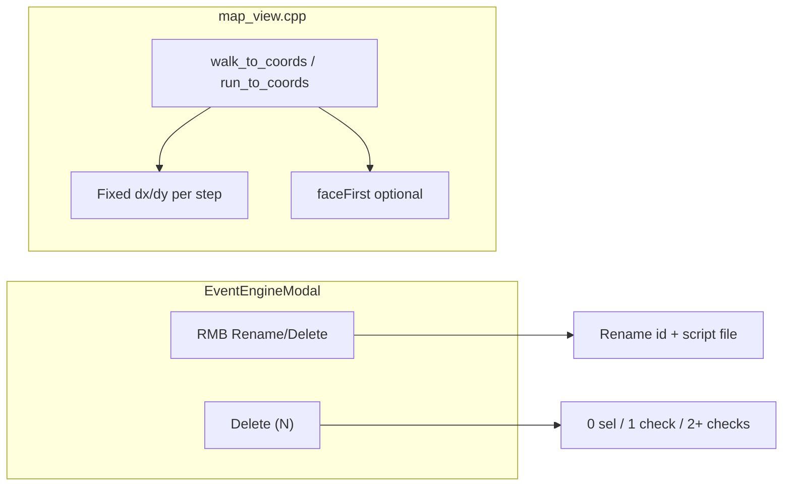

# Event Engine UX + Walk/Run Direction Steps

## Goal and acceptance criteria

**Done when:**

1. **Rename event** — Event list RMB context menu includes **Rename**; user can edit the event id inline; on commit the map JSON, `script.path`, and script file on disk are updated atomically (unique id validation, collision errors surfaced via status).
2. **Unified delete** — One **Delete** control (toolbar + context menu); behavior depends on checkbox state:
   - **0 checks**, row selected → delete the selected event (current single-delete).
   - **1 check** → delete that checked event only (single-delete semantics).
   - **2+ checks** → delete all checked events; label shows count (e.g. `Delete (3)`).
   - Separate `Del` / `Del✓` buttons removed.
3. **Walk/run rail movement** — `walk_to_coords` and `run_to_coords` **no longer use `(x, y)`**; they take **`direction`** + **`steps`** and move the player **exactly along that cardinal rail** (fixed `dx/dy` per step, same stride as manual walk). Optional **`faceFirst`** (default `true`) faces the direction before stepping; chaining with existing `face_*` / `set_player_facing` supports turn-only, turn-then-walk, walk-then-turn, and walk-only scripts.



---

## Feature 1 — Rename event (Event Engine)

**Primary file:** [`tools/event_engine_modal.py`](tools/event_engine_modal.py)

- Add context menu item **Rename** (`ev:rename`) in `_open_event_ctx`.
- Add rename state: `rename_index`, `rename_buf`, `focus == "rename"`.
- On **Rename**: seed `rename_buf` from `events[idx]["id"]`, focus the events-list row (highlight + text field overlay on the id portion, same pattern as block arg editing / map search).
- On **Enter** / blur commit via `_rename_event(idx, new_id)`:
  - Sanitize with existing [`sanitize_map_id`](tools/map_editor.py) (or a thin `sanitize_event_id` wrapper with same rules).
  - Reject empty, unchanged, or duplicate ids on the current map.
  - Rename script file: `src/maps/scripts/{map}/{old_id}.json` → `{new_id}.json` (create parent dir if needed; fail cleanly if target exists).
  - Update `ev["id"]` and `ev["script"]["path"]` to `scripts/{map_id}/{new_id}.json`.
  - Adjust `sel_event_index` / `checks` indices if the renamed row index shifts (rename does not reorder, so index unchanged).
  - Set `events_dirty`, persist, status message.
- **Esc** cancels rename without saving.

---

## Feature 2 — Unified delete

**Primary file:** [`tools/event_engine_modal.py`](tools/event_engine_modal.py)

- Replace toolbar buttons `del1` / `delN` with a single **Delete** button whose label is:
  - `Delete` when `len(checks) <= 1`
  - `Delete (N)` when `len(checks) >= 2`
- Centralize target resolution in `_delete_targets() -> set[int]`:
  - If `len(checks) >= 2` → return `checks`
  - Elif `len(checks) == 1` → return that one index
  - Elif `sel_event_index is not None` → return `{sel_event_index}`
  - Else → empty set (no-op + status hint)
- Wire toolbar **Delete**, context menu **Delete** (dynamic label when 2+ checked), and keep `_delete_indices` as the single delete implementation.
- Context menu **Delete** on RMB row: use `_delete_targets()` but if 0 checks and RMB on row `idx`, prefer deleting `idx` (select row first if needed so behavior matches user expectation).

---

## Feature 3 — Walk/run direction + steps (rail movement)

**Breaking but safe:** grep shows **no** `walk_to_coords` / `run_to_coords` usage under [`src/maps/scripts/`](src/maps/scripts/) today.

### C++ runtime

**Files:** [`include/game.h`](include/game.h), [`src/map_view.cpp`](src/map_view.cpp)

- Replace coordinate drive state with step-rail state on `Game`:
  - `mapScriptDriveStepsRemaining_` (int)
  - `mapScriptDriveStepDx_`, `mapScriptDriveStepDy_` (fixed per opcode)
  - Remove / stop using `mapScriptDriveTargetX_`, `mapScriptDriveTargetY_` for walk ops
- Extract a shared helper (from `applyScriptPlayerFacingHint_` logic): `parseScriptDirectionToDelta(dir) -> (dx, dy)`; invalid direction → finish opcode safely.
- Rewrite `walk_to_coords` / `run_to_coords` handler in `tryMapViewerScriptOpcode_`:
  - Read `direction` (string), `steps` (int, clamped `>= 0`), `faceFirst` (bool, default `true`).
  - **`steps == 0`**: if `faceFirst`, face only; advance `pc` immediately (supports turn-only without a separate `face_*` opcode when desired).
  - **`steps > 0`**: on first activation set remaining = steps, fixed rail deltas, run-speed timing for `run_to_coords`; if `faceFirst`, face direction once before first step.
  - Each frame: if walk animation active → `Yield`; else if remaining == 0 → `finishMapScriptWalkDrive_()`, `++pc`; else attempt **one stride** along `(stepDx, stepDy)` via `requestPlayerMoveOnMap_`; on blocked footprint → finish early (same as today); on success decrement remaining after segment completes.
  - **Rail invariant:** never use greedy `computeScriptWalkStrideTowardTarget_` for these opcodes — movement is strictly along the parsed cardinal axis.
- Clear new fields in `clearMapScriptDriveAndCameraState_` / `finishMapScriptWalkDrive_`.

**No changes** to [`src/op.cpp`](src/op.cpp) dispatch structure (still delegates to map viewer); opcode names unchanged for extractor parity.

### Tooling sync

**Files:** [`tools/event_script_op_meta.json`](tools/event_script_op_meta.json), [`docs/event_script_ops.md`](docs/event_script_ops.md), [`tools/audit_event_script_ops.py`](tools/audit_event_script_ops.py) if it asserts x/y params

- Update `walk_to_coords` / `run_to_coords` meta:
  - `required_params`: `["direction", "steps"]`
  - `default_args`: e.g. `{ "direction": "down", "steps": 1, "faceFirst": true }`
  - `args_help`: document direction aliases (up/down/left/right + n/s/e/w), steps count, `faceFirst` for chaining (set `false` after a prior `face_*` for walk-only / walk-then-turn patterns)
- Run `python3 tools/extract_map_script_ops.py` (exit 0).
- Update human opcode table + add a short **Chaining movement** example in `docs/event_script_ops.md`:

```json
{ "face_west": {} },
{ "walk_to_coords": { "direction": "west", "steps": 3, "faceFirst": false } },
{ "face_south": {} }
```

### Editor block args

**File:** [`tools/event_engine_modal.py`](tools/event_engine_modal.py) — inline arg editor already renders non-`skip` args; new defaults appear automatically after meta update. Optionally add bool toggle UX for `faceFirst` later; v1 can use string `true`/`false` editing or leave as default-only.

---

## Tracker and documentation (repo rules)

Log **before** implementation in [`docs/tracker.md`](docs/tracker.md):

| ID | Type | Title |
|----|------|-------|
| FEATURE-MAP-070 | FEATURE | Event Engine rename + unified delete |
| FEATURE-MAP-071 | FEATURE | Walk/run direction+steps rail movement |

Update after completion:

- [`docs/source_doc.md`](docs/source_doc.md) — `map_view.cpp` walk handler, `Game` drive fields; Event Engine rename/delete behavior
- [`docs/tools_doc.md`](docs/tools_doc.md) — `event_engine_modal.py` rename/delete; meta changes for walk/run

Reference FEATURE IDs in code comments where substantive.

---

## Verification

### Automated

- `make`
- `python3 tools/extract_map_script_ops.py` (exit 0)
- `python3 tools/validate_map_events.py` (exit 0)
- `python3 -m unittest discover tests -v`
- AST parse: `event_engine_modal.py`, `map_editor.py`
- Small C++ harness (or inline test) for step mode: 3 steps north advances 3 tiles on rail; blocked tile stops early; `faceFirst: false` after manual face preserves chaining

### Manual UI matrix (Event Engine)

- Window ~800×600 and typical size: open Event Engine, RMB → **Rename**, commit valid/duplicate/invalid ids
- Checkbox delete: 0 / 1 / 3 checked — confirm single **Delete** button label and behavior
- Scroll events list; confirm rename field and delete button not clipped
- Block editor: insert `walk_to_coords`, edit `direction`/`steps`/`faceFirst`

### Manual engine matrix (map viewer)

- Script: `face_north` → `walk_to_coords {direction:north, steps:2, faceFirst:false}` → `face_east` (walk-then-turn)
- Script: `walk_to_coords {direction:south, steps:4, faceFirst:true}` alone (turn+walk)
- Script: `walk_to_coords {direction:west, steps:0, faceFirst:true}` (turn only via walk opcode)
- Script: `run_to_coords` with 3 steps — faster animation timing, same rail
- Blocked tile mid-rail — opcode completes without hang

### Regression

- Wild Encounters modal, Help overlay Esc/Back priority, main tile painting while Event Engine closed still work
