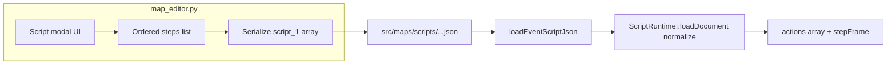
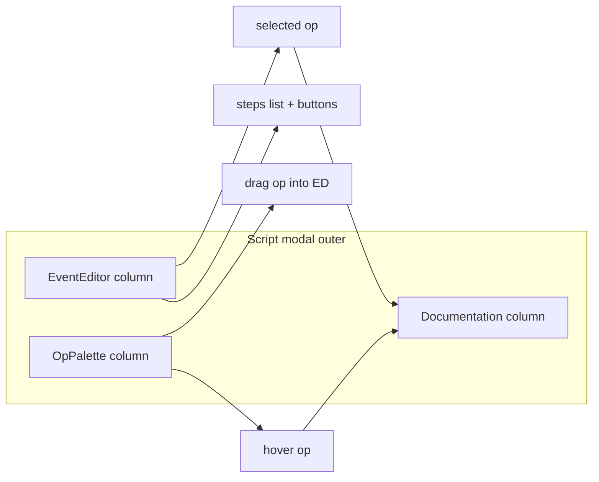

# Event script editor and custom JSON schema

## Current state

- **Editor**: [`tools/map_editor.py`](tools/map_editor.py) events workspace places 2×2 anchors, sprites, and creates `src/maps/scripts/{mapId}/{eventId}.json` with `{"version":1,"actions":[{ "op","args" }, ...]}`; map references it via `events[].script.path` (unchanged in [`src/map_data.cpp`](src/map_data.cpp)).
- **Runtime**: [`ScriptRuntime::loadDocument`](src/script_engine.cpp) only reads `doc["actions"]` as an array; each step must be an object with `"op"` (string) and optional `"args"` (object). Documented in [`docs/event_script_ops.md`](docs/event_script_ops.md).

Your desired top-level `map`, `script_1`, `script_2`, … layout **does not match** the runtime today; the plan includes a **small C++ normalization layer** so one JSON file can use the new shape while execution stays opcode-driven.

---

## Script block shape (decision — **Option A**)

**User choice**: **Option A — array of one-key objects** for each `script_N` body.

Why the other options existed (for reference only; **not** in scope unless you reopen this):

- **B — Flat object + synthetic keys**: compact but duplicate steps need fake keys (`walkForward__2`).
- **C — Legacy `actions` only + metadata**: editor/game already support this as the **legacy** path; new work targets `script_1` instead.
- **D — Hybrid**: two sequences in one file; avoid unless a migration window explicitly needs it.

JSON **objects** cannot repeat the same key twice; **arrays** preserve order and allow the same opcode many times.

**Canonical `script_N` body** (each element is one object with **exactly one** key = opcode string, value = args object or `null`):

- **Shape**: `"script_1": [ {"walkForward": {"steps":10,"direction":"left"}}, {"exclamation": {}}, {"walkForward": {"steps":3}} ]`
- **Pros**: stable order in JSON; duplicate opcodes allowed; maps 1:1 to internal `{ "op", "args" }` after normalization.
- **Con**: slightly more verbose than a single flat object.

**Example** (what editor writes and runtime normalizes for `script_1`):

```json
{
  "version": 1,
  "map": "sample_room",
  "script_1": [
    { "show_message": { "text": "Hello" } },
    { "wait_frames": { "n": 30 } }
  ],
  "script_2": []
}
```

Empty `script_2` as `[]` (not `{}`) keeps a single “list of steps” interpretation.

**Execution rule (MVP)**: On event start, runtime loads **only `script_1`** as the linear program. Additional blocks (`script_2`, …) are stored for future ops (e.g. `call_script`) or tooling; document this in [`docs/event_script_ops.md`](docs/event_script_ops.md).

---

## C++ changes ([`include/script_engine.h`](include/script_engine.h), [`src/script_engine.cpp`](src/script_engine.cpp))

1. **Backward compatible `loadDocument`**:
   - If `doc["actions"]` is an array → current behavior (unchanged).
   - Else if `doc["script_1"]` is an **array** (Option A — canonical): for each element, if it is an object with exactly one key `k`, append `{ "op": k, "args": normalized(v) }` where `normalized` maps `null`/non-object to `{}`.
   - Else if `doc["script_1"]` is an object (legacy / hand-edited): optional **best-effort** same as prior plan (iterate `items()` in insertion order into `{op,args}`); if omitted from MVP, treat as load error or empty steps—pick one and document.
   - Else → empty `actions` (same as today when missing).

2. **Opcode naming**: Existing ops use **snake_case** (`show_message`, `warp_player`). Editor should offer those names first; optional **aliases** in C++ (e.g. `walkForward` → same branch as a new `walk_forward` or stub) only if you add real behavior—otherwise unknown names remain **stubs** as today.

3. **Docs**: Update [`docs/source_doc.md`](docs/source_doc.md) (`ScriptRuntime` / `loadDocument`) and [`docs/event_script_ops.md`](docs/event_script_ops.md) with the new root fields (`map`, `script_1`, …), execution rule, and legacy `actions` compatibility.

---

## Python map editor ([`tools/map_editor.py`](tools/map_editor.py) + optional new module)

Reuse patterns from the world workspace: [`_world_open_context_menu`](tools/map_editor.py), [`_draw_world_context_menu`](tools/map_editor.py), hit-testing and dismiss-on-click-outside.

1. **In-memory model**: Ordered list of steps `{ "op": str, "args": dict }` (same as today’s `actions` entries) so copy/paste, DnD, and serialization are simple.

2. **UI — “Event script editor”** (when events workspace is open and an event is selected):
   - Toggle (e.g. button next to **Open script JSON** or a key): opens a **modal panel** over the map viewport listing steps with row rects.
   - **Add / remove**: buttons or context menu.
   - **Copy / paste**: maintain `self.event_script_clipboard: list[dict] | None` for one or more steps; keyboard shortcuts optional (Ctrl+C/V) if not conflicting with existing bindings.
   - **Drag and drop**: track `_script_editor_drag_from_index`, mouse motion, on release reorder list (same pattern as list reorder elsewhere—if none exists, implement minimal row drag like `_events_drag_i` for anchors).
   - **Context menu (RMB on list / row)**: entries for **every registered action** (from a single `ACTION_REGISTRY` list shared with “Add” submenu), plus row-scoped **Delete**, **Copy**, **Paste after**, **Duplicate**.

3. **Persistence**:
   - On Save / explicit “Apply” or auto-save when closing modal: `json.dump` to the event’s script path from `_event_script_path` (same security rules: under `src/maps`, no `..`).
   - Serialize using **only Option A** for `script_1` from the ordered list; set `"map"` from `sanitize_map_id(self.map_id)`; bump or keep `version`; omit or `[]` for `script_2` until UI supports multiple blocks (or add a simple tab “Script 1 / Script 2” if you want parity with keys immediately).

4. **Load path**: When opening the editor, read existing file: if `actions` present, load into the list; if `script_1` is the **array-of-one-key-objects** form, normalize to the same internal list (mirror C++). Prefer showing **`script_1` as source of truth** when both `actions` and `script_1` exist—document tie-break to avoid drift.

5. **New event template** in [`_events_add_at`](tools/map_editor.py): write the **new** schema (with `map` + `script_1` array) instead of only `actions`, **or** write both `actions` and `script_1` briefly during migration—prefer **one canonical shape** (new) plus C++ legacy support for old maps.

6. **Help / status**: Extend events footer hint and [`docs/tools_doc.md`](docs/tools_doc.md) (`map_editor` tool section) for the new UI and file layout.

**Optional refactor** (code-refactoring skill): move registry + (de)serialize + “normalize file to steps” into [`tools/event_script_schema.py`](tools/event_script_schema.py) to avoid growing `map_editor.py` further; keep behavior identical.

---

## Validation and QA

- **Tracker** (Logging-Rule + bug-checking): Add a **FEATURE** entry in [`docs/tracker.md`](docs/tracker.md) *before* implementation (new ID after latest map feature, e.g. `FEATURE-MAP-043`), with success criteria: editor CRUD, DnD, context add, JSON shape, game still runs scripts.
- **`tools/validate_map_events.py`**: Optionally open script JSON and warn if neither `actions` nor `script_1` is present (non-blocking or error—your choice; recommend **warning** first to avoid breaking old files).
- **Verification**: Create/edit script in editor → save → run game → trigger event; confirm steps run in order. Re-test an **old** `actions`-only file still loads.
- **Performance** ([`qa-ram-performance` skill](file:///Users/rheyn/.cursor/skills/qa-ram-performance/SKILL.md)): Script list is small; avoid O(n²) redraw (only dirty the script panel rect); do not re-read JSON from disk every frame.

---

## Risk note

Your sketch used **camelCase** op names (`walkForward`); the engine today uses **snake_case** op strings. The plan standardizes on **snake_case in the saved JSON** unless you add an explicit alias table in C++—the editor can still display friendly labels while saving canonical op names.



---

## Phase 2 — Modal layout, three panes, palette DnD, doc pane, C++-synced registry (new work)

**Tracker**: Log a new **FEATURE** (e.g. `FEATURE-MAP-044`) before implementation per repo rules; reference it in commits/notes.

### Root cause (current UI bugs)

- In [`tools/map_editor.py`](tools/map_editor.py) `_draw_event_script_editor_modal`, `foot_h` is **44** while buttons are **28px** tall and placed at `panel.bottom - foot_h + 8`, and the hint is drawn at `panel.bottom - 22`, which **overlaps the button tops** and can clip against the panel border (matches screenshot: hint text under buttons, cut off).
- Row text uses `font_small.render` for a long `summary` on one line with hard truncation (`str(args)[:72]`), so **horizontal overflow** is still possible on narrow layouts.

### Goals / acceptance criteria

1. **No clipped text**: Footer reserves explicit vertical space for buttons **and** wrapped hint(s); optional two-line hint; clip rects only after **word-wrapped** layout (reuse or mirror `_help` wrapping patterns). Row labels either wrap inside the row height (multi-line row) or use ellipsis after measuring width against the **editor column** width (not whole modal width).
2. **Three horizontal panes** inside one modal chrome (order **left → right**): **Event editor** (step list + existing Add/Save/Close) | **Op pane** | **Documentation pane**. Overall modal width scales with `map_canvas_rect` (min/max caps) so panes fit on typical resolutions.
3. **Op pane**: Scrollable catalog of all ops (labels from registry). **Drag from op pane → drop on editor list** inserts a new step at the drop index (same semantics as “insert after row”); palette drag is distinct from **in-list reorder** drag (use separate state, e.g. `_script_palette_drag_op` vs `_script_drag_row`).
4. **Documentation pane**: Shows **title + description + args** for the **focused op**: priority = selected **editor row**’s `op`; if none, **hovered** op in the palette; if palette drag active, show dragged op. Text **wrapped** with its own scroll (`event_doc_scroll`).
5. **Stay in sync when C++ changes (user choice: codegen from C++)**: Add `tools/extract_map_script_ops.py` (or similar) that **parses** [`src/script_engine.cpp`](src/script_engine.cpp) for `if (op == "…")` string literals (and optionally treats the `stub()` path as “stub” vs implemented heuristically). **Emit** a generated module or JSON (e.g. `tools/event_script_ops_generated.py` or `.json`) checked into the repo **or** produced in `make` before Python tools run—pick one and document in [`docs/tools_doc.md`](docs/tools_doc.md). **Human-written prose and default args** remain in a **small companion YAML/JSON** keyed by opcode (e.g. `tools/event_script_op_meta.yaml`); codegen **fails** if: (a) an op appears in C++ but has no meta entry, or (b) meta entry exists for an op not in C++. [`tools/event_script_schema.py`](tools/event_script_schema.py) loads **generated op list + merged meta** for `EVENT_ACTION_DEFS`, defaults, and doc strings for the Documentation pane. Update [`docs/event_script_ops.md`](docs/event_script_ops.md) to state “machine list from codegen; prose tables may mirror meta file.”
6. **Verification**: Resize window small/large; confirm hint + doc + rows never overlap controls; drag palette op to first/last row; run codegen script after a dummy C++ op change; `make`, `ast.parse(map_editor.py)`, optional add to `Makefile`/`make check` target.

### Implementation sketch

| Area | Files |
|------|--------|
| Codegen | New `tools/extract_map_script_ops.py`, generated artifact + `tools/event_script_op_meta.yaml`, wire [`tools/event_script_schema.py`](tools/event_script_schema.py) |
| UI | [`tools/map_editor.py`](tools/map_editor.py): replace single `panel` rect with `outer` + 3 column rects; split wheel scroll by hovered column; extend hit tests for palette drag + drop highlight line |
| Docs / tracker | [`docs/tools_doc.md`](docs/tools_doc.md), [`docs/source_doc.md`](docs/source_doc.md) if build hooks touch C++; [`docs/tracker.md`](docs/tracker.md) FEATURE-MAP-044 |

### Risks

- **Parsing C++** is brittle if `op ==` style changes; mitigate with a tight regex + unit test on known file snapshot.
- **Stub vs implemented**: document clearly in meta (`status: stub`) unless parser can infer—prefer **explicit field in YAML** over guessing.

### Mermaid (target layout)


