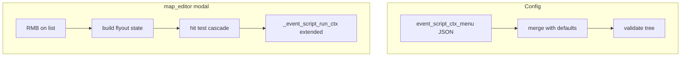

# Event script editor: configurable menus, modal isolation, doc toggle, docs, tests

## Scope (explicit)

- **In scope:** [tools/map_editor.py](tools/map_editor.py) **event script modal** only (three-pane editor opened via **Edit script (modal)**): RMB context menu, small **settings** control on that modal, optional **documentation column** toggle, **no global shortcuts** while modal is open, text clipping safeguards, persistence + docs + tests.
- **Out of scope unless you expand later:** World workspace RMB menu ([`_world_open_context_menu`](tools/map_editor.py)), events **workspace** list (non-modal) context, renaming map `events[]` entries (distinct from “Rename Script” below).

## Root cause for “D deletes map under modal” (req 3)

[`_event_script_modal_keydown`](tools/map_editor.py) only handles Esc and Ctrl+C/V and **`return False`** otherwise (see ~3049–3071). [`KEYDOWN`](tools/map_editor.py) runs the global `delete_map` branch (~6977+) when the modal returns false, so **D still reaches** [`request_delete_map_file`](tools/map_editor.py).

**Fix pattern:** When `event_script_editor_open`, after any higher-priority confirm/prompt branches that must remain usable, route **all remaining** `KEYDOWN` through the modal: either (a) `_event_script_modal_keydown` returns True for *consumed* keys and the outer handler **`continue`s whenever the modal is open** after calling it, or (b) insert a single guard `if self.event_script_editor_open: ...; continue` immediately after the modal-specific block so **no** global `elif` shortcuts run. Apply the same “modal owns input” rule to any other `KEYDOWN` paths that still run (audit the long `elif` chain after line ~6699).

**Mouse:** Already partially gated ([`MOUSEBUTTONDOWN`](tools/map_editor.py) ~6090); audit `MOUSEBUTTONUP`, wheel, and any branches that still paint/edit the map while `event_script_editor_open` (e.g. palette/map drag) and **`continue`** or no-op when the modal should capture focus.

## 1) Configurable + nested context menu (req 1–2)

**Data model (JSON):** Extend [tools/map_editor_config.json](tools/map_editor_config.json) (or add a sibling file e.g. `tools/event_script_ctx_menu.json` loaded next to it—pick one and document it) with a **tree** of entries, for example:

- `type: "submenu"` + `label` + `children: [...]`
- `type: "action"` + `label` + `id` (string)

**Action `id` vocabulary (stable, documented):** Map to existing [`_event_script_run_ctx`](tools/map_editor.py) behavior and extensions:

| `id` | Behavior |
|------|----------|
| `step:delete`, `step:copy`, `step:duplicate`, `step:paste_after` | Current `del` / `copy` / `dup` / `paste_after` |
| `add:<opcode>` | Same as current `add:<op>` where `<opcode>` is a canonical op from [`tools/event_script_schema.py`](tools/event_script_schema.py) / codegen |
| `rename_script` | **New:** minimal v1 = prompt to edit the **script path stem** (or display-only + “Open JSON”)—exact UX to match your preference; if undecided at implement time, ship as “opens status + doc link” and a follow-up ticket |

**Row-scoped vs root:** Preserve today’s rule: RMB on a row passes `row_i`; RMB on empty list passes `row_i=None`. Menu schema should support optional `"when": "row" | "always" | "no_row"` per node so “Delete step” only appears on rows without bloating the default file.

**Rendering / hit-testing (nested):** Replace flat `items` + `rects` with a **cascading menu** model (parent row → flyout to the right for children). Reuse ideas from [`_draw_world_context_menu`](tools/map_editor.py) / [`_world_ctx_hit_action`](tools/map_editor.py) but keep script menu state separate (`event_script_ctx_menu` dict: open path stack, submenu rects, leaf action ids). **Esc / click outside** closes submenu first, then whole menu.

**Implementation split (refactor):** New small module e.g. [`tools/event_script_ctx_menu.py`](tools/event_script_ctx_menu.py): load/merge defaults + user JSON, validate tree (unknown `id`, cycles, depth cap), flatten for drawing, resolve click → action id. [`map_editor.py`](tools/map_editor.py) keeps only pygame glue.

**Defaults:** Ship a **default tree** in repo (same file or embedded constant) mirroring current flat menu (row ops + grouped `Add:` by category if you add optional `group` in meta; else one “Add” submenu with all ops from `EVENT_ACTION_DEFS`).

## 2) Settings icon on event script modal (req 1, 4)

- Add a small **gear** rect in the modal chrome (e.g. title bar next to “Event script editor”), drawn after layout is computed in [`_draw_event_script_editor_modal`](tools/map_editor.py).
- **LMB** opens a compact **settings popover** (anchored rect, click-outside dismiss): checkbox **“Show documentation pane”** (persisted in `map_editor_config` or the same JSON blob as the menu—document choice).
- When disabled: **two-column** layout (steps | op palette only), recompute column widths and [`_event_script_doc_col_rect`](tools/map_editor.py) / doc scroll state; ensure [`_event_script_rebuild_doc_lines`](tools/map_editor.py) is skipped or cheap no-op when hidden.

## 3) Documentation + no clipped text (req 5–6)

- [`docs/tools_doc.md`](docs/tools_doc.md): `map_editor` NOTES — configurable nested script context menu, settings gear, doc pane toggle, modal input isolation.
- [`docs/event_script_ops.md`](docs/event_script_ops.md) or [`docs/tools_doc.md`](docs/tools_doc.md) extract section — JSON schema for menu tree + action ids.
- Help overlay: extend [`_help_build_lines`](tools/map_editor.py) **events** tab (or keybindings) with the new behavior if there is an existing events subsection.
- **Clipping:** Re-run layout math after removing doc column (min widths, `clamp` footer hint, palette labels use existing [`_event_script_wrap_lines`](tools/map_editor.py)); add regression checks for narrow `map_canvas_rect` (min modal width already ~640—verify smaller window).

## 4) Tracker, QA, tests, bugs (repo rules + attached skills)

- **Tracker:** Add **FEATURE-MAP-046** (or next free ID) *before* coding per [Logging-Rule](.cursor/rules/Logging-Rule.mdc): acceptance criteria = nested configurable menu, gear + doc toggle, no global map keys under modal, docs updated, tests pass. Reference **BUG-MAP-025** lessons if any overlap with hit-testing.
- **QA / RAM–performance:** No JSON parse per frame; load menu config **once** at editor open or first use; menu draw O(flattened nodes) with small N; avoid rebuilding wrapped strings every frame unless hover/selection changes (optional dirty flag).
- **Bug-checking:** Reproduce **D under modal** before/after; scan for other shortcuts (`save`, `open_map`, layer keys) with modal open.
- **post-plan-unit-testing:** No existing `pytest` tree in repo; add **`tests/test_event_script_ctx_menu.py`** using **`unittest`** (stdlib only) + `python3 -m unittest discover tests` documented in [`docs/tools_doc.md`](docs/tools_doc.md); cover: valid/invalid JSON, unknown action id, `when` filtering, flatten row count, deep nesting depth cap.

## 5) `docs/source_doc.md`

- No C++ change expected; only update if any **runtime** script contract changes (unlikely). Prefer **tools_doc** for tool JSON.

## Risk notes

- **Nested menus + wheel:** Decide whether wheel scrolls hovered **submenu** vs main modal column—document behavior to avoid accidental map zoom (modal should capture wheel already).
- **User JSON errors:** Fail soft with stderr + status + fallback to **default** menu (do not brick editor).
- **“Rename Script”:** If product meaning is “rename event’s `script.path` on disk,” that touches map JSON and files—scope tightly and add undo checkpoint; if out of scope, expose as disabled menu entry until implemented.

