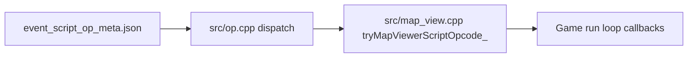

# Events help, opcode parity, wild species picker

## Goals and acceptance criteria

| Deliverable | Done when |
|-------------|-----------|
| **Help (H + events)** | Pressing **H** while **NPC Events** or **Wild Encounters** workspace is active opens the help overlay on an updated **Events** tab (not Contents). Tab documents E popover (NPC vs Wild), wild patch painting, tier tables, validation, and current keys (`V` / **E** toolbar). **H** with script modal still opens **Script opcodes** (existing behavior in [`_event_script_modal_keydown`](tools/map_editor.py) ~4046). |
| **Opcode parity** | All 21 ops in [`tools/event_script_op_meta.json`](tools/event_script_op_meta.json) have matching `if (op == "...")` in [`src/op.cpp`](src/op.cpp); map-viewer ops also have real handlers in [`Game::tryMapViewerScriptOpcode_`](src/map_view.cpp) (not only stubs when `tryMapViewerScriptStep` is unset). `python3 tools/extract_map_script_ops.py` passes; new automated test fails on drift. |
| **Wild species search + stars** | In **Wild Encounters** mode, choosing/editing a tier row opens a species picker (monster.json `Pokemon` keys) with **search** and **star** favorites; starred names persist in [`tools/map_editor_config.json`](tools/map_editor_config.json), sort to the top, and are used as default when adding rows. Picker draws above the map (no z-order regression). |

Per logging rules: log **three** tracker entries before implementation (one responsibility each): e.g. `IMPROVEMENT-MAP-051` (help), `IMPROVEMENT-MAP-052` (opcode audit), `FEATURE-MAP-053` (wild species picker).

---

## 1. Context-aware help and updated Events documentation

**Current gaps** ([`tools/map_editor.py`](tools/map_editor.py)):

- [`_open_help_overlay`](tools/map_editor.py) always sets `help_tab = "home"` (~6685).
- Main-loop **H** (~8206) calls `_open_help_overlay()` with no events/wild context.
- [`events` tab content](tools/map_editor.py) (~6870) is stale: says toolbar **E** “toggles” events only; omits **Wild Encounters**, E popover, FEATURE-MAP-050 wild patches, and `wildPatches` / `layers.wildEncounter`.

**Implementation:**

- Add `_help_default_tab_for_context() -> str`: `script_ops` if `event_script_editor_open`; else `events` if `events_workspace_open` or `wild_encounter_mode_open`; else `home`.
- Use it when opening help from main loop **H** and optionally when toggling help open (keep close behavior unchanged).
- Rewrite `_help_build_lines` for `tab_id == "events"`:
  - E toolbar popover: **NPC Events** vs **Wild Encounters** (mutually exclusive with `#` world).
  - NPC: RMB add, LMB select/drag, **P**, script modal, `validate_map_events.py`.
  - Wild: paint/erase patches, right sidebar (patches, step %, tiers common/uncommon/rare), merge, undo includes wild state.
  - Cross-link: script opcodes tab for `script_1` details.
- Update home TOC line for **Events** (~6763) to mention E popover + wild mode.
- Optional: add `("wild", "Wild encounters")` as a dedicated help tab only if the Events tab becomes too long; default is one expanded **Events** tab to avoid tab-bar clutter.

**Regression:** Help overlay already uses clip + scroll ([`_draw_help_overlay`](tools/map_editor.py)); no change to draw order relative to map except ensuring help still renders last in the frame (verify after edits).

**Docs:** [`docs/tools_doc.md`](docs/tools_doc.md) — help **H** context rules; no `source_doc` unless C++ changes.

---

## 2. Opcode implementation audit (C++)

**Baseline:** Extractor already enforces **meta ↔ `op.cpp` key parity** ([`tools/extract_map_script_ops.py`](tools/extract_map_script_ops.py)). All 21 ops are `status: "implemented"` in meta; [`CPP_SCRIPT_OPS_ORDERED`](tools/event_script_ops_generated.py) matches.

**Gap:** Extractor does **not** verify [`src/map_view.cpp`](src/map_view.cpp) implements map-viewer opcodes. Viewer ops delegate through `tryDispatchMapViewerOpcodes` → `rt.tryMapViewerScriptStep` ([`src/op.cpp`](src/op.cpp) ~165–297); stubs advance PC if callback missing—runtime in map viewer registers callback (~2573).

**Implementation:**



- Extend audit (preferred: new small tool `tools/audit_event_script_ops.py` or extend extractor with `--check-map-view`):
  - **Viewer ops** (from meta categories or fixed list): `walk_to_coords`, `run_to_coords`, `face_*`, `move_camera`, `camera_zoom_*`, `camera_follow_player`.
  - Assert each appears as `if (op == "...")` in `map_view.cpp` inside `tryMapViewerScriptOpcode_`.
  - Assert `set_player_facing` / `warp_player` use `onFacingHint` / `onWarp` wired in script setup (~2565–2573).
- Add [`tests/test_event_script_opcode_parity.py`](tests/test_event_script_opcode_parity.py): import generated ops + meta; subprocess or grep audit; must pass in CI/local `python3 -m unittest discover tests -v`.
- Manual smoke checklist (document in tracker / PR): load `event_script_demo` (or similar), run game map viewer, exercise Q on event: message, warp, walk_to_coords, move_camera, camera_follow_player.

If audit finds a missing handler (unlikely today), implement in `map_view.cpp` and update meta/docs per [event-script-opcode-docs skill](.cursor/skills/event-script-opcode-docs/SKILL.md): regen `event_script_ops_generated.py`, [`docs/event_script_ops.md`](docs/event_script_ops.md), [`docs/source_doc.md`](docs/source_doc.md).

---

## 3. Wild encounter species picker: search + starred favorites

**Scope (per user):** Wild tile / patch editor only—not the NPC sprite picker.

**UX flow:**

- **LMB** on a tier encounter row (`species w=N`) → open `wild_species_pick_open` modal.
- **+ row** → append row, then open picker for that row (or open picker first then commit on select—prefer select-then-append for cleaner undo).
- Modal layout (mirror [`_draw_events_sprite_pick_overlay`](tools/map_editor.py) patterns, smaller copy):
  - Title: “Species (wild encounter)”
  - **Search** field (click to focus; type to filter; Backspace/Esc clears)
  - Scrollable list: `★` column + species name; optional small icon if `src/Graphics/Pokemon/Icons/<stem>.png` resolves (best-effort; no new assets)
  - **Enter** / double-click row → set `rows[ri]["species"]`, close modal, `_undo_checkpoint` on change only
  - **LMB** on ★ toggles favorite without closing
- Sort order: **starred first** (stable alpha within groups), then remaining keys; filter: case-insensitive substring on species key.

**State** ([`MapEditor.__init__`](tools/map_editor.py)):

- `wild_species_pick_open`, `wild_species_pick_target_row`, `wild_species_pick_filter`, `wild_species_pick_scroll`, `wild_species_pick_sel`
- `wild_species_favorites: set[str]` loaded/saved via config

**Config** ([`tools/map_editor_config.json`](tools/map_editor_config.json)):

```json
"wildEncounterEditor": {
  "favoriteSpecies": ["Pikachu", "Abomasnow"]
}
```

Merge on save like existing `eventScriptEditor` persistence ([`_persist_event_script_editor_*`](tools/map_editor.py) pattern).

**Input routing:**

- While `wild_species_pick_open`: handle keys/mouse in modal first (do not paint map); reuse text input pattern from map id prompt or lightweight `wild_species_pick_filter` string buffer.
- Draw modal **after** [`_draw_wild_patches_panel`](tools/map_editor.py) and popover so it stays on top.

**Rendering / QA (RAM-performance):**

- Filter/sort a **cached** `self._pokemon_species_keys()` list once per open/keystroke, not per frame from disk.
- Use `screen.set_clip` on list inner rect; cap visible rows like sprite picker.
- Widen modal only within `map_viewport_rect`; do not shrink wild sidebar panel width.

**Validation:** Existing [`tools/validate_map_events.py`](tools/validate_map_events.py) already checks species keys vs `monster.json`—unchanged.

---

## 4. Testing, docs, tracker

| Area | Action |
|------|--------|
| **Unit tests** | `tests/test_event_script_opcode_parity.py`; `tests/test_wild_species_picker.py` (filter sort, favorites order, config round-trip helpers as pure functions where possible). |
| **Tools doc** | [`docs/tools_doc.md`](docs/tools_doc.md): help H context, wild species picker, audit command. |
| **Source doc** | [`docs/source_doc.md`](docs/source_doc.md) only if C++ audit forces opcode fixes. |
| **Tracker** | Three entries → **IN_PROGRESS** during work → **DONE** after verification. |

**Verification commands:**

```bash
python3 tools/extract_map_script_ops.py
python3 tools/audit_event_script_ops.py   # new
python3 tools/validate_map_events.py
python3 -m unittest discover tests -v
make
```

**Manual:** map editor → E → Wild Encounters → + row / click species → search “aboma” → star → reload editor → favorites persist; **H** opens updated Events help.

---

## Risk summary

| Risk | Mitigation |
|------|------------|
| Help **H** conflicts with eraser key **E** | Document in help; no key rebinding in this task. |
| Modal blocks map paint | Explicit `wild_species_pick_open` guard in mouse handlers (same as `event_script_editor_open`). |
| Icon stem ≠ species key | Icons optional; list shows JSON keys only. |
| Opcode “implemented” vs stub | Map-view grep audit + manual smoke on demo map. |
