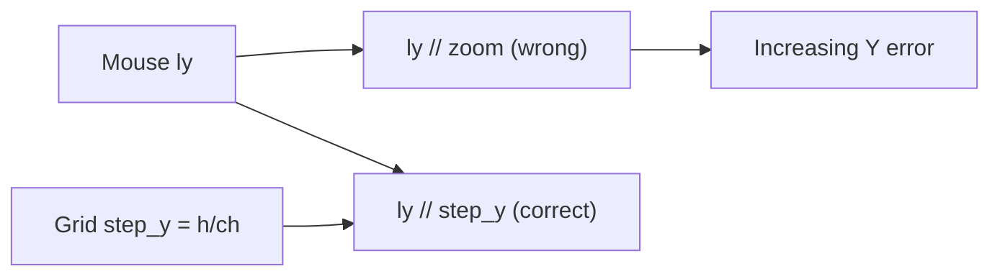

# Fix NPC Sprite Editor paint offset and UI layout

## Root cause (paint offset bug)

In [`tools/npc_sprite_editor_modal.py`](tools/npc_sprite_editor_modal.py):

**Draw path** (lines 437–447): the active cell (32×48 px) is scaled to fill a **square** `_canvas_rect`, and grid lines use proportional steps:

```python
step_x = canvas_rect.w / cw   # e.g. 384/32 = 12
step_y = canvas_rect.h / ch   # e.g. 384/48 = 8
```

**Hit-test path** (lines 305–306): uses a single `_zoom` for both axes:

```python
px = lx // self._zoom   # assumes 12 px/cell
py = ly // self._zoom   # also 12 — wrong; should be 8
```

Because Y uses the wrong divisor, error **accumulates as `ly` increases** — exactly the bug you see. Changing zoom only adjusts the canvas size cap (`cw * _zoom + 4`) but not the actual scale used for painting vs. hit-testing.



---

## Part A — Fix paint coordinate mapping

**File:** [`tools/npc_sprite_editor_modal.py`](tools/npc_sprite_editor_modal.py)

1. Add cached display metrics updated in `draw()` (or a small `_layout_edit_canvas()` helper):
   - `_cell_step_x: float`, `_cell_step_y: float` — pixels per sprite pixel on screen
   - `_canvas_rect` sized with **correct aspect ratio** `cw:ch` (not forced square)

2. Rewrite `_pixel_at_canvas()`:

```python
px = min(cw - 1, int(lx / self._cell_step_x))
py = min(ch - 1, int(ly / self._cell_step_y))
```

3. Keep `_zoom` as a user-facing scale multiplier that drives canvas pixel dimensions:

```python
display_w = cw * self._zoom
display_h = ch * self._zoom
# clamp to available body area, preserve aspect if needed
```

4. Add unit test in [`tests/test_npc_sprite_editor_modal.py`](tests/test_npc_sprite_editor_modal.py):
   - Set `_canvas_rect`, `_cell_step_x/y` for a 32×48 cell at zoom 12
   - Assert `(mx, my)` at known grid intersections map to expected `(px, py)`, especially near bottom rows (where the old bug was worst)

---

## Part B — UI rework (blank space + clipped text)

**File:** [`tools/npc_sprite_editor_modal.py`](tools/npc_sprite_editor_modal.py)

Current layout problems:
- Tool buttons placed at fixed x offsets (`+418`, `+484`) — clip on narrow panels
- Edit + reference are two **square** boxes using only `body.w // 2`, leaving ~40% empty panel on the right when resized
- `Ref:` label hard-coded at `body.right - 100` with 120px truncate — clips against panel edge
- `File:` at `body.x + 180` — no width clamp

**New layout** (two-column, fills `body.w`):

| Region | Content |
|--------|---------|
| **Header** | Title, Back, Close (unchanged) |
| **Row 1** | Direction tabs (Down/Left/Right/Up) — full width |
| **Row 2** | Frame tabs F0–F3 — full width |
| **Row 3–4** | Toolbar split into **two wrapped rows** computed from `body.w` (Mirror, Idle→F3, Dup, New, Load / Save, Save As, Zoom −+, Ref ◀ ▶) |
| **Left col (~58%)** | **Edit canvas** (aspect-correct 32:48), color palette swatches, W/H + filename (truncated) |
| **Right col (~42%)** | **Reference preview** (same aspect), label `Reference: <name>` with `mtext.truncate_to_width` to available width |

Concrete changes:
- Replace fixed button x-positions with a simple row-packing helper (same pattern as [`tools/modal_text.py`](tools/modal_text.py) form metrics)
- `_ref_rect` fills right column height aligned with edit canvas top
- Filename uses `mtext.truncate_to_width(ed.font_small, self._filename, avail_w)`
- Slightly lower default panel width if needed (`_MODAL_MIN_W` ~640) but content must expand when user resizes — no dead right gutter

---

## Part C — Docs and tracker

- Log **BUG-MAP-101** in [`docs/tracker.md`](docs/tracker.md) (paint offset + UI layout)
- Update [`docs/tools_doc.md`](docs/tools_doc.md) `TOOL: tools/npc_sprite_editor_modal.py` NOTES: aspect-correct canvas, fixed hit-test
- Append to [`docs/session_changelog.md`](docs/session_changelog.md) per Change-Tracking-Rule

---

## Verification

1. Manual: open Events → NPC Sprites on `development`
   - Paint pixels at top, middle, bottom of grid — cursor and painted pixel align
   - Resize modal — no clipped toolbar text; columns fill width
   - Zoom in/out — hit-test stays aligned
2. Automated: `python3 -m unittest tests/test_npc_sprite_editor_modal.py -q`
3. Full suite: `python3 -m unittest discover -s tests -q`
