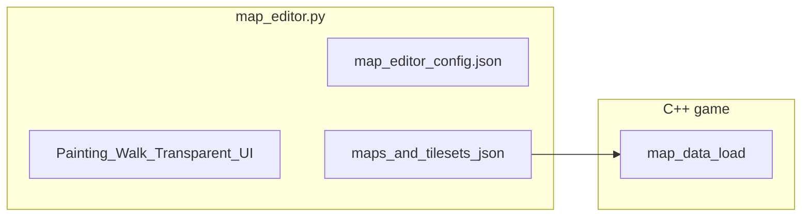

# Map editor: advanced features

## Assumptions (confirmed)

- **Multi-tile drag:** implement **both** (1) palette rectangle → multi-tile brush pattern, and (2) map rectangle drag → fill/clear a region.
- **Key rebinding:** persist to a small JSON file (e.g. [`tools/map_editor_config.json`](tools/map_editor_config.json)) loaded at startup; **gear icon** opens an in-editor panel (not OS-native dialog required for v1).

## 1. Hover / clicked cell highlight

- Track **`hover_cell`**: `(cx, cy)` or `None` from `MOUSEMOTION` when cursor is over [`map_viewport_rect`](tools/map_editor.py) (reuse [`map_cell_at_pixel`](tools/map_editor.py)).
- After drawing the cell grid, draw a **1–2px yellow (or theme) rectangle** around the **hover** cell in screen coordinates (account for `map_view_off_*`).
- On `MOUSEBUTTONDOWN` over map, optionally flash or keep outline on **last clicked** cell for one frame (optional); hover is enough for “which tile I’m on”.

## 2. Palette multi-select + map rectangle fill (both)

**Palette (brush):**

- On `MOUSEBUTTONDOWN` on sheet: record `palette_drag_start` (tile col/row or pixel-derived index).
- On `MOUSEMOTION` with button held: update `palette_drag_end`; draw a **sem-transparent rectangle** on the scaled thumb between min/max tile indices.
- On `MOUSEBUTTONUP`: compute **axis-aligned tile range** (min/max col/row in sheet space), build **`brush_pattern`**: 2D list of `(tileset_id, local_index)` using the **active** tileset for all cells in range (see §7 for multi-tileset; initially single tileset per brush).
- **Paint mode:** when painting map cells, repeat `brush_pattern` toroidally or align pattern origin to first click (document behavior: **pattern aligned to first stamp**, then repeats every `brush_w` x `brush_h`).

**Map (rectangle fill):**

- When **`MOUSEBUTTONDOWN`** on map and **not** in palette: record `map_drag_start_cell`.
- While dragging: draw rectangle overlay from start to current hover cell.
- On **`MOUSEBUTTONUP`:** fill bounding box with current brush (single tile or `brush_pattern`), or clear if right-button drag (match existing erase semantics).

## 3. Key rebinding + Mac-friendly defaults + settings icon

- Add **`tools/map_editor_config.json`** (gitignored optional, or committed with defaults) storing action → pygame key name or scancode list (strings like `"equals"`, `"minus"`).
- **Defaults:** map **tileset prev** to **`=` / `+`** (handle `K_EQUALS` and `K_PLUS` with shift), **tileset next** to **`-`** — matching “plus up / minus down” vs old PgUp/PgDn; keep **PgUp/PgDn** as secondary if still desired.
- Resolve **conflicts:** current [`KEYDOWN`](tools/map_editor.py) uses **`+`/`-`** for **map resize** — reassign map resize to **`Shift+`** / **`Shift+-`** or a dedicated **`G`** “set size” flow (see §4) so **`=`/`-`** are free for tileset cycling per user request.
- **Settings panel:** small **gear** hit-rect (e.g. top-right of map viewport or footer). Click toggles **`settings_open`**. Draw a semi-opaque overlay listing actions and “click to capture next key” or cycle keys; **Save** writes config JSON; **Reset** restores defaults.
- Load config in `MapEditor.__init__` and route key handling through a **`key_matches(action, event)`** helper.

## 4. Expand map to any size

- Replace “grow by 1” as the only story: add **“Set map size…”** (key **`G`** or button in settings/footer) opening a **simple in-game text prompt** (reuse `text_buffer` pattern): two fields **width** and **height**, **Enter** to apply.
- Clamp to **reasonable max** (e.g. 512×512) and **min** 1×1; on shrink, **truncate** `ground` / new layers from bottom-right (same as current [`resize_map`](tools/map_editor.py) behavior extended to all layers).
- Keep small **nudge** resize (e.g. **Shift+Alt+plus/minus**) optional; not required if G-dialog exists.

## 5. Walkability + transparency modes (red / green)

- Extend **edit mode** enum: add **`walk`** and **`transparent`** (names flexible), alongside existing `paint`, `map_id`, `conn`.
- **Toggle key** (e.g. **`Tab`** or **`1/2/3`**): cycle Paint → Walk → Transparent → … (document in footer).
- **Data model** (same `width` × `height` as `ground`):
  - **`layers.walkability`**: `0` = **legal** (default), `1` = **illegal**.
  - **`layers.transparent`**: `0` = **opaque** (default), `1` = **transparent** (sprite/skip draw in game).
- **Walk mode UI:** semi-transparent overlay per cell: **green tint** where legal, **red tint** where illegal (alpha ~40–80%).
- **Transparent mode UI:** e.g. **cyan/blue** hatch for transparent cells (distinct from walk).
- **Painting:** in walk mode, **left click** sets **illegal**, **right click** sets **legal** (or vice versa—document); in transparent mode, **left** = transparent, **right** = opaque.
- **Save/load:** extend [`save`](tools/map_editor.py) / [`try_load_map_by_id`](tools/map_editor.py) to serialize new layers; default missing layers to zeros when loading old maps.

## 6. Tile graphic fills the grid cell

- In [`blit_tile`](tools/map_editor.py), stop using integer **`scale = cell_px // tw`** only; **`pygame.transform.scale`** the subsurface to **`(cell_px, cell_px)`** (or `(cell_px, cell_px)` preserving aspect with letterboxing—**prefer full stretch** to match “fit for every tile” unless you want letterbox; plan assumes **stretch to cell**).
- Apply the same in **palette thumb** if tiles look small there (thumb may keep scale cap for perf).

## 7. Import tilesets + mix/match on the map

**Import:**

- **Gear** or **Import** entry: use **`tkinter.filedialog.askopenfilename`** (stdlib on macOS Python) for `.png`, copy file to e.g. [`src/Graphics/Tilesets/`](src/Graphics/Tilesets/) with a safe filename, prompt for **id** and **tile width/height** (defaults 16), append entry to [`src/tilesets.json`](src/tilesets.json), reload registry.
- If tkinter unavailable, fallback: **console path input** (print prompt).

**Mix/match:**

- **Per-cell tile reference** when not using legacy int-only ground:
  - Introduce **`layers.groundCells`**: `height` × `width` array of **`null`** (empty) or **`{ "ts": "<tilesetId>", "t": <int> }`** where `t` is 1-based local tile index (consistent with current `ground`).
  - **Migration:** if `groundCells` absent, treat **`layers.ground`** as today with map-level **`tilesetId`**.
  - Editor keeps **`ground`** in sync for simple maps (optional) or writes **only `groundCells`** in v2 saves—pick one **canonical** save format: recommend **`groundCells` + omit redundant `ground`** when any cell differs from default tileset, else save compact int `ground` for compatibility.

**UI for switching tilesets while painting:**

- **Dropdown or row of tabs** in palette header listing **enabled** tilesets (checkboxes from registry + imported).
- **Active tileset** drives palette image and default **`ts`** for new paints and brush patterns.

## 8. Schema, validation, C++

| File | Changes |
|------|---------|
| [`tools/validate_maps.py`](tools/validate_maps.py) | Validate optional `walkability`, `transparent` layers (0/1), optional `groundCells` structure; keep backward compat with int-only `ground`. |
| [`src/maps/README.md`](src/maps/README.md) | Document new layers, `groundCells`, version bump if used. |
| [`include/map_data.h`](include/map_data.h) / [`src/map_data.cpp`](src/map_data.cpp) | Add `std::vector<std::vector<int>> walkLayer`, `transparentLayer`; add **`MapCell`** or parallel `groundTilesetIds` + int indices, or parse `groundCells` JSON array; **loader** branches on presence of `groundCells` vs legacy `ground`. |

## 9. Testing / verification

- Run editor: hover outline, palette/map drag, `=`/`-` tileset, **G** resize dialog, walk/transparent overlays, save/reload JSON.
- `python3 tools/validate_maps.py` passes for old and new maps.
- `make` still builds after C++ struct changes.

