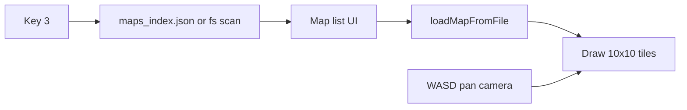

# Map editor UX + C++ map viewer

## Prerequisites (workspace rules)

Before implementation, add separate log entries to [`docs/tracker.md`](docs/tracker.md) for each deliverable (e.g. FEATURE entries for palette outline, event layer/UI, help text, C++ viewer). Reference those IDs in commits or code comments where useful. Status flow: OPEN → IN_PROGRESS → DONE.

---

## 1. Palette: persistent outline for selected brush tiles

**Where:** [`tools/map_editor.py`](tools/map_editor.py) (draw path ~1163–1192, mouse up ~1759–1777).

**Behavior:**

- After the brush is set (on `MOUSEBUTTONUP` when the palette drag completes, and whenever `_sync_brush_tileset` / defaults reset the brush), compute the **bounding rectangle in sheet tile coordinates** (col/row) for all brush cells whose `ts` matches `active_tileset_id`. Convert each 1-based tile index with `columns`: `col = (t-1) % columns`, `row = (t-1) // columns`.
- Store that rect (or `None` if no cells for the active sheet) on the editor instance.
- In the palette draw pass (after blitting the scaled thumb, still inside the palette clip), draw a **high-contrast rectangle outline** (e.g. 2px yellow/white) around that region in **screen pixels**: same math as the drag preview (`ox, oy`, `scale`, minus `palette_scroll_y`).

**Edge cases:** Multi-tileset brush: outline only the subset on the current tileset; if none, draw no outline. Single click already builds a 1×1 brush on mouseup—outline will show for that tile.

---

## 2. Event layer + clearer “which layer” UI

**Data model:** Same as existing `tileLayers`: a layer with id **`event`**, cells identical to `ground` (`null` or `{ts, t}`). No schema change beyond what already supports arbitrary layer ids ([`src/maps/README.md`](src/maps/README.md), [`include/map_data.h`](include/map_data.h)).

**Editor behavior ([`tools/map_editor.py`](tools/map_editor.py)):**

- **Option to have an event layer:** Prefer a **Settings** control (gear overlay already exists; extend [`_draw_settings_overlay`](tools/map_editor.py) / its click handling) such as **“Add event layer”** if no layer id `event` exists, and optionally **“Remove event layer”** when present and you want explicit removal (or rely on existing layer-remove flow). Avoid silently deleting user data without confirmation.
- **New maps:** Either keep default single `ground` and rely on the button, or default new maps to `ground` + empty `event`—pick one and document in the setting label so intent is obvious. (Recommendation: **explicit “Add event layer”** in settings keeps existing `new_map` behavior and matches “option”.)

**UI indicator (make “vague” line obvious):**

- Add a **visible chip or bar** in the map column (e.g. below the `*` gear or along the top of [`map_viewport_rect`](tools/map_editor.py)): e.g. `EDITING: GROUND` vs `EDITING: EVENT` with distinct background colors and short hint “comma/period — switch” using **primary** key only (see §3).
- Keep footer metadata but shorten: e.g. `Layer 2/2 · event` instead of burying it in a long line, or move redundant text out if the chip is authoritative.

**Save/load:** No change if layer id is already persisted in `tileLayers`; loading already preserves ids ([`try_load_map_by_id`](tools/map_editor.py)).

**Validation:** If [`tools/validate_maps.py`](tools/validate_maps.py) assumes layer id patterns, ensure `event` is allowed (it should be already as a generic string id).

---

## 3. Help text: one key per action

**Where:** [`tools/map_editor.py`](tools/map_editor.py) — `keys_for` (~558–560) and all footer/quickstart strings (~1266–1306).

**Approach:**

- Add something like `key_primary(action: str) -> str` that returns the **first** binding from [`tools/map_editor_config.json`](tools/map_editor_config.json) (e.g. `equals` for tileset prev), with a safe fallback if empty.
- Use `key_primary` for **all user-visible** help strings (footer lines, quickstart parentheses, layer hint).
- **Keep** `event_matches_key` using the **full** list so power users who rely on `pageup` / `kp_plus` etc. are not broken without editing the message.

Optional cleanup: shorten [`map_editor_config.json`](tools/map_editor_config.json) to one key per action **only if** you want docs and behavior aligned; not required if display-only primary is enough.

**Hardcoded shortcuts** in the third footer line (`ID:I · Conn:C`) should become consistent one-key style (e.g. `Id: I · Conn: C · Pan: arrows` → use primary pan keys from config or label `arrows` once).

---

## 4. C++: key `3` map list, load map, 10×10 camera, WASD pan (last)

**Context:** [`Game::run`](src/game.cpp) currently handles keys `1`/`2` and battle UI; there is **no** map rendering yet. [`map_data.cpp`](src/map_data.cpp) already implements `loadMapFromFile`, `loadTilesetRegistry`, and multi-layer `tileLayers`.

**Dynamic map list JSON:**

- Add **`src/maps/maps_index.json`**, produced whenever maps should be discoverable:
  - **Recommended:** write/refresh from [`tools/map_editor.py`](tools/map_editor.py) on successful **save** (same directory as map files), and from [`tools/validate_maps.py`](tools/validate_maps.py) after validation (keeps CI/manual runs in sync).
  - Shape (example): `{ "version": 1, "maps": [ { "id": "sample_room", "name": "Sample room" }, ... ] }` built by scanning `*.json` in `src/maps/` **excluding** `maps_index.json`.
- **C++:** On **SDLK_3** / **SDLK_KP_3** (no battle / no dex modal), enter a **map viewer mode**: load `src/maps/maps_index.json`; if missing or invalid, **fall back** to enumerating `src/maps/*.json` via `std::filesystem` (same exclusion) so the game still works.

**UI flow in viewer mode:**

- Overlay or replace title text with a **scrollable list** of map ids/names; **Up/Down** (or W/S if you prefer list navigation—**WASD reserved for camera pan when a map is loaded**; use arrow keys for list selection to avoid conflict) and **Enter** to load selected map; **Esc** exits viewer / returns to title.
- After load: `loadMapFromFile` + `loadTilesetRegistry("src/tilesets.json")`.

**Rendering:**

- **Viewport:** exactly **10×10 tiles** visible. Compute integer tile size: `tilePx = min(kLogicalWidth / (10 * map.tileWidth), kLogicalHeight / (10 * map.tileHeight))` (or scale to a dedicated rect with margins), then draw layers bottom-to-top from `MapData::tileLayers` using SDL source rects from each tileset sheet (same margin/spacing/columns rules as editor—mirror logic from [`tools/map_editor.py`](tools/map_editor.py) `blit_tile` math or add a small helper in a new `.cpp` if needed).
- **Camera:** `camTileX`, `camTileY` (top-left of window in map coords). **WASD** moves by **1 tile**, clamped so the 10×10 window stays inside `map.width` / `map.height` (for a 12×10 map, max `camTileX = 2`, `camTileY = 0`).

**Engine integration:**

- Extend [`include/game.h`](include/game.h) / [`src/game.cpp`](src/game.cpp) with a small nested state: `enum class TitleSubMode { Normal, MapPick, MapView };` plus selected index, loaded `MapData`, camera, and **cached SDL textures per tileset id** (load on demand from registry paths; paths are relative to project root—document that `./build/app` is run from repo root).
- Update [`displayText_`](src/game.cpp) instructions to mention **Press 3 — map viewer** and WASD pan when in map view.
- **Linking:** `map_data.cpp` is already compiled via the wildcard [`Makefile`](Makefile); include `map_data.h` from `game.cpp` (or a tiny `map_view_renderer.cpp` if you want to keep `game.cpp` smaller).

**Order of work:** Implement items 1–3 in Python first; then item 4 in C++ as the final step.

---

## Architecture sketch (C++ viewer)

---

## Files touched (summary)

| Area | Files |
|------|--------|
| Editor | [`tools/map_editor.py`](tools/map_editor.py), optionally [`tools/map_editor_config.json`](tools/map_editor_config.json) |
| Index | New [`src/maps/maps_index.json`](src/maps/maps_index.json) (generated), [`tools/validate_maps.py`](tools/validate_maps.py), map save path in editor |
| C++ | [`include/game.h`](include/game.h), [`src/game.cpp`](src/game.cpp), possible new `src/map_view.cpp` + header if split |
| Docs / process | [`docs/tracker.md`](docs/tracker.md) per workspace logging rules |
