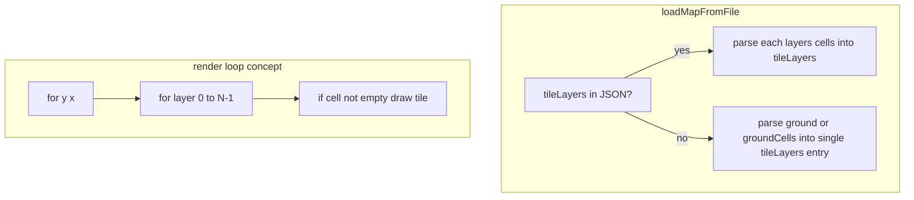

# Multi-layer tile maps (editor + C++)

## Current state

- **[tools/map_editor.py](tools/map_editor.py)** holds one 2D grid `ground_cells`; paint/fill/erase only touch that grid. Save writes either `layers.ground` (int, single tileset) or `layers.groundCells` (mixed `{ts,t}`). `walkability` and `transparent` are separate global grids (not stacked tiles).
- **[include/map_data.h](include/map_data.h)** / **[src/map_data.cpp](src/map_data.cpp)** load a **single** tile layer plus optional walk/trans. **`loadMapFromFile` is not used from [src/game.cpp](src/game.cpp) today**—so C++ work is **loader + data model + a clear render contract** (actual SDL draw loop can follow in the same style you use elsewhere).

## Data model (JSON)

Add a canonical ordered list of tile layers (bottom → top):

```json
"layers": {
  "tileLayers": [
    { "id": "ground", "cells": [ /* same shape as current groundCells: null or { "ts", "t" } */ ] },
    { "id": "decor", "cells": [ /* ... */ ] }
  ],
  "walkability": [ /* unchanged */ ],
  "transparent": [ /* unchanged */ ]
}
```

- **`tileLayers`**: array order = draw order. Empty cell = `null` (shows through to layers below).
- **Legacy** (keep working): if `tileLayers` is absent, treat existing `layers.groundCells` or `layers.ground` as **one** layer with a default id (e.g. `"ground"`) when loading.
- **Version**: bump map `version` when saving the new shape (e.g. `3` when `tileLayers` is present); document in [src/maps/README.md](src/maps/README.md).
- **Mixed tilesets**: reuse the same per-cell encoding as today; `_has_mixed_tilesets`-style logic should consider **all** tile layers when deciding whether anything still needs int-only `ground` (likely **always emit `tileLayers` with `cells`** from the editor to avoid N× dual code paths—optional simplification).

## Map editor (Python)

- **State**: Replace lone `ground_cells` with `tile_layers: list[list[list[dict | None]]]` and `active_layer_index: int` (always `0 <= index < len(tile_layers)`). Minimum **one** layer.
- **Load** ([`try_load_map_by_id`](tools/map_editor.py)): If `tileLayers` present, fill `tile_layers` from each `cells` entry; else migrate legacy `groundCells`/`ground` into a single layer.
- **Save** (`save`): Write `layers.tileLayers` with stable ids; stop writing top-level `ground`/`groundCells` for new saves (or write both during a transition—prefer **one** canonical format to reduce bugs).
- **Resize / new map**: Extend [`resize_map`](tools/map_editor.py) / [`new_map`](tools/map_editor.py) to resize **every** layer the same way current code preserves `ground_cells` content.
- **Painting**: [`apply_brush_at`](tools/map_editor.py), [`fill_rect_with_brush`](tools/map_editor.py), drag-fill, erase → only modify `tile_layers[active_layer_index]`.
- **Rendering**: In the map viewport, for each cell `(x,y)`, draw layers **0..n-1** in order (skip `None`). Reuse existing `blit_tile_scaled` / transparency tinting as today; composite order is the only change.
- **UI / UX** (minimal but usable):
  - Show **active layer name + index** in the footer or map chrome (e.g. `Layer: decor (2/3)`).
  - **Cycle layer**: new keybinds in [tools/map_editor_config.json](tools/map_editor_config.json) (e.g. `[` / `]` or `pageup`/`pagedown`)—do **not** steal `Tab` (used for paint/walk/transparent).
  - **Add / remove layer** (buttons in footer or keys): add duplicates empty grid; remove requires confirm if non-empty or always with confirm—spec: **remove** clears only that layer’s slot (or block if last layer).
  - **Rename layer** optional follow-up; default ids `Layer 1`, `Layer 2`, … or `ground`/`layer2`/…

- **Cross-layer tools**: [`delete_tileset`](tools/map_editor.py), import-driven updates, and any “clear all references to tileset X” must scan **all** tile layers.

## Validation

- Update [tools/validate_maps.py](tools/validate_maps.py): accept either legacy `ground`/`groundCells` **or** `layers.tileLayers` (non-empty array). For each layer, validate `id` (string), `cells` dimensions `h×w`, and each cell (same rules as current `groundCells`). Reject duplicate layer ids if you want stable tooling.

## C++ (`map_data`)

- Extend [`MapData`](include/map_data.h) with something like:

  - `struct TileLayer { std::string id; std::vector<std::vector<MapCell>> cells; };`
  - `std::vector<TileLayer> tileLayers;`
  - Keep legacy fields optional for one release **or** load legacy into `tileLayers` with one entry and clear legacy vectors—prefer **one** representation in memory after load.

- In [`loadMapFromFile`](src/map_data.cpp):
  - If `layers.tileLayers` exists: parse each layer with existing `parseGroundCells`-equivalent logic.
  - Else: current `ground` / `groundCells` branch populates `tileLayers` with a single layer.

- **Rendering contract** (for when you wire `game.cpp`): for each `(y,x)`, for `i` in `0 .. tileLayers.size()-1`, draw non-empty `MapCell` in order; then apply any global walk/transparency behavior you already define (likely unchanged: **one** walk grid and **one** trans grid for the whole map).

## Docs / tracker

- Update [src/maps/README.md](src/maps/README.md) with `tileLayers` schema and migration note.
- Add a **FEATURE** entry in [docs/tracker.md](docs/tracker.md) per project rules.

## Mermaid: load + draw order



## Out of scope / later

- Per-layer walkability or transparency (you’d add parallel grids or flags per layer).
- Parallax / different scroll speeds.
- Automatic migration of **all** repo JSON files on disk (can be manual re-save from editor or a one-off script).
