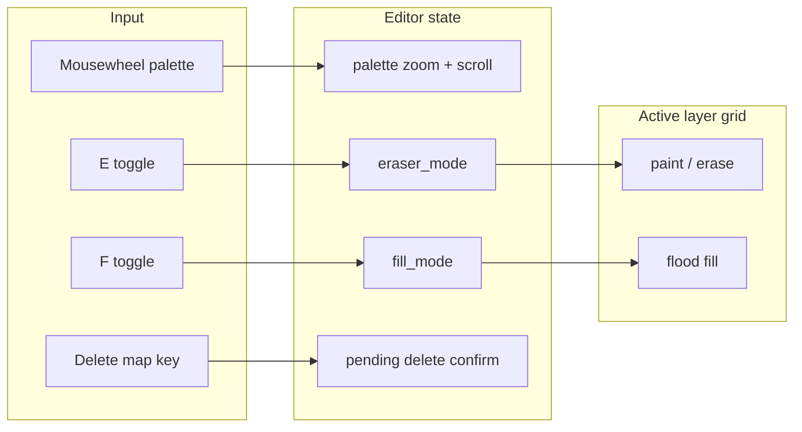

# Map editor: zoom, eraser, fill, delete map

## Context (current behavior)

- **Palette / “tile editor”:** [`_palette_thumb_metrics`](tools/map_editor.py) computes a single integer `scale` (auto-fit to the palette rect, hard cap `min(..., 2)`). Wheel over the palette only adjusts [`palette_scroll_y`](tools/map_editor.py) (vertical scroll). Hit-testing uses the same `scale` in [`palette_tile_at_pixel`](tools/map_editor.py).
- **Erase:** [`apply_brush_at`](tools/map_editor.py) / rect fill already support `erase`; on mouse up, `erase = self.map_drag_button == 3` (right button) only ([~3043–3051](tools/map_editor.py)).
- **Rect fill:** Dragging on the map in paint mode already fills a rectangle with the brush (or erases with RMB)—this is **not** a paint-bucket flood fill.
- **Maps on disk:** JSON files under [`src/maps`](src/maps); [`write_maps_index()`](tools/map_editor.py) rebuilds [`maps_index.json`](src/maps/maps_index.json). [`refresh_map_file_list`](tools/map_editor.py) / [`try_load_map_by_id`](tools/map_editor.py) drive the `[` / `]` file cycling.

## 1. Logging (required before implementation)

Add **four** new `FEATURE` blocks to [docs/tracker.md](docs/tracker.md) (one responsibility each), with the next free IDs **FEATURE-MAP-015** … **018** (FEATURE-MAP-014 is the latest FEATURE id today). Each entry must include full required fields per [.cursor/rules/Logging-Rule.mdc](.cursor/rules/Logging-Rule.mdc). Reference these IDs in code comments where appropriate.

## 2. Palette zoom (tileset preview pane)

**Goal:** User-controlled zoom for the left palette sheet (larger/smaller tiles than the current auto-fit cap of 2).

**Approach:**

- Introduce state such as `palette_zoom_offset: int` (default `0`) applied on top of a computed **fit** scale: e.g. `fit = min(max_w // sw, max_h // sh)` (keep current layout math), then `scale = max(1, min(PALETTE_SCALE_MAX, fit + palette_zoom_offset))` with a reasonable `PALETTE_SCALE_MAX` (e.g. 8–16).
- When `sw * scale > max_w`, the thumbnail is wider than the clip rect: add **`palette_scroll_x`** (mirror of `palette_scroll_y`), clamp in `_clamp_palette_scroll`, and blit at `(ox - palette_scroll_x, oy - palette_scroll_y)`.
- **Input:** In the existing `MOUSEWHEEL` branch when the cursor is over `palette_rect`, if **Ctrl or Gui (⌘)** is held, adjust zoom (and clamp scroll); otherwise keep current vertical scroll behavior. Optionally add **+ / −** (respecting existing `tileset_prev`/`tileset_next` bindings on `=`/`-`) only when the palette is hovered to avoid stealing global tileset switching—e.g. zoom only via **Ctrl+wheel** unless you also add dedicated config keys.
- Update footer hint text (e.g. “Scroll: wheel · **Ctrl+wheel: palette zoom**”) near the existing “Scroll: wheel” line in the draw routine (~2279).

**Files:** [tools/map_editor.py](tools/map_editor.py) (`_palette_thumb_metrics`, `_clamp_palette_scroll`, palette draw, `palette_tile_at_pixel` / `palette_tile_xy_from_pixel`, `MOUSEWHEEL` handler).

## 3. Eraser mode (E)

**Goal:** Toggle eraser so **left** click/drag clears tiles like RMB does today.

**Approach:**

- Add `eraser_mode: bool = False`.
- On **KEYDOWN**, when not in text/prompt/overlay modes (same guards as other global shortcuts), toggle on **`K_e`** (and wire through [tools/map_editor_config.json](tools/map_editor_config.json) + [`default_key_config`](tools/map_editor.py) as `toggle_eraser: ["e"]` so the footer can show `key_primary('toggle_eraser')` and settings rebinding works).
- On paint mouse-up, set `erase = (self.map_drag_button == 3) or self.eraser_mode` (replacing the current `erase = self.map_drag_button == 3` only).
- Update the brush status line (~2155–2158) to show `eraser=ON` when active; optionally mention RMB still erases when eraser is off.

**Files:** [tools/map_editor.py](tools/map_editor.py), [tools/map_editor_config.json](tools/map_editor_config.json).

## 4. Fill mode (flood fill / “paint bucket”)

**Goal:** A **fill mode** distinct from the existing drag-rectangle fill: flood-fill the **active tile layer** from the clicked cell through all **4-connected** cells that match the seed cell’s content (treat `None` as its own “color”; two dicts match if same `ts` and `t`).

**Approach:**

- Add `fill_mode: bool = False`; toggle with **`f`** (add `toggle_fill: ["f"]` to defaults + JSON for discoverability and rebinding). Ignore while `edit_mode != "paint"` or in text modes.
- On **single-cell** click release in paint mode when `fill_mode` is on (same mouse-up path as today): run a BFS/DFS flood from `(x0,y0)`; for each visited cell, write the **top-left brush tile** `self.brush_pattern[0][0]` (or `None` if `eraser_mode` is on—define precedence: **eraser wins** and fill clears). Use **`_undo_checkpoint()`** once before mutating the grid.
- If the user drags a rectangle while fill mode is on, either **no-op** beyond the first cell or only flood at drag start—pick one behavior and document it in the tracker (simplest: **only act on single-cell release**, ignore multi-cell drags for fill).
- Footer/quick text: mention Fill toggle key and that it targets the **active layer** only.

**Files:** [tools/map_editor.py](tools/map_editor.py), [tools/map_editor_config.json](tools/map_editor_config.json).

## 5. Delete current map (file + index)

**Goal:** Remove the current map’s **JSON file** from `src/maps`, refresh `maps_index.json`, and leave the editor in a sensible state.

**Approach:**

- Add configurable shortcut, e.g. **`delete_map`: `["d"]`** with a **Y/N confirmation overlay** (reuse the interaction pattern from `tileset_delete_confirm_id`: new `map_delete_confirm: bool` or store pending stem; **Esc/N** cancel, **Enter/Y** confirm).
- **Target file:** Prefer the on-disk identity: if `self._map_disk_backing_id` is set and `MAPS_DIR / f"{self._map_disk_backing_id}.json"` exists, delete that; else if `sanitize_map_id(self.map_id).json` exists, delete that; if **no file** (never-saved buffer), show status “No saved map file to delete” and cancel.
- On success: `path.unlink()`, `write_maps_index()`, `refresh_map_file_list()`, then **load another map** if any remain (`try_load_map_by_id` on neighbor index), else **`new_map(reset_connections=True)`** and clear `_map_disk_backing_id` / `saved_once` as appropriate.
- **Never delete** [`maps_index.json`](src/maps/maps_index.json) by name (already excluded from globs in [`write_maps_index`](tools/map_editor.py)).
- Optional note in tracker: other maps’ `connections` may still reference the deleted id (no automatic cleanup in v1 unless you explicitly want that scope).

**Files:** [tools/map_editor.py](tools/map_editor.py), [tools/map_editor_config.json](tools/map_editor_config.json).

## 6. Documentation touchpoint (optional)

If you want runtime docs aligned with behavior, a short addition to [src/maps/README.md](src/maps/README.md) editor section is enough; skip if you prefer code + footer only.

## Testing (manual)

- Palette: Ctrl+wheel zooms; wheel alone still scrolls; brush selection drag still matches cells at all zoom levels; horizontal scroll appears when zoomed past panel width.
- Eraser: `E` toggles; LMB paints vs clears; RMB still erases when eraser off.
- Fill: `F` toggles; single click fills region on active layer only; Undo restores; eraser + fill clears region.
- Delete: confirm flow; file gone from `src/maps`; index updated; editor loads another map or empty new map.
