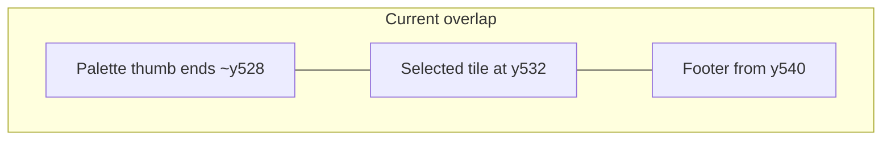

# Map editor: scalable window + readable UI

## Root cause (from current code)

In [`tools/map_editor.py`](tools/map_editor.py):

- The window is fixed at **1280×720** (`set_mode((1280, 720))`).
- **`palette_rect`** height is **520** (y ≈ 8…528). The line **"Selected tile index: …"** is drawn at **`palette_rect.bottom + 4`** (≈532), while the status block starts at **`yb = 540`** with **22px / 40px / 62px** offsets — those regions **overlap** the palette tail and each other on a 720px-tall window.
- **Line 1** of the footer is one long string with **no wrapping**, so it is **clipped** at the right edge.
- There is **no** `RESIZABLE` flag or **`VIDEORESIZE`** handling, so the user cannot grow the window to recover space.

## Implementation plan (code changes)

**Single file:** [`tools/map_editor.py`](tools/map_editor.py).

### 1. Resizable display

- Use `pygame.display.set_mode((initial_w, initial_h), pygame.RESIZABLE)` (pick sensible defaults, e.g. 1280×720 or 1400×800).
- Track `self.window_w`, `self.window_h`.
- On **`pygame.VIDEORESIZE`**, clamp to a **minimum size** (e.g. 960×600), call `pygame.display.set_mode((w, h), pygame.RESIZABLE)`, then **`self.relayout()`**.

### 2. Central `relayout()` (or `layout_from_size(w, h)`)

Compute all rectangles from window size so **nothing overlaps**:

| Region | Rule |
|--------|------|
| **Footer** | Full width, fixed **minimum height** derived from font metrics (e.g. `footer_h = max(100, N * line_skip + pad)`), anchored to **bottom** (`y = h - footer_h`). Fill with a slightly lighter panel color for contrast. |
| **Main content** | Area above footer: `content_h = h - footer_h - top_margin`. |
| **Palette column** | Left: width `palette_w = clamp(280, w * 0.28, 420)` (tune as needed). `palette_rect` height = **`content_h`** (top to footer), so the **tile sheet thumb** stays inside this rect. |
| **Map viewport** | Right of palette: remaining width, same vertical span as palette. Replace the hard-coded **880×520** [`map_rect`](tools/map_editor.py) with `w - palette_w - margins`. |

Update **`map_origin_x` / `map_origin_y`** from this layout so **`map_cell_at_pixel`** and drawing stay consistent.

### 3. Fix palette vs. “Selected tile” text

- Either **(A)** draw “Selected tile …” **inside** `palette_rect` at the bottom (reduce `_palette_thumb_layout` **`max_h`** to reserve ~1–2 lines below the thumb), or **(B)** move it to the **first line of the footer**. **(A)** keeps palette context together; **(B)** is simpler. Prefer **(A)** if thumb scaling still works after reserving text lines.

### 4. Footer text: wrap, don’t clip

- Add a small **`blit_wrapped_text(surface, font, text, rect, color)`** (word-split on spaces, accumulate words until line width exceeds `rect.w`, then newline). Use `font.size(" ")` / `render` for measurement.
- Split current mega-line into **short logical lines** or bullet groups, e.g.:
  - Line A: `Map: {id}  Size: {w}x{h}  Tileset: {id}  Mode: {edit_mode}`
  - Line B: shortcuts split across 2–3 wrapped lines (`Paint`, `I/C`, `S/N`, `[ ]`, arrows, `+/-`, `T/PgUp/Dn`, `Esc`).
- Connection / map-id edit lines stay below, with **explicit `y += line_skip`** using **`font.get_linesize()`** (or height from `render`).

### 5. Optional UX polish (low cost)

- Slightly increase default font size on large windows (optional), or keep fixed fonts for predictability.
- Ensure **mouse palette picking** still uses `_palette_thumb_layout()` / `palette_rect` after relayout (no code path should use stale constants).

### 6. Docs touch

- One short paragraph in [`src/maps/README.md`](src/maps/README.md): window is resizable; run from repo root; footer shows shortcuts.

---

## Instructions: how to use the editor (for you to ship after the change)

*(Agent will embed this in README or reply; summary here.)*

1. **Install:** `python3 -m pip install pygame`
2. **Run** from repo root: `python3 tools/map_editor.py`
3. **Resize** the window if the map or palette feels cramped.
4. **Paint:** left-click tileset to select; left-click/drag on map to paint; right-click/drag to erase (tile `0`).
5. **Tileset:** `T`, `PgUp` / `PgDn`
6. **Map size:** `+` / `-`
7. **Pan view:** arrow keys
8. **Save:** `S` → writes `src/maps/<map_id>.json`
9. **New map:** `N`
10. **Map id:** `I`, type id, `Enter`
11. **Connections:** `C` cycles field; type value; `Enter` to apply
12. **Switch map file:** `[` / `]`
13. **Validate:** `python3 tools/validate_maps.py`
14. **Quit:** `Esc`

---

## Instructions: porting maps into the C++ program

Your game already has a **data-side** hook; there is **no in-game overworld renderer** yet.

1. **Author data** with the editor → JSON under [`src/maps/`](src/maps/) matching [`src/maps/README.md`](src/maps/README.md).
2. **Tileset registry:** [`src/tilesets.json`](src/tilesets.json) — C++ can load via **`loadTilesetRegistry("src/tilesets.json", ...)`** in [`include/map_data.h`](include/map_data.h) / [`src/map_data.cpp`](src/map_data.cpp).
3. **Load a map:** **`loadMapById("src/maps", mapId, mapData)`** or **`loadMapFromFile("src/maps/foo.json", mapData)`** — populates `MapData::groundLayer`, dimensions, `tilesetId`, `connections`.
4. **Rendering (your work):** resolve `tilesetId` to a `TilesetDef`, load the PNG with SDL_image (same as sprites), then for each cell in `groundLayer[y][x]` if `> 0`, compute source rect in the sheet: index `tile-1` → `(col, row)` using `columns` and `tileWidth`/`tileHeight`/`margin`/`spacing` (mirror the math in the editor’s `blit_tile` / palette picker).
5. **Connections:** use `MapData::connections` when you implement doors/warps (load target map with `loadMapById`, place player at `entryTileX/Y`).
6. **Working directory:** run the binary from project root (or embed resource paths) so relative paths match `monster.json` / battle assets.

---

## Verification

- Run editor at default size: **no overlap** between palette, map, and footer; footer text **fully visible** and **wrapped**.
- Shrink window to minimum: layout still **degrades gracefully** (footer scroll not required for v1; minimum size prevents unusable UI).
- Resize larger: map viewport **grows**; no hard-coded 880×520 clipping of interaction.
- `python3 tools/map_editor.py` + save + `python3 tools/validate_maps.py` still pass.
