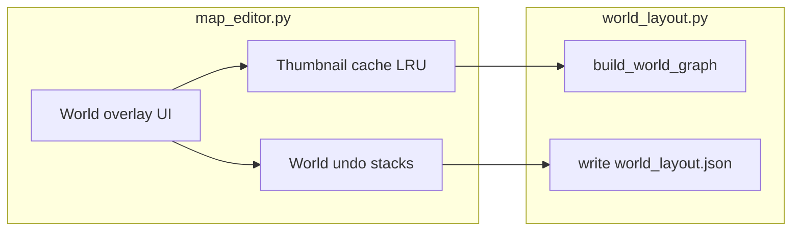

# Map connection workspace (editor + export)

## Preconditions (repo rules)

- Add a **FEATURE** entry to [`docs/tracker.md`](docs/tracker.md) before implementation (reference its **ID** in commits / PR text).
- After code changes: update [`docs/tools_doc.md`](docs/tools_doc.md) for the editor tool; update [`docs/source_doc.md`](docs/source_doc.md) if C++ gains new types/functions for the world JSON.
- **QA / RAM–performance** (from attached skill): treat workspace draw + thumbnail generation as hot paths; avoid unbounded surfaces, duplicate full map grids in memory, or O(n²) proximity checks on every frame without throttling.

## 1) Backup and version labels (no behavior change yet)

- Create a dated rollback folder, e.g. [`backups/map_editor_world_workspace_20260418/`](backups/map_editor_world_workspace_20260418/) (path name can use actual run date), and copy at minimum:
  - [`tools/map_editor.py`](tools/map_editor.py)
  - Any small helper you add under `tools/` for world JSON / algorithms
- Per your request for “all the code”: also copy [`src/`](src/), [`include/`](include/) if present, and [`docs/`](docs/) into the same backup tree so rollback is one directory restore.
- **Tool version 1.0**: surface in the editor UI (footer or window caption via `pygame.display.set_caption`) and in `tools_doc.md`.
- **C++ alpha 0.1**: add a single visible string the game already uses for status/title (likely [`src/game.cpp`](src/game.cpp) where the window title or HUD is set) plus a short note in `source_doc.md`.

## 2) UX: icon next to settings

- In [`MapEditor.relayout`](tools/map_editor.py) (~804–835), place **`world_btn_rect`** immediately **left of** `gear_rect` (same height as today’s gear chip), and shift `gear_rect` left by `32 + gap` so both fit inside `map_viewport_rect`.
- In `draw()`, draw a second bordered rect + glyph (e.g. `#` or `W`) analogous to the `*` gear (~2359–2361).
- In `run()` `MOUSEBUTTONDOWN`, handle `world_btn_rect` before `gear_rect` (~3563): toggle **`world_workspace_open`** (name flexible), clear other modal drags when opening/closing.

## 3) World workspace overlay (separate camera from map edit)

When `world_workspace_open`:

- **Viewport**: reuse **`map_canvas_rect`** (or full `map_viewport_rect` below chips) as the world view so palette/tileset stay usable; alternatively a semi-transparent overlay—prefer **opaque dedicated rect** with its own transform for clarity.
- **Workspace camera**: new state, e.g. `world_cam_x`, `world_cam_y`, `world_cam_zoom` (float). **Pan/zoom** mirrors existing map canvas wheel behavior ([`MOUSEWHEEL` branch ~3432–3488](tools/map_editor.py)): Ctrl/Meta = zoom toward cursor, Shift = horizontal pan, else vertical pan—but apply deltas to **world** camera only when pointer is in the world rect and workspace mode is on. Add `world_workspace_open` to the exclusion list next to `settings_open` so wheel does not fight map editing underneath.
- **Thumbnails**: each **node** = `{ id: map stem, x, y, w, h }` in **world space** (world pixels). Draw a **downscaled preview** (fixed max edge, e.g. 160–256 px) + label (map id). **Do not** deep-copy full `tile_layers` into the world model.

### Thumbnail generation (performance-critical)

- On **insert** (or first visibility), load the map’s JSON from disk with existing loader paths (same as `load_map_file` logic), render **one** `pygame.Surface` at low resolution using the same tile blit path as the main editor but with a computed `thumb_cell_px`, then store in a dict **`thumb_surfaces[map_id]`** (LRU cap, e.g. 32 entries, evict oldest surface to bound RAM).
- **Regenerate** thumbnail only when that map file’s mtime changes (optional follow-up) or on explicit “refresh”; avoid per-frame `pygame.transform.scale` of full-size composites.

## 4) Interactions

- **Insert map**: open the **existing** open-map overlay flow (`open_map_overlay`, list + scroll ~3581+) filtered to “pick map to add”; on select, push undo, append node with default position (e.g. staggered grid near origin).
- **Delete map**: remove **only** the node from the workspace list; never call map delete / `_write_map_json_to_disk` for removal from graph.
- **Drag nodes**: left-drag hit-test on node rects (world to screen: subtract camera, apply zoom). Store `drag_offset`.
- **Right-click context menu** on node: small rect menu with **Insert…** (opens picker), **Delete**, **Undo**, **Redo**, **Copy**, **Paste** (paste creates new node offset from source; new internal node id).
- **Copy/Paste**: keep `world_clipboard` as a **serialized node spec** (map id + optional display scale), not a full map duplicate.

## 5) Undo / redo (must not blow RAM)

- **Do not** extend `_snapshot_map_state()` with tile data for every world move (that would duplicate huge grids).
- Add a **parallel** stack, e.g. `_world_undo_stack` / `_world_world_redo_stack` (or namespaced dict snapshots **only** `{ "nodes": [...], "cam": {...} }`), `WORLD_UNDO_STACK_MAX` similar to `UNDO_STACK_MAX`.
- Wire **existing** shortcuts: where `undo_map_edit` / `redo_map_edit` are invoked from keys, branch: if `world_workspace_open` and focus is world view (or always when world open and last edit was world—simplest: **when world overlay focused** / pointer inside world rect), call `undo_world_edit` / `redo_world_edit`; else keep current map tile undo. Document this split in `tools_doc.md`.
- On each world-mutating op: `_world_undo_checkpoint()`; mirror “clears redo” behavior like `_undo_checkpoint`.

## 6) Export JSON + proximity algorithm (for rendering)

- **Save** to a dedicated file, e.g. [`src/maps/world_layout.json`](src/maps/world_layout.json) (or `MAPS_DIR/world_layout.json`—pick one path and document). Suggested schema:

```json
{
  "version": 1,
  "editorTool": "1.0",
  "nodes": [
    { "mapId": "route1", "worldX": 0, "worldY": 0, "widthPx": 320, "heightPx": 240, "mapWidthTiles": 40, "mapHeightTiles": 30, "tileWidth": 16, "tileHeight": 16 }
  ],
  "edges": [ { "a": "route1", "b": "town", "kind": "proximity", "distanceWorldPx": 12 } ]
}
```

- **Edge build (offline, on Save or explicit “Export world”)**: O(n²) over **node count** (small; typically &lt; 100). For each pair, convert node rects to world AABB; if **separation** is ≤ `edge_snap_px` (config constant), push an edge with distance. Optionally merge with per-map **`connections`** in existing map JSON ([`empty_connections`](tools/map_editor.py) / load ~1113–1121) for warp-style links—document as “logical portals” vs “spatial adjacency”.
- **Render order by proximity** (deterministic algorithm for the runtime / future C++):
  1. Choose **`originMapId`** (first node, or user-selected “root” in settings later).
  2. Run **Dijkstra** (or BFS if unweighted) on the proximity graph from `originMapId` using `distanceWorldPx` as weight; stable-tie-break by `mapId` string.
  3. Output `renderOrder: [ ... ]` and optional `compositeBounds` (min/max world rect union) for streaming loads.

Pure-Python function e.g. `build_world_graph(nodes) -> dict` in a small module [`tools/world_layout.py`](tools/world_layout.py) keeps [`map_editor.py`](tools/map_editor.py) slimmer and is easy to unit-test.

## 7) C++ follow-through (minimal)

- Either **stub** reader in [`src/map_data.cpp`](src/map_data.cpp) / new `world_layout.h` that only validates JSON and prints bounds, or document “Phase 2: load `world_layout.json` in Game” in `source_doc.md` without full integration unless you want it in this same change. The user asked for JSON **for rendering**; the **algorithm** above can ship in Python + docs first, with C++ consuming the same file later.

## 8) QA checklist (RAM + performance) — targets before merge

- Thumbnail cache: **bounded LRU**, no full-map surfaces retained for evicted ids.
- World pan/draw: O(nodes) per frame; no JSON disk read in the draw loop.
- Proximity export: O(n²) **only on save/export**, not per mousemove.
- Validation: open workspace with 20+ maps, pan/zoom 30s, watch process RSS; export JSON and verify edge count.


