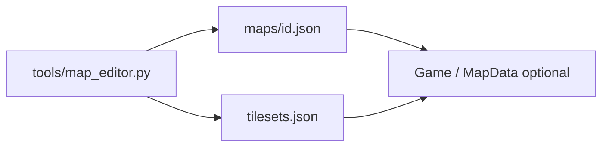

# Maps framework, versionHistory, and battle backgrounds

## Context

- Game loop and battle UI live in [`src/game.cpp`](src/game.cpp): battle draws **black clear** then [`drawCornerSprites`](src/game.cpp) / HP / move prompt ([lines 596–602](src/game.cpp)); debug “test mode” today is **key 1** (dex modal) and **key 2** (quick battle) ([lines 547–562](src/game.cpp)).
- JSON is loaded via nlohmann in [`Game::Game`](src/game.cpp) (same pattern as `monster.json`).
- [`src/Graphics/Tilesets`](src/Graphics/Tilesets) already exists (nested packs); **no** `Battlebacks` or `maps/` tree yet.

---

## 1. Map creation framework (data + editor + optional C++ stub)

**Goal:** Tileset-based maps you can **create, save, and connect** without hardcoding paths; tilesets rooted under `src/Graphics/Tilesets`.

### 1a. JSON contracts (simple, versioned)

| File | Role |
|------|------|
| [`src/tilesets.json`](src/tilesets.json) | **Tileset registry:** `tilesets[]` with `id`, `image` (path relative to repo root, e.g. `src/Graphics/Tilesets/.../sheet.png`), `tileWidth`, `tileHeight`, optional `margin`, `spacing`, `columns` (for autotile math later). |
| [`src/maps/*.json`](src/maps/) | **Map instances:** `id`, `name`, `tilesetId`, `width`, `height` (tiles), `tileWidth`/`tileHeight` (copy or override from tileset), `layers` (e.g. one `"ground"` layer: 2D array of **local tile indices** 0 = empty), `connections` / `exits` object: e.g. `{ "north": { "mapId": "other_map_id", "entryTileX": 5, "entryTileY": 12 } }` for linking maps (framework only until overworld exists). |

Add a short [`src/maps/README.md`](src/maps/README.md) (or comment block in a sample `sample_room.json`) describing the schema so hand-editing stays possible.

### 1b. Interactive editor (recommended: Python + Pygame)

- New script [`tools/map_editor.py`](tools/map_editor.py): loads `tilesets.json`, lets user pick a tileset, shows the sheet with a grid, **paint** into the current layer, set map size, **save** to `src/maps/<id>.json`, and a small **connections** UI (text fields or key bindings for north/south/east/west `mapId` + entry tile).
- **Dependency:** `pygame` (document in a one-line comment at top of script or in root README snippet). Alternative fallback: document “edit JSON by hand + run `python3 tools/validate_maps.py`” if you want zero deps (optional small validator script using only stdlib + PIL optional).

This keeps iteration fast and avoids bloating the SDL binary with a full in-game editor in the first pass.

### 1c. C++ “framework hook” (minimal)

- Optional small module: [`include/map_data.h`](include/map_data.h) + [`src/map_data.cpp`](src/map_data.cpp) — load `tilesets.json` + one `maps/<id>.json`, expose structs (`TilesetDef`, `MapLayer`, `MapExit`) and `bool loadMap(const std::string& mapId)`. **No requirement to render overworld yet** unless you want a **debug-only** “press 4 to preview map tiles” pass (stretch goal; can omit for v1).

### 1d. Directories

- Ensure [`src/Graphics/Battlebacks`](src/Graphics/Battlebacks) is created when implementing item 3 (can add `.gitkeep`).
- Create [`src/maps`](src/maps) with one committed **sample** map referencing an existing tileset path under `Tilesets` (or a placeholder path documented until art is finalized).



---

## 2. `versionHistory.txt`

- Add **[`versionHistory.txt`](versionHistory.txt)** at repo root.
- Structure: **Released / done** (reverse-chronological or by topic) summarizing major work from this project thread: nested species JSON + `formKey`, battle UI (move panel, HP placement/colors), sprite scaling, dex corrections (Giratina/Shaymin, placeholder 650+ fixes), shadow forms merged under `alternateFormeShadow`, `monster.json` sorted to 649 species, sync/migrate tool updates.
- Add **Future / backlog** section listing planned items (full overworld rendering, in-SDL map editor, audio, etc.) so “future” has a home without pretending dates you did not ship.

---

## 3. `battle.json` + background DB + test selection

### 3a. Data file

- New [`src/battle.json`](src/battle.json), e.g.:

```json
{
  "defaultBackgroundId": "black",
  "backgrounds": [
    { "id": "black", "file": "" },
    { "id": "example", "file": "src/Graphics/Battlebacks/example.png" }
  ]
}
```

- Empty `file` or missing entry = **no texture** (keep current solid black). All other entries are paths relative to project root, same style as `monster.json` sprites.

### 3b. Load once, use many times

- In [`Game`](include/game.h): after `initVideo` / renderer ready, load `src/battle.json` into a `json battleCfg_`.
- Maintain `std::vector<std::pair<std::string, SDL_Texture*>> battleBackgrounds_` (or `unordered_map` + ordered id list for cycling), populated by iterating `backgrounds` and calling existing [`loadIntoTexture`](src/game.cpp)-style helper into **non-null** textures only for non-empty `file`.
- On [`~Game`](src/game.cpp), destroy each cached battle background texture (new `destroyBattleBackgrounds()`).

### 3c. Rendering

- In the main loop where you `SDL_RenderClear` ([~596–597](src/game.cpp)), when `activeBattle_` is set and a current background texture exists, **`SDL_RenderCopy`** scaled to full logical rect (`kLogicalWidth` x `kLogicalHeight`) **before** `drawCornerSprites`.

### 3d. Test mode selection

- Add `size_t debugBattleBgIndex_` (or store current `id` string) initialized from `defaultBackgroundId`.
- While **battle is active** and not ended, handle **`[` / `]`** (with `event.key.repeat == 0`) to decrement/increment index modulo `battleBackgrounds_.size()`, wrapping with optional small on-screen label (e.g. bottom line or next to move box): `BG: <id>`.
- Update title/help text in [`returnToTitle`](src/game.cpp) / initial `displayText_` to mention `[` `]` during battle.

---

## Files to add / touch (summary)

| Area | Files |
|------|--------|
| Maps | [`src/tilesets.json`](src/tilesets.json), [`src/maps/*.json`](src/maps/), [`tools/map_editor.py`](tools/map_editor.py), optional [`tools/validate_maps.py`](tools/validate_maps.py), optional [`include/map_data.h`](include/map_data.h) / [`src/map_data.cpp`](src/map_data.cpp), [`Makefile`](Makefile) if new `.cpp` added |
| Changelog | [`versionHistory.txt`](versionHistory.txt) |
| Battle BG | [`src/battle.json`](src/battle.json), [`include/game.h`](include/game.h), [`src/game.cpp`](src/game.cpp), [`src/Graphics/Battlebacks/.gitkeep`](src/Graphics/Battlebacks/) or sample PNG note |

---

## Verification

- `make` passes.
- Drop a PNG into `Battlebacks`, list it in `battle.json`, run app, start battle (key 2), **`[`/`]`** switches background; empty/default stays black.
- Run `tools/map_editor.py`, save a map, confirm JSON validates and references a tileset from `tilesets.json`.
- `versionHistory.txt` present and readable.
