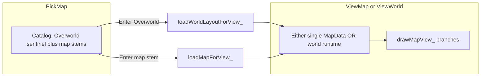

# Overworld: render `world_layout.json` from map viewer (key 3)

## Goal and acceptance criteria

- Press **3** → existing [`Game::openMapPicker_`](src/map_view.cpp) / pick-map UI.
- **First row** is **Overworld** (label in the list), selecting it and pressing **Enter** opens a playable view that **renders the composite described by** [`src/maps/world_layout.json`](src/maps/world_layout.json) (same path the map editor exports via F9).
- **WASD** moves the player; **Esc** returns to the list (same as current `ViewMap` → `PickMap`).
- **Walkability** respects the underlying map tile under the player’s world-tile footprint (reasonable behavior when the footprint spans two maps: blocked if any covered world cell is blocked).
- If `world_layout.json` is missing, invalid, or a referenced `mapId` file is missing: show a clear status message in the picker or console and **remain** in pick mode (no crash).
- **Threading:** **Do not** use a separate thread for **rendering** (SDL requires the main thread that owns the renderer). **Do not** add a background render thread by default. If later profiling shows JSON parse + multi-map load is a noticeable hitch, the only candidate would be a **worker thread for CPU-only prep** (parse + `MapData` load) with a main-thread handoff—defer unless measured; document “single-thread first” in the tracker.

## Current architecture (anchor)

- Key **3** calls [`openMapPicker_`](src/map_view.cpp) → [`loadMapCatalog_`](src/map_view.cpp) scans `src/maps/*.json`, skips only `maps_index.json`, sorts stems.
- Enter on selection calls [`loadMapForView_`](src/map_view.cpp) which loads one `MapData` via `loadMapFromFile` and draws in [`drawMapView_`](src/map_view.cpp) using `mapCamTileX_` / `mapPlayerTileX_` in **map-local** tile space.

## Proposed design

1. **Catalog UX** ([`loadMapCatalog_`](src/map_view.cpp), [`drawMapPicker_`](src/map_view.cpp), Enter handler in [`handleMapUiKey_`](src/map_view.cpp))
   - After building the sorted stem list, **skip** `world_layout` (filename stem) so it does not appear twice.
   - **Prepend** one synthetic entry at index 0, e.g. display id `Overworld` with internal sentinel id (constant string not colliding with real map ids, e.g. `__overworld__`).
   - Picker title line can stay or become slightly broader (“Map / Overworld viewer …”).

2. **Mode flag / enum**
   - Minimal change: add `bool worldLayoutViewActive_` (or extend [`MapUiMode`](include/game.h) with `ViewWorld`) plus runtime state on `Game`.
   - **Recommendation:** `enum class MapUiMode { None, PickMap, ViewMap, ViewWorld }` so `drawMapView_` / `handleMapUiKey_` / `game.cpp` draw dispatch stay explicit and avoid “ViewMap but not really” bugs.

3. **Load world layout** (new private method on `Game`, e.g. `loadWorldLayoutForView_()` in [`map_view.cpp`](src/map_view.cpp))
   - Read and parse `src/maps/world_layout.json` with existing `nlohmann::json`.
   - Validate `version`, `nodes` array; use `compositeBounds` when present else derive min/max from node `worldX`/`worldY`/`widthPx`/`heightPx` (tile spans per [export schema](tools/world_layout.py)).
   - Build **ordered instances**: for each `instanceId` in `renderOrder`, locate the matching node; load `MapData` for `mapId` from `src/maps/<mapId>.json` (reuse `loadMapFromFile` / `loadMapById`).
   - **Cache by `mapId`**: multiple instances of the same `mapId` need **separate `MapData` copies** in memory (or a shared immutable map + per-instance offset only—copy is simpler and matches editor semantics).
   - Populate `mapTilesetDefs_` / textures like [`loadMapForView_`](src/map_view.cpp); `rebuildMapTilesetRenderMeta_()` once all maps loaded.
   - **Spawn player**: use `originInstanceId` / `originMapId` from JSON to pick the node; spawn at map-local center converted to **world tile** coordinates (integer math consistent with node placement).
   - **Camera**: interpret `mapCamTileX_`/`mapCamTileY_` as **world-space** top-left of the viewport when in `ViewWorld`; clamp using composite bounds minus viewport size (same pattern as [`clampMapCamera_`](src/map_view.cpp) but in world extents).
   - Optional stretch: seed camera from `editorCamera` in JSON (world x/y + zoom do not map 1:1 to current tile-based camera—only apply if you convert zoom to equivalent tile window or ignore zoom for v1).

4. **Rendering** ([`drawMapView_`](src/map_view.cpp) or split helper `drawWorldLayoutView_`)
   - For each viewport cell `(tx,ty)`, world tile `(wx, wy) = (mapCamTileX_ + tx, mapCamTileY_ + ty)`.
   - **Painter order**: iterate `renderOrder` **front-to-back** or **back-to-front** consistently with how overlapping nodes should stack (match editor intent: last in `renderOrder` = on top—verify against Python [`render_order_by_proximity`](tools/world_layout.py) comment “sorted ids”; treat list as **back to front** so the last id paints last / on top).
   - For each node, if `(wx, wy)` lies inside its world AABB, convert to local `(mx, my)` and sample `tileLayers` like today’s inner loop (same tileset meta map).
   - Empty world cells (gaps): fill with the same void color as out-of-map today.

5. **Movement / walkability**
   - Extend [`mapWalkabilityBlocksAt_`](src/map_view.cpp) / [`mapPlayerFootprintBlockedAt_`](src/map_view.cpp): in `ViewWorld`, resolve world tile to the **topmost** covering instance (same paint order), map to local coords, read that instance’s `MapData.walkabilityLayer` (if invalid grid, treat blocked).
   - [`tryMovePlayerOnMap_`](src/map_view.cpp): use world coordinates when `ViewWorld`.

6. **Wire-up**
   - [`game.cpp`](src/game.cpp) render path: when `MapUiMode::ViewWorld`, call the world draw function (mirror `ViewMap` branch).
   - Help string near line 75: mention Overworld entry.

## Threading decision (explicit)

- **Rendering:** main thread only.
- **No default worker thread.** Multi-map load is typically small vs. one cold load; if stutter appears, measure then consider `std::async` for JSON + `MapData` construction only, with main thread doing texture creation—only if evidence shows benefit.

## Files to touch

- [`include/game.h`](include/game.h) — enum / members for world runtime (instance list, world bounds, maybe `std::vector<MapData>` keyed by instance).
- [`src/map_view.cpp`](src/map_view.cpp) — catalog, load, draw, walk, clamp, spawn.
- [`src/game.cpp`](src/game.cpp) — draw dispatch + title/help text if needed.
- [`docs/tracker.md`](docs/tracker.md) — new **FEATURE** (e.g. `FEATURE-MAP-029`) before implementation; reference ID in code comments.
- [`docs/source_doc.md`](docs/source_doc.md) — document new `Game` methods / mode and world-resolution rules.
- [`docs/tools_doc.md`](docs/tools_doc.md) — short note under runtime / map viewer if you document key 3 behavior there.

## Risks and verification

- **Duplicate `mapId` instances:** must not share one `MapData` mutably; verify two `tree_map_border` instances render at different `worldX`/`worldY`.
- **Per-node `tileWidth`/`tileHeight`:** if maps disagree, world grid must use a single convention (document: assume uniform 16×16 for v1, or skip nodes that mismatch and log).
- **Large composite:** viewport is capped (~30×30); performance should remain acceptable; verify FPS on worst-case layout.
- **Manual tests:** key 3 → Overworld → walk across a seam between two maps; Esc back; pick a normal map still works; missing `world_layout.json` shows error.
