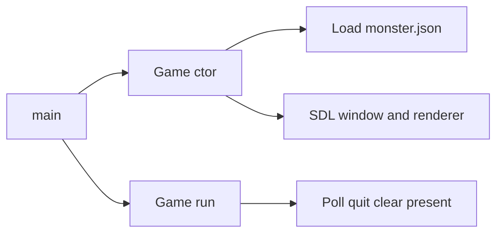

# Phase 1: Core Refactoring and Stability

## Preconditions

- Fix invalid JSON in [`src/monster.json`](src/monster.json): line 1 is `~{`; it must be `{` or the database will not parse.
- [`include/game.h`](include/game.h) uses `std::unordered_map` without `#include <unordered_map>`; add the include when touching the header.

## 1. Pokemon: `setTypeValues` and type parsing

**Current bug:** [`setTypeValues`](src/pokemon.cpp) is empty, and the constructor passes `data[pk][key]["type"]` into it (the type **array**), while the second parameter `name` is unused—implementation should ignore `name` or remove it from the signature for clarity.

**Plan:**

- Implement `setTypeValues(const nlohmann::json& typeArray)` (or keep name param only if you use it for error messages).
- Clear `types`, then iterate the JSON array. For each element, if it is a string: normalize to lowercase (reuse a small helper), look up in the existing string-to-`Type` map, `push_back` on success; on unknown type, log to `std::cerr` and skip (do not crash).
- Move the type string map out of per-instance state: use a **file-scope `static`** `unordered_map` in [`src/pokemon.cpp`](src/pokemon.cpp) (or a single `static` function `parseType(std::string_view) -> std::optional<Type>`) so every `Pokemon` does not carry a copy of the map (currently ~17 entries × every instance).

## 2. Stats: enum + direct struct access (remove string `setStat` / `getStat`)

**Current:** Large if/else chains in [`src/pokemon.cpp`](src/pokemon.cpp); [`helperMethods.cpp`](src/helperMethods.cpp) `operator<<` depends on string APIs.

**Plan:**

- In [`include/game.h`](include/game.h), add `enum class StatId { Hp, Atk, Def, SpAtk, SpDef, Spd };`.
- Lift `Stats` to a **public** struct (e.g. `PokemonStats` at namespace scope, or public nested `Pokemon::Stats`) with the same fields: `hp`, `atk`, `def`, `spAtk`, `spDef`, `spd`.
- Replace public `setStat` / `getStat` with:
  - `const PokemonStats& ivs() const` and `const PokemonStats& bases() const` (read-only for game/battle code later).
  - Private mutation only inside `Pokemon`: in `blankPoke`, `setBaseStats`, and IV initialization—assign fields directly (`iv.spAtk = random(...)` etc.).
- Implement **one** internal helper in the `.cpp` file, e.g. `int& mutableStat(PokemonStats&, StatId)` and `int stat(const PokemonStats&, StatId) const` using a `switch` on `StatId`, if you want to avoid repeating six field names in multiple places; this removes all string matching.
- Update [`operator<<(std::ostream&, const Pokemon&)`](src/helperMethods.cpp) to print via `StatId` + the small accessor or direct `p.ivs().hp`, etc.

**JSON key mapping (abbreviations):** Keep reading `spa` → `spAtk`, `spd` → `spDef`, `spe` → `spd` in `setBaseStats` via explicit `.value("spa", 0)`-style reads (see below)—no need to rename JSON keys for Phase 1.

## 3. JSON safety

**Current:** Unchecked `data[pk][key]["baseStats"]["hp"]` etc. throws or misbehaves if keys are missing.

**Plan:**

- Wrap **Pokemon construction path** (either `Pokemon::Pokemon` body or `Game::createPokemon`) in `try { ... } catch (const nlohmann::json::exception& e) { std::cerr << ...; }` so one bad entry does not abort the process.
- For each scalar, prefer **`object.value("key", default)`** on the correct sub-object, e.g. `auto const& species = data.at(pk).at(key);` inside try, then `species.at("baseStats").value("spa", 0)` after confirming `baseStats` exists, or use `value` with nested access carefully to avoid creating null entries—pattern:

  - `const auto& bs = species.at("baseStats");`
  - `baseStats.hp = bs.value("hp", 0);` … `baseStats.spAtk = bs.value("spa", 0);` …

- For the `type` array: `if (species.contains("type") && species["type"].is_array())` before parsing; else leave `types` empty and log.

## 4. Integrate SDL into `Game`

**Current:** [`src/main.cpp`](src/main.cpp) only calls `game.run()`; SDL lives in unused `createGUI`.

**Plan:**

- Add to `Game` private members: `SDL_Window* window = nullptr`, `SDL_Renderer* renderer = nullptr`, and optionally `bool sdlOk` or infer from pointers.
- **Initialization strategy (pick one, both valid):**
  - **A)** `Game` constructor: after JSON load, call `SDL_Init(SDL_INIT_VIDEO)`, `SDL_CreateWindow`, `SDL_CreateRenderer`; destructor: `SDL_DestroyRenderer`, `SDL_DestroyWindow`, `SDL_Quit()` (only if init succeeded—use a flag to avoid double-quit).
  - **B)** Lazy `bool initVideo()` called at start of `run()`; destructor still cleans up.
- [`Game::run()`](src/game.cpp): if video init failed, log and return (or keep console-only fallback). If success: minimal loop—`SDL_PollEvent` until `SDL_QUIT`, `SDL_SetRenderDrawColor`, `SDL_RenderClear`, `SDL_RenderPresent`, small `SDL_Delay`—so the window is visibly alive. **Do not** add `TTF_OpenFont` / `renderText` here (Phase 2).
- [`main.cpp`](src/main.cpp): remove or delete dead `createGUI` (or leave commented with a one-line note that rendering moved to `Game`) so the only path is `Game` + `run()`.

## 5. Header style: no `using namespace std`

- Remove `using namespace std;` from [`include/game.h`](include/game.h).
- Qualify types in the header with `std::` (`std::string`, `std::cout` usage should not appear in the header if possible—keep I/O in `.cpp` files).
- Replace `string` parameters in declarations with `std::string` (or `std::string_view` for read-only keys if you adjust call sites).

## 6. Optional schema note (no file required now)

- Document in a comment or later readme: prefer consistent keys `spAtk`, `spDef`, `spe` in JSON **or** keep abbreviations and document the mapping in one place (the `setBaseStats` implementation only).

## Files to touch

| File | Changes |
|------|---------|
| [`include/game.h`](include/game.h) | `StatId`, public `Stats` struct, new accessors, `Game` SDL members, remove `using namespace std`, add includes |
| [`src/pokemon.cpp`](src/pokemon.cpp) | `setTypeValues`, refactor stats/JSON, remove string stat chains |
| [`src/helperMethods.cpp`](src/helperMethods.cpp) | `operator<<` uses new stat API |
| [`src/game.cpp`](src/game.cpp) | SDL init/cleanup, safe JSON load message, `run()` loop |
| [`src/main.cpp`](src/main.cpp) | Thin main; drop or relocate `createGUI` |
| [`src/monster.json`](src/monster.json) | Fix leading `~` on first line |

## Out of scope for Phase 1 (per your roadmap)

- `GameState` enum, keyboard gameplay, `renderText` / TTF (Phase 2).
- Battle / damage / AI (Phase 3).
- Map grid / encounters (Phase 4).

After you confirm this plan, implementation can proceed in the repo; each subsequent phase waits on your go-ahead.
