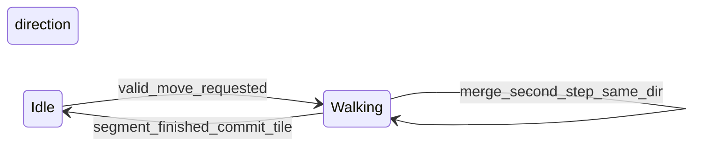

# Player walk animation and sprite (2×2 footprint)

## Goal and acceptance criteria

- **Visual**: The main character is drawn from a **4×4** sprite sheet (columns = walk frames 1–4, rows = facing: row 0 **S/down**, 1 **A/left**, 2 **D/right**, 3 **W/up**), scaled to **`playerTilesW` × `playerTilesH` × tilePx** (already **2×2** via [src/overworld_view.json](src/overworld_view.json)).
- **Animation rules** (user columns are **1-based** in spec; implement as **0-based** indices `0..3`):
  - **One tile** move: columns **`1,2,3`** → indices `[0,1,2]`.
  - **Next tile** in same direction (odd/even step alternation): **`3,4,1`** → `[2,3,0]`.
  - **Two tiles in one continuous action** (held key / merged segment): **`1,2,3,4,1,2,3,4,1`** → `[0,1,2,3,0,1,2,3,0]`; neutral “landed” frames align with columns **1** and **3** as described.
- **Logical gameplay**: Collision, events, and script hooks must use the **committed** tile while idle; during a walk segment, **do not** advance `mapPlayerTileX_`/`mapPlayerTileY_` until the segment completes (today they jump immediately in [`tryMovePlayerOnMap_`](src/map_view.cpp)).
- **Transparency**: Treat **white** sheet background as transparent (`SDL_SetColorKey` or rely on alpha if the PNG is RGBA).
- **Test**: Walk in **Overworld** (`MapUiMode::ViewWorld`) and **single map** (`ViewMap`) with WASD; verify facing rows and frame order for single step vs two-step continuous motion.

## Current behavior (baseline)

- Instant move + camera snap:

```570:586:src/map_view.cpp
bool Game::tryMovePlayerOnMap_(int deltaX, int deltaY)
{
    if (mapScript_ && mapScript_->playerLocked)
    {
        return false;
    }
    const int nx = mapPlayerTileX_ + deltaX;
    const int ny = mapPlayerTileY_ + deltaY;
    if (mapPlayerFootprintBlockedAt_(nx, ny))
    {
        return false;
    }
    mapPlayerTileX_ = nx;
    mapPlayerTileY_ = ny;
    syncCameraToFollowPlayer_();
    return true;
}
```

- Player draw is placeholder rects in [`drawMapView_`](src/map_view.cpp) and [`drawWorldLayoutView_`](src/map_view.cpp) (~lines 1233–1250 and 1361–1378).

- Main loop already calls [`tickMapScript_`](src/game.cpp) every frame before render — add an adjacent **`tickMapPlayerWalk_`** (or equivalent) there.

## Design: walk state machine



- **Committed position**: `mapPlayerTileX_` / `mapPlayerTileY_` (and world equivalents) only update when a walk **segment** finishes.
- **Visual offset**: Fractional tile offset (or integer pixels) from committed toward target, updated each tick from segment progress.
- **Segment definition**:
  - **Length 1 tile**: 3 animation ticks (columns `[0,1,2]`) or next alternation `[2,3,0]` depending on a **`stepsSinceFacingChange` parity** counter (reset when facing changes or after idle).
  - **Length 2 tiles** (continuous): 9 ticks with column list `[0,1,2,3,0,1,2,3,0]`; position lerps from start to **two** tiles ahead in that direction.
- **Input**: Refactor [`handleMapUiKey_`](src/map_view.cpp) / [`game.cpp`](src/game.cpp) so movement requests go to **`requestPlayerMove_(dx,dy)`** instead of calling `tryMovePlayerOnMap_` directly:
  - If **idle**: start segment for one tile; if **already walking same direction** with room to merge, upgrade current segment to the 9-frame two-tile variant (only when the second key arrives **before** the first segment would commit — exact condition to implement and verify manually).
  - If **playerLocked** (script): ignore moves (unchanged semantics).
  - Pass **`SDL_Keycode` repeat** from the event into map key handling so “continuous” can be distinguished from a single tap where needed (signature change: `handleMapUiKey_(key, Uint32 repeat)` or bool `isRepeat`).
- **Camera**: While walking, center camera on **interpolated** footprint center; on idle, keep existing [`syncCameraToFollowPlayer_`](src/map_view.cpp) / world equivalent behavior.
- **Events / Q**: [`tryStartNearbyMapScript_`](src/map_view.cpp) should only fire when **idle** (no active walk), using committed tile — avoids interacting from “in-between” tiles.

## Assets and config

- Copy the provided PNG into the repo under a **stable path**, e.g. [`src/Graphics/Characters/trainer_red.png`](src/Graphics/Characters/trainer_red.png) (or match existing naming under `Graphics/Characters/`).
- Extend [src/overworld_view.json](src/overworld_view.json) with e.g. **`playerSprite`** (path relative to project or `src/`) and optional **`playerWalkMsPerFrame`** (or ticks) so timing is tunable without recompile.
- Parse these in [`loadOverworldViewConfig_`](src/map_view.cpp) (already loads tile counts from the same file).

## Rendering

- Load texture once when map UI opens / config loads (mirror patterns used for map tilesets / event sprites); destroy in [`destroyMapViewTextures_`](src/map_view.cpp).
- Compute **cell width/height** as `textureW/4` and `textureH/4` (verify sheet is uniform grid).
- **`SDL_Rect src`**: `col * cellW`, `row * cellH`, `cellW`, `cellH` where `row` comes from `(dx,dy)` and `col` from the active animation index.
- **`SDL_Rect dst`**: same footprint math as today’s `playerRect`, plus **sub-tile pixel offset** from the walk lerp.
- **Fallback**: If texture fails to load, keep the current semi-transparent debug rect so the game remains usable.

## Files to touch (expected)

- [include/game.h](include/game.h) — walk state, sprite texture handle, facing/parity, optional queue; `handleMapUiKey_` signature if passing repeat.
- [src/map_view.cpp](src/map_view.cpp) — config load, texture load/destroy, `requestPlayerMove_`, `tickMapPlayerWalk_`, refactor move validation to “peek” target without committing until segment end; update `drawMapView_` / `drawWorldLayoutView_`.
- [src/game.cpp](src/game.cpp) — call walk tick after input / with `tickMapScript_`; pass key repeat into map handler.
- [src/overworld_view.json](src/overworld_view.json) — sprite path + timing.
- [docs/tracker.md](docs/tracker.md) — **FEATURE** entry **before** substantive coding ([Logging-Rule](.cursor/rules/Logging-Rule.mdc)); reference ID in commit/notes.
- [docs/source_doc.md](docs/source_doc.md) — walk FSM, config keys, asset path, interaction with `playerLocked`.
- [docs/tools_doc.md](docs/tools_doc.md) — only if JSON/tooling docs require schema updates per project rules.

## Risks, edge cases, verification

| Risk | Mitigation |
|------|------------|
| Double-move on key repeat | Gate moves while walking unless merging; use repeat flag + small queue. |
| Wrong row for diagonal | Only allow cardinal deltas (already true for WASD). |
| Event overlap mid-walk | Scripts/events use committed tile only when idle. |
| World vs map coordinate paths | Share one walk FSM; world movement already funnels through similar tile APIs — ensure both draw paths use the same visual offset. |
| Non-uniform PNG grid | Assert or log if `W % 4 != 0`; fallback to debug rect. |

**Manual test checklist**: single tap each direction (frame order 1–2–3); second tap same direction (3–4–1); hold key for two tiles (full 9-frame sequence); blocked tile cancels segment without committing; `playerLocked` freezes movement; overworld + single map.

## RAM / performance (qa-ram-performance)

- **Single** `SDL_Texture` for the player sheet for the session; no per-frame file I/O or texture creation.
- Walk tick: **O(1)** scalar updates; no allocations in the hot path.
- Optional: document in tracker/source_doc that future expansion should not load per-frame textures.

## Bug-checking note

This work is a **feature**, not a bugfix; full bug-checking repro/fix template applies only if a defect is filed during implementation.
