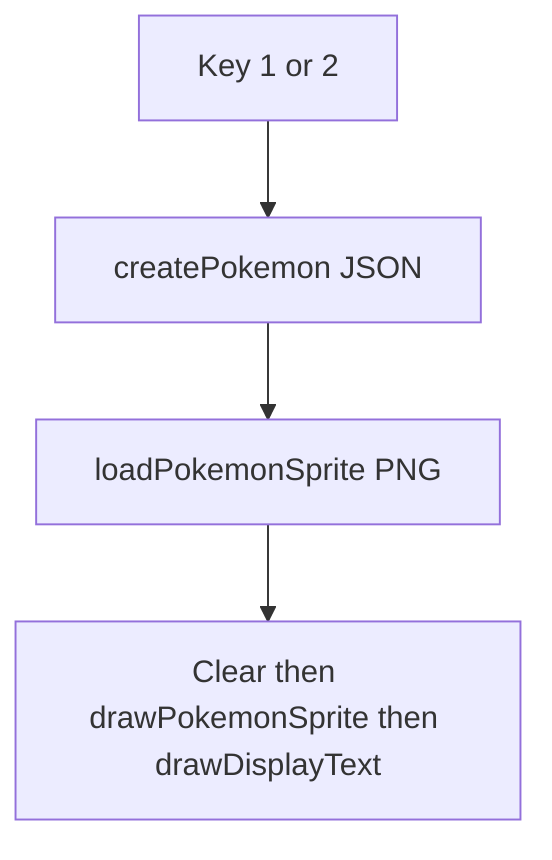

# Display Charmander / Squirtle front sprites on key press

## Asset locations (already in the repo)

| Species | File |
|---------|------|
| Charmander | [`src/Graphics/Pokemon/Front/CHARMANDER.png`](src/Graphics/Pokemon/Front/CHARMANDER.png) |
| Squirtle | [`src/Graphics/Pokemon/Front/SQUIRTLE.png`](src/Graphics/Pokemon/Front/SQUIRTLE.png) |

Run the app from the **project root** (as today) so these relative paths resolve.

## Dependency: SDL2_image (PNG)

Core SDL2 does not decode PNG. Add **SDL2_image** and use `IMG_LoadTexture` (or `IMG_Load` + `SDL_CreateTextureFromSurface`).

- Update [`Makefile`](Makefile): add compile/link flags for SDL2_image, consistent with your Homebrew setup (e.g. `pkg-config --cflags --libs SDL2_image`, or `-I$(BREW_PREFIX)/include/SDL2` and `-L$(BREW_PREFIX)/lib -lSDL2_image` if `pkg-config` is unavailable).
- **Init:** After `SDL_CreateRenderer`, call `IMG_Init(IMG_INIT_PNG)` (check return / log errors).
- **Shutdown:** In `~Game`, call `IMG_Quit()` only if `IMG_Init` succeeded (mirror `ttfInitialized_` with e.g. `imageInitialized_`).

Document for developers: `brew install sdl2_image` on macOS if the linker fails.

## Game state and rendering

Add to [`class Game`](include/game.h) (private):

- `SDL_Texture* pokemonSprite_ = nullptr` — holds the **currently selected** species’ front texture (only one visible at a time).
- Helpers in [`src/game.cpp`](src/game.cpp):
  - `void destroyPokemonSprite()` — `SDL_DestroyTexture` if non-null.
  - `bool loadPokemonSprite(const char* relativePath)` — destroy previous texture, then `IMG_LoadTexture(renderer, path)`; on failure log `IMG_GetError()` / `SDL_GetError()` and leave sprite null.
  - `void drawPokemonSprite()` — if `pokemonSprite_` is null, return; else `SDL_QueryTexture` for size, set a **destination rect** with **integer scaling** (e.g. 3x–5x) so small GBA-style sprites read well, **horizontally centered** in the window (`dst.x = (kWindowWidth - dst.w) / 2`), `dst.y` a small top margin (e.g. 24).

**Key handler (existing 1 / 2 logic):** After `createPokemon(...)`, call `loadPokemonSprite` with the matching path constant (`CHARMANDER.png` vs `SQUIRTLE.png`).

**Frame order in `run()`:** `SDL_RenderClear` → `drawPokemonSprite()` → text. **Avoid overlap:** adjust [`drawDisplayText()`](src/game.cpp) to accept a **starting Y** (or a member `textStartY_` set whenever the sprite is drawn) so the first line of stats begins **below** the scaled sprite (e.g. `textStartY_ = margin + scaledHeight + gap`). When no sprite (initial hint screen), keep current top margin.

## Files to touch

| File | Changes |
|------|---------|
| [`Makefile`](Makefile) | Link SDL2_image; add include/lib paths as needed |
| [`include/game.h`](include/game.h) | `pokemonSprite_`, optional `int textStartY_` or pass parameter through private `drawDisplayText` overload; `bool imageInitialized_`; declarations for sprite load/destroy/draw; `initImage()` or fold into `initVideo` |
| [`src/game.cpp`](src/game.cpp) | `IMG_Init` / `IMG_Quit`; path constants for both PNGs; implement load/draw; update key branch; offset text drawing |

## Testing

- `make clean && make` from project root.
- `./build/app`: press **1** — Charmander front + stats; press **2** — Squirtle front + stats; initial screen still shows the hint with no sprite until a key is pressed.

## Out of scope

- Animated backs, shiny variants, or JSON-driven sprite paths (can map species name → path later).
