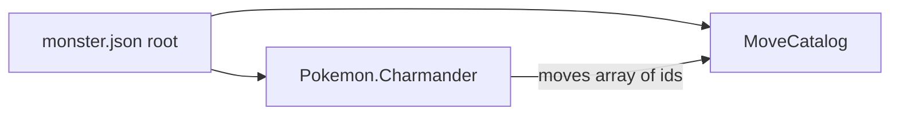

# Pokemon moves: generic template and JSON mapping

## Design

**Two-level data (avoids duplicating move text on every species):**

1. **`MoveCatalog`** – a map of **move id** (stable string key, e.g. `"ember"`) → full definition.
2. **Per species** – an array of **move ids** the Pokemon knows, e.g. `["ember", "scratch", "growl"]`.

The root JSON object in [`src/monster.json`](src/monster.json) gains a sibling of `Pokemon` (same level as `"Pokemon"`), not nested inside each species.



## C++ types ([`include/game.h`](include/game.h))

Add an enum and a plain struct (no `using namespace std` in header):

- `enum class MoveCategory { Physical, Special, Status };`
- `struct MoveTemplate`
  - `std::string id;` – catalog key (for debugging / future battle logs)
  - `std::string name;` – display name
  - `Type moveType;` – move’s elemental type (reuse existing [`Type`](include/game.h))
  - `MoveCategory category;`
  - `int power;` – `0` = status / no direct damage
  - `int accuracy;` – `0–100`, or use a sentinel e.g. `-1` for “always hits” if JSON uses `null` or `0` with a convention (document in one place)
  - `int pp;`

**`Pokemon` changes:**

- Private: `std::vector<MoveTemplate> moves_;`
- Public: `const std::vector<MoveTemplate>& moves() const;`
- New private loader, e.g. `void loadMoves(const nlohmann::json& root, const nlohmann::json& species, const std::string& speciesKey);` called from the constructor after `loadFromSpecies` / types (same `try` block).

**Parsing helpers (in [`src/pokemon.cpp`](src/pokemon.cpp)):**

- `std::optional<MoveCategory> parseMoveCategory(std::string_view);` – map `"physical"`, `"special"`, `"status"` (case-insensitive).
- `parseMoveFromCatalogEntry(id, json object)` – fill `MoveTemplate` from one catalog object; validate required keys with `.value()` / `.at()` inside try/catch or local checks.
- `loadMoves`: if root lacks `"MoveCatalog"` or species lacks `"moves"`, leave `moves_` empty and optionally log once (not fatal). For each string id in `species["moves"]` array, look up `root["MoveCatalog"][id]`; on success `push_back`; on missing id log to `std::cerr` and skip.

Use a `constexpr const char* kMoveCatalogKey = "MoveCatalog";` next to [`kPokemonDbKey`](include/game.h) (or in an anonymous namespace in the `.cpp` only if you prefer to keep the header smaller).

## JSON schema (concrete example)

Root:

```json
{
  "MoveCatalog": {
    "ember": {
      "name": "Ember",
      "type": "fire",
      "category": "special",
      "power": 40,
      "accuracy": 100,
      "pp": 25
    },
    "scratch": {
      "name": "Scratch",
      "type": "normal",
      "category": "physical",
      "power": 40,
      "accuracy": 100,
      "pp": 35
    }
  },
  "Pokemon": {
    "Charmander": {
      "pokedexNum": 4,
      "type": ["fire"],
      "baseStats": { ... },
      "moves": ["ember", "scratch"]
    }
  }
}
```

**Field conventions:**

| JSON field | Meaning |
|------------|---------|
| `name` | Display name |
| `type` | String, same vocabulary as Pokemon types (`fire`, `normal`, …) |
| `category` | `physical` / `special` / `status` |
| `power` | Integer; `0` allowed for status |
| `accuracy` | Integer 0–100 (or extend later with `null` = never miss) |
| `pp` | Integer |

Species `moves`: array of strings, each a key in `MoveCatalog`.

## Display ([`src/helperMethods.cpp`](src/helperMethods.cpp))

Add a `--- Moves ---` section to [`operator<<`](src/helperMethods.cpp): for each `MoveTemplate`, print one line: name, type, category, power/accuracy/pp (compact line or aligned columns). If `moves()` is empty, print `(none)` or omit section—pick one and stay consistent.

## Files to touch

| File | Action |
|------|--------|
| [`include/game.h`](include/game.h) | `MoveCategory`, `MoveTemplate`, `moves()` accessor, `loadMoves` declaration |
| [`src/pokemon.cpp`](src/pokemon.cpp) | Implement parsing + catalog resolution |
| [`src/helperMethods.cpp`](src/helperMethods.cpp) | Print moves in `operator<<` |
| [`src/monster.json`](src/monster.json) | Add `MoveCatalog` + `moves` arrays for at least Charmander / Squirtle |

## Out of scope (future battle phase)

- Damage formula, STAB, PP consumption, learning new moves, TM/HM—only data + display here.

## Testing

- `make`, run app, press 1/2; screen output should list moves without crashing if a move id is wrong (graceful skip + stderr).
