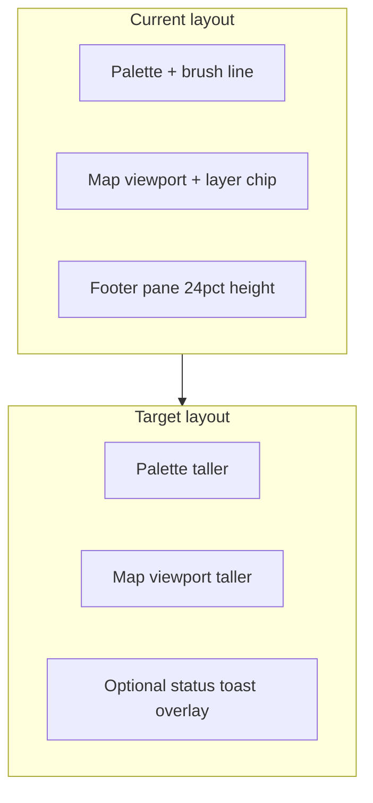

# Remove map editor bottom footer pane

## Current behavior

The bottom pane is allocated in [`tools/map_editor.py`](tools/map_editor.py) `relayout()`:

```1954:1958:tools/map_editor.py
footer_h = max(150, min(int(h * 0.24), 280))
footer_h = min(footer_h, max(120, h - 100))
self.footer_rect = pygame.Rect(0, h - footer_h, w, footer_h)
content_bottom = self.footer_rect.y
available_h = max(60, content_bottom - 2 * m)
```

It is drawn in `draw()` (lines ~4562–4664) and shows:
- Map metadata (`Map "sample_room" · 12×10 · Layer … · Mode …`)
- Mode hints (walk / over-player / valid-stand overlays)
- Static help line (`Press h for the help guide…`)
- Transient `set_status()` messages (save ok/err)
- Inline prompts for `edit_mode == "map_id"` and `edit_mode == "conn"`

The screenshot matches the static metadata + help lines. The green **Brush:** line above it lives in the **left palette panel**, not the footer — it stays unchanged.



## Implementation (single file focus)

### 1. Tracker + docs (required by repo rules)

- Add **IMPROVEMENT-MAP-098** to [`docs/tracker.md`](docs/tracker.md): remove reserved footer strip; reclaim vertical space; status/toast overlay retained.
- Update [`docs/tools_doc.md`](docs/tools_doc.md) `TOOL: tools/map_editor.py` NOTES: remove references to footer hint lines (IMPROVEMENT-MAP-036 walk explanation, BUG-MAP-WORLD-007 footer shortcut); note status appears as map-viewport toast; help remains via **H**.

### 2. `relayout()` — reclaim space

In [`tools/map_editor.py`](tools/map_editor.py):
- Drop dynamic `footer_h` calculation.
- Set `content_bottom = h - m` (full window minus bottom margin).
- Keep `self.footer_rect` as a zero-height rect at the bottom (or remove field if unused) to avoid touching unrelated code paths.

**Effect:** `palette_rect`, `tileset_list_rect`, and `map_viewport_rect` all grow by ~150–280 px vertically.

### 3. `draw()` — remove footer pane UI

Delete the footer block (~4562–4664):
- Background rect + separator line
- Map metadata line
- Walk / over-player / valid-stand hint paragraphs
- Static “Press h…” help line

**Do not remove** the mode-specific **visual** overlays on the map canvas (cyan/magenta footprint, green/orange valid-stand boxes) — only the text in the footer goes away.

### 4. Add compact status/toast overlay (preserve UX)

Introduce a small helper, e.g. `_draw_map_status_overlay()`, called near the end of `draw()` (before modals):

| Content | When shown | Placement |
|---------|------------|-----------|
| `set_status()` message | `status_message` active | Bottom of `map_viewport_rect`, semi-transparent bar, 1–2 wrapped lines, existing ok/err/info colors |
| Map id inline edit | `edit_mode == "map_id"` | Same overlay area |
| Connection inline edit | `edit_mode == "conn"` | Same overlay area |

No persistent hint text when idle — empty map area when nothing to show.

### 5. Optional chip enrichment (low cost, replaces lost metadata)

Extend the layer chip string (~4391) to include map id and dimensions, e.g.:

`sample_room · 12×10 · EDITING: GROUND · (layers …)`

This replaces the primary info line users lose from the footer without bringing the pane back.

### 6. Verification

- Manual: launch `python3 tools/map_editor.py` — confirm footer gone, map/palette taller, save still shows toast, **I** map-id edit and connection edit still visible.
- Automated: `python3 -m unittest discover -s tests -q` and `make test` (no existing footer tests; should remain green).

## Scope boundaries

- **In scope:** [`tools/map_editor.py`](tools/map_editor.py), tracker, tools doc.
- **Out of scope:** Backup copies under `tools/backup_*`, C++ runtime footer hints in `docs/source_doc.md`, help overlay content.

## Risk

- **Low:** Layout-only change; `set_status()` remains functional via toast overlay.
- Mode hint text removed — mitigated by **H** help guide and existing walk-mode canvas overlays.
