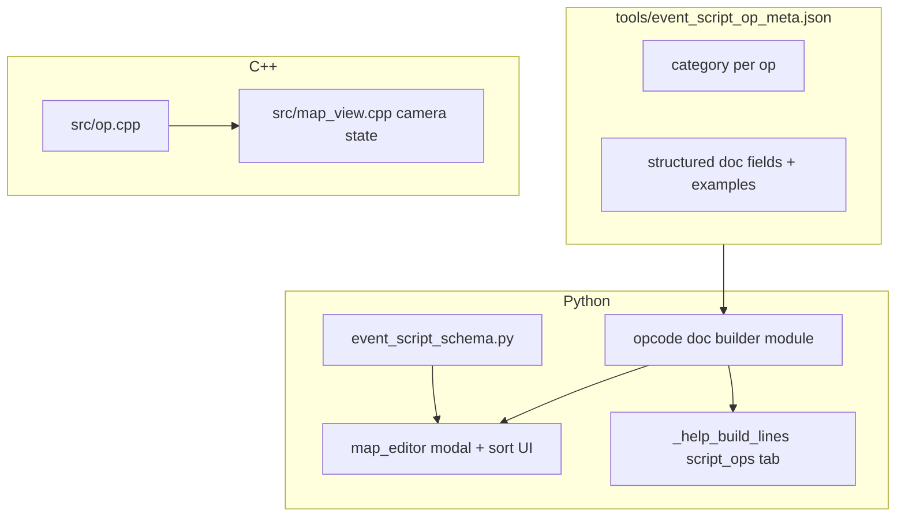

# Event script editor UX, sprite picker, opcode sorting, camera opcode, and documentation

## Goal (consolidated)

1. **Resizable modal** — Same as prior plan: bottom-right grip, persisted size in [`tools/map_editor_config.json`](tools/map_editor_config.json) `eventScriptEditor`, [`_draw_event_script_editor_modal`](tools/map_editor.py) + [`MapEditor.run`](tools/map_editor.py) MOUSEMOTION path ([~6186](tools/map_editor.py)).
2. **Sprite picker inside event script editor** — Consolidate the flow that today opens via **events workspace + `open_map` key** (see [`_open_events_sprite_picker`](tools/map_editor.py), [`_draw_events_sprite_pick_overlay`](tools/map_editor.py), ~7268–7274): choose **sprite kind**, **PNG file**, **4×4 frame** for characters where applicable, and **initial facing** (N/S/E/W or `dir` string aligned with game/script). Show a **live preview** (load sheet / icon texture and blit selected cell). Persist on the **map event** JSON (`sprite` / optional new fields); update [`tools/validate_map_events.py`](tools/validate_map_events.py) and map event schema docs if shape changes.
3. **Opcode: camera back to player** — New C++ opcode (name TBD, e.g. `camera_follow_player` or `reset_camera_to_player`) that clears script-driven camera offset (`mapScriptCameraOffsetTiles*`) and leaves the viewer following the player as today after [`syncCameraToFollowPlayer_`](src/map_view.cpp). Wire through [`src/op.cpp`](src/op.cpp), [`tools/event_script_op_meta.json`](tools/event_script_op_meta.json), extractor, [`docs/event_script_ops.md`](docs/event_script_ops.md). Log a **FEATURE** in [`docs/tracker.md`](docs/tracker.md).
4. **Opcode palette sort** — Two user-selectable orders in the event script modal (persist in `eventScriptEditor`): **Alphabetical** (by opcode id or label); **By category** (categories sorted A–Z, ops sorted A–Z within category). Requires **`category`** (string) per op in [`tools/event_script_op_meta.json`](tools/event_script_op_meta.json). Default remains current **source** order (`CPP_SCRIPT_OPS_ORDERED`) unless user picks another mode.
5. **Opcode documentation format** — For every opcode, surface in the **editor documentation column** and in a dedicated **Help (H) tab** the same structure:
   - **Name** (opcode id + human label)
   - **Description**
   - **Function** — how it appears in JSON (`script_1` one-key object shape)
   - **Parameters** — indented list with **mandatory** vs **optional** fields (types + one-line purpose)
   - **Example** — full `script_1` snippet as valid JSON  
   Store machine-readable fields in **`tools/event_script_op_meta.json`** (e.g. nested `documentation` object or parallel keys) and add a **single Python builder** (e.g. in [`tools/event_script_schema.py`](tools/event_script_schema.py) or `tools/event_script_opcode_docs.py`) used by both [`_event_script_rebuild_doc_lines`](tools/map_editor.py) and [`_help_build_lines`](tools/map_editor.py) for tab `script_ops` (add to [`HELP_GUIDE_TABS`](tools/map_editor.py) ~174).
6. **Cursor skill** — New skill under [`.cursor/skills/`](.cursor/skills/) (e.g. `event-script-opcode-docs/SKILL.md`) describing the **mandatory checklist** whenever opcode-related files change: `src/op.cpp`, [`tools/event_script_op_meta.json`](tools/event_script_op_meta.json), [`tools/extract_map_script_ops.py`](tools/extract_map_script_ops.py), [`docs/event_script_ops.md`](docs/event_script_ops.md), help tab content source, [`tools/map_editor.py`](tools/map_editor.py) doc rendering, run `python3 tools/extract_map_script_ops.py`, fix meta/C++ parity, update human summary. Purpose: keep documentation **in sync** with implementation (planning-rule / project integration).

## Architecture (high level)

## Implementation notes (existing plan + extensions)

### Resize (unchanged from prior write-up)

- State, grip rect, clamp rules, `MOUSEMOTION` handler, persist on mouseup, `VIDEORESIZE` clamp via [`relayout`](tools/map_editor.py).

### Sprite + facing in event editor

- Reuse list/cache logic from `_open_events_sprite_picker` / `_events_sprite_pick_at` / character frame overlay; avoid duplicating PNG enumeration — factor shared helpers where practical.
- **H key** today toggles global help ([`toggle_help`](tools/map_editor.py)); clarify in implementation whether **H** opens the new **Script opcodes** tab globally, only while the event script modal is open, or both (document in `docs/tools_doc.md`).

### Help tab

- Extend [`HELP_GUIDE_TABS`](tools/map_editor.py) with `("script_ops", "Script opcodes")` (or similar label).
- Implement `_help_build_lines(..., "script_ops", ...)` to stream the same sections as the editor doc pane (scrollable like other tabs).

### Cursor skill

- Follow [`.cursor/skills/create-skill/SKILL.md`](.cursor/skills/create-skill/SKILL.md) structure: **When this applies** (any change to opcode list, meta schema, extract script, C++ dispatch, or opcode doc rendering), **Steps** (ordered checklist), **Verification** (extract script exit 0, import schema, optional unittest).

## Risks / edge cases

- **Help vs modal focus**: If H opens global help while modal is open, ensure key routing in [`run`](tools/map_editor.py) does not break modal isolation (existing FEATURE-MAP-046 patterns).
- **Category sort**: Ops without `category` fall into `"Uncategorized"` or similar bucket.
- **Doc duplication**: Single builder function avoids editor/help drift.
- **Sprite schema**: Backward compatibility for maps without `initialFacing`; default facing documented.

## Verification

- Resize: persisted size, clamp on small window.
- Sprite: edit event from script modal, pick sprite + facing, see preview, save JSON, validate passes.
- Sort: three modes persist; category order deterministic.
- C++: new opcode clears camera offset; script continues in order.
- Help: H → Script opcodes tab shows full template for each op.
- Skill: file exists; manual test — edit one op in meta and follow skill checklist.

## Project integration (planning-rule)

- [`docs/tracker.md`](docs/tracker.md): log before substantive work (split tracker rows if scope is large).
- [`docs/tools_doc.md`](docs/tools_doc.md), [`docs/event_script_ops.md`](docs/event_script_ops.md), [`docs/source_doc.md`](docs/source_doc.md) for C++/tooling changes.
- Do not edit this plan file’s **execution** branch from the agent except via explicit user “execute plan” requests; this document is the single source for scope.
