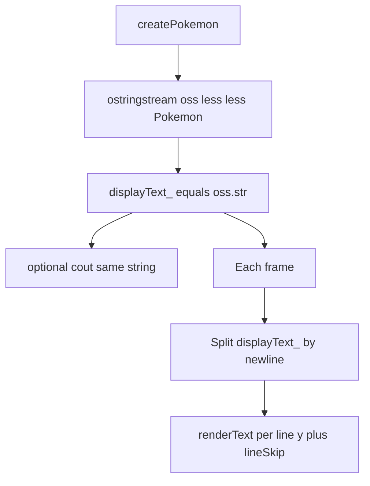

# Render console output in the SDL window

## Current behavior

- [`src/game.cpp`](src/game.cpp): `createPokemon` prints a `Pokemon` with `std::cout << temp << std::endl`; the main loop only clears the renderer to black.
- [`src/helperMethods.cpp`](src/helperMethods.cpp): `operator<<` builds a **multiline** string (IVs, base stats, types).

There is **no font file** in the project today, so implementation must include a **font resolution strategy** (see below).

## Approach: one source of truth for the “stats block”

Avoid duplicating formatting logic:

1. In `createPokemon`, build the same text with a `std::ostringstream`:

   `oss << temp;` then `std::string text = oss.str();`

2. Assign that string to a **`Game` member** (e.g. `std::string displayText_`) used only for drawing.

3. Optionally keep `std::cout << text` so the terminal still matches the window (your request is window parity with console; keeping both is natural).

4. On error paths inside `createPokemon`, set `displayText_` to a short error message (and still `std::cerr` as today) so the window shows something useful if loading fails.

## Text rendering API (in `Game`)

- Add `#include <SDL_ttf.h>` in [`src/game.cpp`](src/game.cpp) (keep headers minimal; no need to expose TTF in [`include/game.h`](include/game.h) unless you want `renderText` public later).

- **Init:** After the renderer is created in `initVideo()` (or a small `initFont()` called from it):

  - `TTF_Init()`; on failure log with `TTF_GetError()` and treat text as unavailable.
  - `TTF_OpenFont` with an **ordered list of paths**, e.g.:
    - `fonts/default.ttf` (document for contributors: drop any licensed TTF here)
    - macOS fallback: e.g. `/System/Library/Fonts/Supplemental/Arial.ttf` or `Verdana.ttf` (exists on typical macOS installs) so the project runs without committing a font binary.
  - Store `TTF_Font*` in `Game` (e.g. `font_`), nullptr if all paths fail.

- **Shutdown:** In `~Game`, before destroying the renderer: `TTF_CloseFont(font_)` if non-null; call `TTF_Quit()` only if `TTF` was initialized (use a `bool ttfInitialized_` flag, same pattern as `sdlInitialized_`).

- **`renderText(const std::string& text, int x, int y, SDL_Color color)`** (private helper):

  - `TTF_RenderUTF8_Blended(font_, text.c_str(), color)` → `SDL_Surface*`
  - `SDL_CreateTextureFromSurface(renderer_, surface)` → `SDL_Texture*`
  - `SDL_QueryTexture` for size; `SDL_RenderCopy` with `dst` rect at `(x, y)`
  - `SDL_FreeSurface`, `SDL_DestroyTexture` (textures recreated each frame is acceptable for this static text; optional later: cache texture when `displayText_` unchanged).

- **Multiline:** Split `displayText_` on `'\n'` (simple loop or small helper). For each line, advance **y** by `TTF_FontLineSkip(font_)` (or `fontHeight` from `TTF_SizeText` if you prefer). Start at a fixed margin (e.g. 16, 16). Use white `SDL_Color{255,255,255,255}` on the existing black clear.

- **`run()` loop:** After `SDL_RenderClear`, if `font_` is valid, draw all lines; if no font, skip drawing (optional: one line via SDL_Log only). Then `SDL_RenderPresent`.

## Scope note: “everything in the console”

- **In scope for this change:** All text that is part of the **normal demo path**—the Pokemon stats block produced by `operator<<`, plus error strings you set from `createPokemon` when construction fails.
- **Out of scope unless you want extra work:** Startup messages that only run in `Game::Game()` **before** a window/renderer exists (e.g. JSON file missing) still only go to `std::cerr`; fixing that would require deferred UI or logging buffers. Same for `initVideo` failures (no renderer). Can be a follow-up.

## Files to change

| File | Change |
|------|--------|
| [`include/game.h`](include/game.h) | Private members: `std::string displayText_`, `TTF_Font* font_` (forward-declare or include SDL_ttf in header only if you expose font; prefer pointer + include only in `.cpp`) — actually if TTF_Font is opaque, need `struct TTF_Font;` forward decl or include SDL_ttf in header. Simplest: include `<SDL_ttf.h>` in `game.h` only if Game stores `TTF_Font*` — SDL_ttf.h is fine in header. |
| [`src/game.cpp`](src/game.cpp) | Font init/teardown; `renderText`; multiline draw; `createPokemon` fills `displayText_` via `ostringstream`; main loop draws text. |
| **Optional:** [`readme.txt`](readme.txt) or a one-line comment in `game.cpp` | Where to put `fonts/default.ttf` |

No change required to [`src/helperMethods.cpp`](src/helperMethods.cpp) if you use `ostringstream` + `operator<<` (same output as console).

## Testing

- Build with existing [`Makefile`](Makefile) (already links `-lSDL2_ttf`).
- Run `./build/app` from project root so `src/monster.json` resolves; confirm stats appear in the window and still print to the terminal if you keep `cout`.
