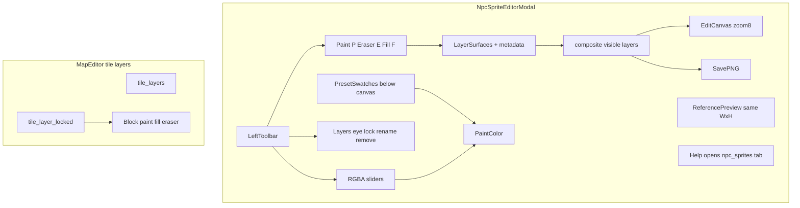

# Sprite editor tools, layers, and map layer lock

## Confirmed decisions (audit)

| Topic | Decision |
|-------|----------|
| Layer save | Composite all **visible** layers → single PNG on Save |
| Fill hotkey | **F** (paint **P**, eraser **E**) |
| Tool keys | **Exclusive select** — P/E/F always switch to that tool (no toggle-off) |
| Map layer lock | **Tile layers** only (ground, decorations, event, …) |
| Layer UI | **Visibility** (eye), **remove** (min 1 layer), **rename** (double-click row) |
| Color picker | **RGBA sliders** (R, G, B, A each 0–255) on left rail |
| Default zoom | **8** px per sprite pixel; edit canvas and reference always **same WxH** |
| Grid cells | One grid cell = one sprite pixel (uniform scale; BUG-MAP-101 step math) |
| Fill behavior | **4-connected flood** from seed through **non-transparent** pixels only; fill with current paint color; transparent islands stay separate |
| Locked layer | **Can select** to view in composite; **all edits blocked** until unlock |
| Preset swatches | **Keep row below canvas** + **Edit Swatches** in-modal overlay (add/remove/reorder colors) |
| Swatch persistence | Store in `map_editor_config.json` → `npcSpriteEditor.paletteColors` (loaded on open) |
| Help | **Help button** on sprite editor title bar (pattern: other Events modals) → `_open_help_overlay(tab="npc_sprites", back_to="npc")` |
| Help docs | New **Help → NPC Sprites** tab documenting **every tool and control** |

---

## Scope summary

| Area | Change |
|------|--------|
| [tools/npc_sprite_editor_modal.py](tools/npc_sprite_editor_modal.py) | Left rail, tools, RGBA, layers, layout, swatch editor overlay, Help btn |
| [tools/npc_sprite_sheet_helpers.py](tools/npc_sprite_sheet_helpers.py) | `flood_fill_surface` (opaque-connected), `composite_rgba_layers` |
| [tools/map_editor.py](tools/map_editor.py) | `tile_layer_locked`, lock UI, paint guards, `npc_sprites` help tab, config load for palette |
| [tools/map_editor_config.json](tools/map_editor_config.json) | `npcSpriteEditor` section (palette colors, optional defaults) |
| Tests + docs + tracker | FEATURE-MAP-102, 103, 104 |

---

## Architecture



---

## Part A — Sprite editor: data model

**File:** [tools/npc_sprite_editor_modal.py](tools/npc_sprite_editor_modal.py)

**Layer stack** (full-sheet surfaces):

- `_layer_surfaces: list[pygame.Surface]`
- `_layer_names: list[str]` (default `"Layer 1"`, …; double-click to rename inline)
- `_layer_visible: list[bool]` (eye icon; hidden layers skipped in composite)
- `_layer_locked: list[bool]` (lock icon; edits blocked but row selectable)
- `_active_layer_index: int`
- `_active_tool: Literal["paint", "eraser", "fill"]` (default `"paint"`)

**Limits:** max **16** layers; remove blocked when only one layer remains.

**Composite / save / display:**

- `_composite_layers()` blends **visible** layers bottom→top (index 0 = bottom)
- Save / Save As: composite → `pygame.image.save`
- Load / New: flatten into layer 0; clear upper layers and reset names

**Undo snapshot** (max 32): copies of all layer surfaces + names + visible + locked + active index + active tool + paint color. Layer add/remove/rename/visibility/lock toggles push undo before change.

**Mirror-lock:** runs on **active layer surface** after Left-direction edits (not composite).

**Copy frame / Idle→F3 / Dup:** operate on **composite** or active layer? → **active layer** (consistent with painting); document in help.

---

## Part B — Helpers

**File:** [tools/npc_sprite_sheet_helpers.py](tools/npc_sprite_sheet_helpers.py)

1. **`flood_fill_surface(surf, x, y, fill_rgba)`** — 4-connected BFS from `(x,y)`:
   - Expand only to neighbors with **alpha > 0** (same opaque-connected region as seed)
   - If seed is transparent (`alpha == 0`): **no-op**, return 0
   - Match seed RGBA exactly for connectivity (standard flood fill within opaque region)
   - Write `fill_rgba` to visited pixels

2. **`composite_rgba_layers(layers, visible)`** — bottom-to-top alpha blit.

Tests: isolated region fill, transparent seed no-op, composite order/visibility, alpha blending.

---

## Part C — Tools and keyboard

| Tool | LMB behavior | Key |
|------|----------------|-----|
| Paint | `set_at` with `_paint_color` | **P** selects |
| Eraser | `set_at` with transparent | **E** selects |
| Fill | single-click flood fill | **F** selects |

- **Exclusive select:** pressing P/E/F always sets that tool (never “turns off”)
- **Locked active layer:** status `"Layer locked."`, skip edit
- **RMB:** erase one pixel (transparent) unless layer locked
- **Drag:** paint/eraser only (fill is click-only)
- **`handle_key`:** P/E/F when save/dim/swatch-edit prompts inactive; preserve Ctrl+Z/Y

---

## Part D — Layout

**Row structure** (below header):

1. Direction tabs (full width)
2. Frame tabs F0–F3
3. File toolbar (Mirror, Save, Zoom, Ref ◀▶) — row-packed, truncated labels

**Main body:**

```
[ Left rail ~130px ]  [ Work area: centered canvas ]  [ Ref: identical WxH ]
[ Swatch row + W/H + filename — full body width below canvas row ]
```

**Left rail:**

- Tool buttons: Paint (P), Eraser (E), Fill (F) — highlight active
- Current color preview swatch
- **RGBA sliders** + numeric labels (compact vertical sliders)
- **Layers:** scrollable rows — eye (visibility), truncated name (dbl-click rename), lock icon, active highlight; `+` add; `−` remove (if >1 layer)
- **Edit Swatches** button → sub-overlay to add/remove/reorder preset colors; saves to config on Done

**Canvas / reference:**

- `display_w = cw * _zoom`, `display_h = ch * _zoom`; default `_zoom = 8`
- Uniform `fit_scale` clamp to work area; `_canvas_rect` and `_ref_rect` **always same (w,h)**
- Center `_canvas_rect` in work area between rail and ref column
- `_cell_step_x = w/cw`, `_cell_step_y = h/ch`
- Reference cell scaled to **exact** canvas dimensions

**Preset swatches:** horizontal row below canvas (from config); click selects color + selects paint tool; selected swatch outlined.

**Text:** `mtext.truncate_to_width` on all rail labels, layer names, filenames, ref label.

**Title bar buttons:** Back, **Help** (new), Close — match [event_engine_modal.py](tools/event_engine_modal.py) spacing (`panel.right - 216` pattern).

`_MODAL_MIN_W` ≥ **840** after rail + ref.

---

## Part E — Help (sprite editor + global)

1. **Modal Help button** → `ed._open_help_overlay(tab="npc_sprites", back_to="npc")` (same as wild encounters / event engine).

2. **New help tab** in `HELP_GUIDE_TABS`: `("npc_sprites", "NPC Sprites")`.

3. **`_help_build_lines("npc_sprites")`** — document **every** control:
   - Directions / frames / mirror-lock
   - Paint (P), Eraser (E), Fill (F) — behavior, RMB erase, drag paint
   - RGBA sliders, preset swatches, Edit Swatches overlay
   - Layers: add, remove, rename (dbl-click), visibility, lock, composite on save
   - Reference pane, zoom wheel/+−, Save/Save As/New/Load
   - W/H dimension edit, filename
   - Undo Ctrl+Z / Redo Ctrl+Y

4. **Home Contents:** add TOC entry (e.g. under Events or Reference); extend number-key jump if tab count changes.

5. **Events help tab:** one-line link to NPC Sprites tab.

**Tracker:** FEATURE-MAP-104 for help + swatch config (or fold into FEATURE-MAP-102).

---

## Part F — Map editor: tile layer lock

**File:** [tools/map_editor.py](tools/map_editor.py)

- `tile_layer_locked: list[bool]` parallel to `tile_layers`
- Snapshot/restore includes lock flags
- **Block** when active layer locked: map paint drag, flood fill, **eraser strokes** (`eraser_mode` or RMB erase on tiles)
- Status: `"Layer locked."`
- **UI:** lock button on layer chip (toggle active layer); Settings tab rows — layer id + lock icon; click row → `active_layer_index`; lock icon toggles that layer
- Lock is **editor-only** (not in map JSON)

**Settings help text:** mention layer lock on tile layer rows.

---

## Part G — Config

**`map_editor_config.json`:**

```json
"npcSpriteEditor": {
  "paletteColors": [[0,0,0,0], [24,24,28,255], ...],
  "defaultZoom": 8
}
```

Load on `open_modal()`; swatch editor writes back on Done.

---

## Part H — Docs and tracker

- **FEATURE-MAP-102** — sprite toolbar, RGBA, tools, layers, layout, zoom 8
- **FEATURE-MAP-103** — map tile layer lock
- **FEATURE-MAP-104** — NPC Sprites help tab + modal Help button + swatch editor
- [docs/tools_doc.md](docs/tools_doc.md) — modal, helpers, config section
- [docs/session_changelog.md](docs/session_changelog.md)

---

## Part I — Testing and bug-audit checklist

**Automated:**

- Helpers: flood fill opaque-connected, transparent seed no-op, composite visibility
- Modal: P/E/F exclusive select, locked layer blocks paint/fill/erase, fill only opaque region, hit-test bottom rows at zoom 8, layer add/remove/rename/visibility in undo
- Map: locked layer blocks paint/fill/eraser; undo restores lock flags
- Config: palette load/save round-trip
- Full suite: `python3 -m unittest discover -s tests -q`

**Manual:**

1. Paint alignment top/mid/bottom at zoom 8 and after wheel zoom
2. RGBA sliders → semi-transparent paint
3. Fill through opaque blob; transparent holes stay separate
4. Two layers, hide layer 1 → composite omits it; save merges visible only
5. Lock layer → select OK, paint blocked; unlock works
6. Edit Swatches → persists after restart
7. Help button → NPC Sprites tab explains all tools
8. Map editor lock on ground → brush/fill/eraser blocked
9. Resize modal → no clipped rail/layer names (truncate OK)

**Regression:**

- Mirror-lock on active layer when editing Left
- Map **P** = open map only when sprite modal closed
- Save As / dim prompts capture keyboard
- Back from help returns to sprite editor (`back_to="npc"`)

---

## Implementation order

1. Helpers + tests
2. Config load + palette defaults
3. Layer model + composite + undo metadata
4. Tools + fill + keyboard
5. Left rail + layout + zoom 8 + swatches row
6. Edit Swatches overlay
7. Help tab + modal Help button
8. Map layer lock + UI
9. Docs/tracker/changelog + full verification

---

## Audit notes (resolved / open)

**Resolved in this revision:** map lock target, tool key behavior, layer extras, RGBA, zoom default, fill semantics, locked-layer select, swatch config UI, layer rename UX, help button + docs.

**Explicit non-goals:** lock on tileset palette panel; persisting sprite layer stack to PNG as multiple files; persisting map layer lock to map JSON.

**Edge cases to implement:**

- Removing active layer → clamp active index
- Renaming layer while locked → allow (metadata only)
- Flood fill with eraser tool selected → use transparent fill color OR block (plan: **fill always uses paint color**; eraser tool + click erases single pixel unless user switches to fill)
- Layer panel scroll when many layers + tall rail
