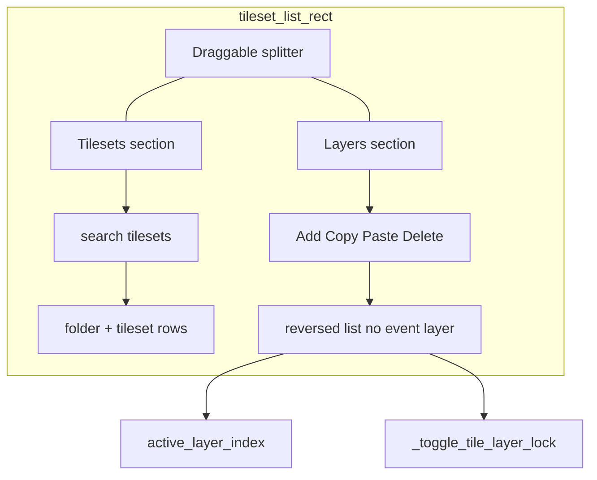

# Tile sidebar: lock fix, tileset search, layer manager

## User decisions (confirmed 2026-08-06)

| Topic | Decision |
|-------|----------|
| **Paste position** | Insert at `active_layer_index + 1`, clamped to `>= 1` (never before ground) |
| **Ground layer** | Exactly **one** layer with id `"ground"` per map; **cannot delete, rename, or move**; stays at **index 0** (bottom of compositing stack / bottom of reversed UI list) |
| **Event layer** | **Hidden** from sidebar; add/remove stays in Settings only; when present, event layer is always at the **top** of the stack (highest index — existing `add_event_layer()` append behavior) |
| **Settings list** | **Remove** tile-layer list from Help → Settings; sidebar is the sole layer GUI (Settings keeps event layer buttons + key rebind) |
| **FEATURE-MAP-042** | **Sidebar only** — update tracker cross-ref; no L-key popup |
| **Section split** | **Draggable horizontal splitter** between Tilesets and Layers; persist ratio in `map_editor_config.json` |
| **Delivery** | **Phased:** Phase 1 = lock fix + search (uniform rows) + layer panel + splitter; Phase 2 = smaller indented tileset rows + per-row height refactor |

---

## Problem summary

1. **Layer lock stuck (BUG-MAP-107)** — `tile_layer_locked` omitted from session map cache ([tools/map_editor.py](tools/map_editor.py) `_snapshot_session_map_bundle` ~2850). Toggle guards fail silently when list length desyncs.

2. **No in-panel layer GUI** — Ops scattered across chip, keyboard, Settings. Need Event Engine-style Layers section with select/lock/rename/delete/copy/paste.

3. **Tileset search / hierarchy** — Folders exist in `editorTilesetFolders`; no search; child rows same size as folders (Phase 2 visual polish).

**Help overlay note:** Map mouse input blocked while Help is open (~6572); sidebar layer panel is primary UX when editing.

---

## Architecture

**Excluded from sidebar layer list:** any layer with `tile_layer_ids[i] == "event"` (managed via Settings).

**Bottom of reversed list:** index 0 = `"ground"` (only ground allowed at index 0).

---

## Phase 1 — core delivery

### 1. BUG-MAP-107 — lock desync

**File:** [tools/map_editor.py](tools/map_editor.py)

- Log tracker entry before coding.
- Persist `tile_layer_locked` in session bundle snapshot/restore (mirror `_restore_map_state` length guard).
- `_sync_tile_layer_locked_len()` after session restore, disk load.
- `_toggle_tile_layer_lock(li) -> None`: sync, flip, status message.
- Wire chip, sidebar lock icons through shared helper only (Settings list removed in Phase 1).

### 2. Draggable splitter layout

- Config: `tilesetList.sectionSplitRatio` (float 0.0–1.0, fraction of sidebar height below header chrome given to **Tilesets** section; Layers gets remainder).
- `_measure_tileset_sidebar_layout()`: rects for `tilesets_header`, `tilesets_search`, `tilesets_list`, `splitter`, `layers_header`, `layers_toolbar`, `layers_list`.
- Splitter drag: 4px hit band, clamp so each section keeps min height (~80px tilesets list, ~100px layers list).
- Rebind `_tileset_list_hit()` / `_tileset_list_row_index_at_pixel()` to **`tilesets_list` sub-rect** (not full sidebar — Phase 1 required).
- Introduce `_tileset_list_row_height(row)` **stub** (uniform height Phase 1; Phase 2 varies by row kind).
- `_clamp_tileset_list_scroll()` uses `tilesets_list.h`, not full sidebar minus header.
- **Wheel:** hit-test sub-rect — tilesets list vs layers list scroll independently.
- Whole-column collapse unchanged (`tileset_list_collapsed` strip).

### 3. Tilesets section — search (uniform rows)

- State: `tileset_list_search`, `tileset_list_search_focus`, `_tileset_list_search_rect`.
- Placeholder: `search tilesets` (Event Engine style).
- Filter: substring on tileset id + folder name; auto-expand folders when `q` non-empty.
- Include query in cache token.
- **Disable drag/drop** while search non-empty.
- Remove/relocate three drag hint lines to Help (room for search box).
- `TILESET_LIST_W`: **292 → 310px** for four layer toolbar buttons.

### 4. Layers section — FEATURE-MAP-111

**Visible layers:** all indices where `tile_layer_ids[i] != "event"`.

**Display:** reversed — top = highest non-event index, bottom = ground (index 0).

| Control | Behavior |
|---------|----------|
| **Select** | Click row → `active_layer_index = li` |
| **Lock** | `_toggle_tile_layer_lock(li)` |
| **Rename** | Double-click → inline buffer; commit with uniqueness check; **block** if id is `"ground"` or `"event"` |
| **Add** | `_undo_checkpoint()` + insert via `_insert_tile_layer_at(idx, …)` at **event index if event exists else append** (never above event) |
| **Copy** | Deep-copy active layer cells to `tile_layer_clipboard` |
| **Paste** | `_undo_checkpoint()`; `insert_idx = max(1, active+1)`; if event layer exists, `insert_idx = min(insert_idx, event_layer_index())`; insert with new `_unique_layer_id()` |
| **Delete** | Block if id `"ground"`, only one non-event layer, or active is event; else `layer_remove_confirm_idx = active` → Y/N overlay; **checkpoint before** `_remove_tile_layer_at` on confirm |

**Ground rules (strict):**

- Exactly one `"ground"` id per map (validate on paste/rename/add — reject duplicate ground id).
- Index 0 must remain the ground layer; no reorder UI (out of scope); paste/add never insert at 0.
- Ground: no delete, no rename, no move.

**Event layer rules:**

- Not shown in sidebar.
- Always highest index when present (`add_event_layer` appends).
- Add/remove only via Settings (existing buttons).

**Undo:** checkpoint before add, paste, delete (on confirm), rename commit. No checkpoint for lock toggle.

**Chip:** keep compact `EDITING: {LAYER}` status only.

### 5. Settings cleanup

- Remove “Tile layers” scroll list and lock icons from `_draw_help_settings_content` / `_help_handle_settings_click`.
- Keep: Add/remove **event** layer, remove current tile layer (keyboard hint), key rebind rows.
- Update Help text to point users to sidebar Layers section.

### 6. FEATURE-MAP-042 cross-reference

- In [docs/tracker.md](docs/tracker.md): note FEATURE-MAP-111 sidebar supersedes L-popup from 042; no `layer_popup_open` implementation.

---

## Phase 2 — tileset visual polish

**Prerequisite:** Phase 1 complete (sub-rect hit-test + `_tileset_list_row_height(row)` stub call sites).

- Change `_tileset_list_row_height(row)`: folder full height, child `linesize + 4`.
- Cumulative Y: `_tileset_list_row_y_offset(ridx)` for scroll clamp, hit-test, drag drop index, scrollbar thumb.
- Child tilesets: inset rect, single-line truncate, lighter background.
- Tests: indented row hit-test selects correct tileset; scroll thumb with mixed row heights.

---

## Documentation

- [docs/tracker.md](docs/tracker.md): BUG-MAP-107, FEATURE-MAP-111 (Phase 1 + Phase 2 sub-notes), FEATURE-MAP-042 cross-ref.
- [docs/tools_doc.md](docs/tools_doc.md): sidebar, splitter, search, layer ops, ground/event rules.
- [docs/session_changelog.md](docs/session_changelog.md).
- Help → Editing modes: sidebar layer panel, tileset search, ground/event constraints.

---

## Tests

**Phase 1** — [tests/test_map_layer_lock.py](tests/test_map_layer_lock.py), new [tests/test_map_layer_panel.py](tests/test_map_layer_panel.py):

| Test | Asserts |
|------|---------|
| Session cache lock round-trip | Lock survives restore; toggle unlocks |
| `_sync_tile_layer_locked_len` | Pad/truncate |
| `_toggle_tile_layer_lock` | Status + flip |
| Layer list excludes event | Event layer not in sidebar row count |
| Ground at bottom of reversed list | Index 0 is last visual row |
| Ground delete blocked | No confirm for ground |
| Duplicate ground id blocked | Paste/rename cannot create second `"ground"` |
| Paste at active+1 | Active 2 → index 3; active 0 → index 1 |
| Delete uses confirm overlay | `layer_remove_confirm_idx` set |
| Search filter | Folder + child visible on match |
| Splitter ratio | Persisted in config (optional layout test) |

**Phase 2** — add per-row height hit-test test.

Run: `python3 -m unittest discover -s tests -q`, `make test`.

---

## Key touchpoints

| Area | Location |
|------|----------|
| Session cache | `_snapshot_session_map_bundle` ~2850 |
| Event layer | `add_event_layer` ~4136, `has_event_layer` ~4127 |
| Ground init | `_reset_tile_layers_single`, map load ~3030 |
| Tileset rows | `_build_tileset_list_rows` ~3349 |
| Wheel | ~6360 |
| Settings draw | `_draw_help_settings_content` ~4760 |
| Event Engine search ref | [tools/event_engine_modal.py](tools/event_engine_modal.py) |

---

## Out of scope

- Layer drag-reorder (ground immovable; general reorder deferred).
- Per-layer visibility / eye toggle.
- Lock in map JSON (editor-only).
- L-key layer popup.
- Event layer in sidebar.
- NPC sprite editor.

---

## Second-pass audit (2026-08-06)

### Phase 1 — readiness

| Item | Status | Action required |
|------|--------|-----------------|
| Session cache lock omission | Confirmed bug | As planned |
| `_insert_tile_layer_at(idx, …)` helper | **Missing from plan** | Add/Paste must **not** use append-only `add_tile_layer()` when event layer exists — insert **below event** (at `event_layer_index()`), never above it |
| Paste at `active+1` with event on top | **Conflict** | Clamp: `insert_idx = max(1, active+1)` then `if event_idx is not None: insert_idx = min(insert_idx, event_idx)` |
| `_tileset_list_hit` / `_tileset_list_row_index_at_pixel` | **Phase 1 break** | Both use monolithic `_tileset_list_header_h` + full `tileset_list_rect` bottom (~3600, ~3626). Must rebind to `tilesets_list` sub-rect in Phase 1 (not defer to Phase 2) |
| `_clamp_tileset_list_scroll` | **Phase 1 break** | Uses full sidebar height minus header (~3896); must use `tilesets_list.h` |
| Delete undo | **Gap** | Confirm handler (~7019) calls `_remove_tile_layer_at` with **no** `_undo_checkpoint()` today — add checkpoint before remove on Y confirm |
| Ground delete via keyboard/settings | **Gap** | `layer_remove` (~7408) and Settings “Remove current tile layer” (~4873) have no ground guard — block when `tile_layer_ids[idx]=="ground"` |
| Event layer keyboard access | **UX gap** | `layer_prev`/`layer_next` (~7386) cycle **all** layers incl. event (hidden from sidebar). **Decision:** keep keyboard cycling so event layer remains editable; chip shows `EDITING: EVENT` |
| Map load ground enforcement | **Gap** | `try_load_map_by_id` loads `tileLayers[]` in file order (~3047); no guarantee index 0 is `"ground"`. Phase 1: `_normalize_layer_stack_after_load()` — warn if no `"ground"` or index 0 ≠ ground; do **not** auto-reorder files silently |
| Search text input | **Gap** | Add `tileset_list_search_focus` branch in KEYDOWN (~7119 area) mirroring `folder_rename` / `tileset_rename` unicode handling; guard other shortcuts while focused |
| Layer rename input | **Gap** | Same KEYDOWN pattern as tileset rename; block when rename idx is ground/event |
| Splitter + section headers | **Clarify** | Split ratio applies to **list areas** below fixed chrome (tilesets header+search, layers header+toolbar). Document formula in `_measure_tileset_sidebar_layout` |
| `TILESET_LIST_W` 310 | OK | Four buttons ~70px each fits at 310 |
| Help content stale | **Gap** | ~5844–5849 references Settings for layers — update in Phase 1 docs pass |
| `_wild_modal_main_backup` | OK | Uses session bundle — lock fix covers it |

### Phase 1 — risk estimate

- **Size:** ~800–1200 LOC touched in `map_editor.py` (draw, layout, event loop, new layer helpers).
- **Highest regression:** tileset mouse hit-test bounds after split; drag/drop drop index.
- **Mitigation:** layout tests with `draw()` + hit rect asserts (extend QA audit pattern).

### Phase 2 — readiness

| Item | Status | Action required |
|------|--------|-----------------|
| Depends on Phase 1 sub-rect hit-test | OK | Phase 1 already scopes pixel math to `tilesets_list` |
| `_tileset_list_row_height(row)` | As planned | Folder vs child heights; cumulative Y table |
| Scroll thumb math | **Gap** | `content_h = sum(row_heights)` not `n * rh`; update thumb in draw (~4377) |
| Horizontal scroll | OK | Unaffected (folder names width) |
| Drag during search | Phase 1 | Already disabled when `q` non-empty |
| Multiline tileset ids at root | OK | Phase 2 single-line only for **indented** rows; root unfiled tilesets can keep wrap until Phase 2.5 if needed |
| Phase 2 without Phase 1 | **Blocked** | Do not ship Phase 2 alone |

### Phase 2 — risk estimate

- **Medium–high** — drag reorder drop lines, scroll clamp, and hit-test must share one cumulative-Y helper (`_tileset_list_row_y_offset(ridx)`).
- **Recommendation:** introduce `_tileset_list_row_height(row)` in Phase 1 returning constant `_tileset_list_row_h()` for all rows (stub), switch call sites in Phase 1 split work — Phase 2 only changes the helper body.

### Cross-phase consistency

| Rule | Phase 1 enforcement | Phase 2 impact |
|------|---------------------|----------------|
| Event always top | Insert helper | None |
| Ground index 0 | Delete/rename/paste guards | None |
| Search + uniform rows | Phase 1 | Visual only in Phase 2 |
| Splitter ratio persisted | Phase 1 | None |

### Recommended plan amendments (applied below in implementation notes)

1. Add `_insert_tile_layer_at(idx, grid, lid)` + refactor `add_tile_layer` / paste to respect event top.
2. Phase 1: stub `_tileset_list_row_height(row)` → constant; migrate hit/clamp/draw to use it.
3. Add `_normalize_layer_stack_after_load()` warn-only.
4. Ground guard on keyboard/settings remove paths.
5. `_undo_checkpoint()` before confirmed layer delete.
6. Document event layer keyboard cycling in Help.

### Phase 1 test additions (audit)

| Test | Phase |
|------|-------|
| Insert layer below event, not above | 1 |
| Paste clamp when active is last before event | 1 |
| `_tileset_list_hit` ignores clicks in layers_list rect | 1 |
| Delete ground via keyboard blocked | 1 |
| Remove confirm pushes undo snapshot | 1 |
| Load map without ground → warning flag / status | 1 |
| `_tileset_list_row_height` stub constant | 1 |
| Indented row hit-test after variable heights | 2 |
