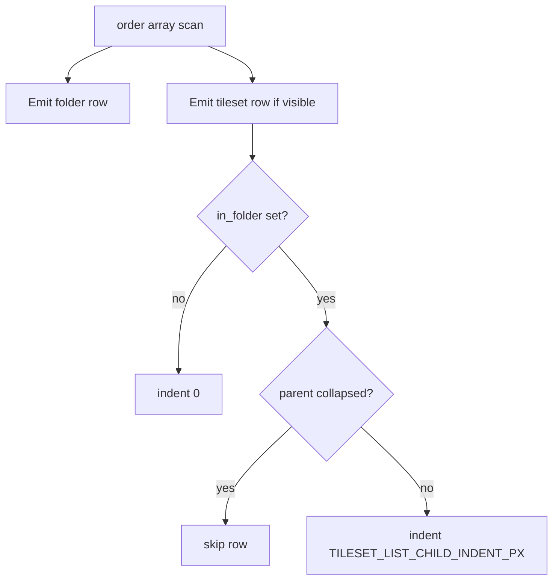

# Explicit folder membership for tileset list

## Current behavior (what already matches your sketch)

In [`tools/map_editor.py`](tools/map_editor.py), [`_build_tileset_list_rows`](tools/map_editor.py) walks the flat `order` array. It **hides** tilesets after a **collapsed** folder (`skip_tilesets`) and **indents** tilesets after an **expanded** folder using [`TILESET_LIST_CHILD_INDENT_PX`](tools/map_editor.py) (see ~1135–1199). The **draw** path already uses `indent_px` on tileset rows.

**Limitation:** folder membership is **implicit**: any tileset between folder A and the next folder row is treated as a child of A while A is open. So you cannot show a **root** tileset between two folders without it inheriting the open folder’s indent—exactly the case you flagged with “anywhere.”

## Target behavior

- **Open folder:** show folder row; show tilesets with `in_folder == that id` (in global `order` sequence), **indented**; root tilesets (`in_folder` absent) show **not indented** wherever they appear.
- **Closed folder:** hide only tilesets whose `in_folder` is that folder’s id; folder row still shown; root tilesets still shown.

## Schema change

On each `{"kind": "tileset", "id": "..."}` entry in `editorTilesetFolders.order`, add an optional field, e.g. **`in_folder`**: string folder id, **omitted** (or null) for root.

- [`validate_maps.py`](tools/validate_maps.py) already ignores editor metadata; unknown keys on order entries remain fine as long as writers preserve them (same as today).

## One-time migration

In [`_ensure_editor_tileset_order`](tools/map_editor.py) (or a small helper it calls): if **no** tileset entry in `order` contains `in_folder`, run a **legacy inference** pass using the **current** state machine (folder → open/collapsed → following tilesets until next folder) and assign `in_folder` for those implied children. Then save or mark migrated so we do not re-run incorrectly.

After migration, existing projects like [`src/tilesets.json`](src/tilesets.json) keep the same **visible** structure but gain explicit membership.

## Code touchpoints (same file unless noted)

| Area | Change |
|------|--------|
| [`_build_tileset_list_rows`](tools/map_editor.py) | Replace `skip_tilesets` / `tileset_indent_px` with: for each tileset, resolve `in_folder`; skip if parent collapsed; set `indent_px` from membership. Still append **Unfiled** for defs not present in `order` (unchanged). |
| [`_move_tileset_into_folder_order`](tools/map_editor.py) | After inserting the tileset near the folder block (current “before next folder” index), set `in_folder` to that folder id. |
| [`_append_tileset_to_order_end`](tools/map_editor.py) | Ensure new/ moved entries **clear** `in_folder` (root / Unfiled drop). |
| [`_move_tileset_before_in_order`](tools/map_editor.py) | When inserting before target tileset, set moved tile’s `in_folder` to **target’s** `in_folder` (so reordering among siblings preserves group; dropping before a root makes root). |
| [`_apply_tileset_list_drop`](tools/map_editor.py) | If dropping on a **tileset** row, copy target’s `in_folder` as above; folder / section behavior unchanged except folder path sets `in_folder`. |
| [`_order_extract_folder_block`](tools/map_editor.py) | **Breaking change in meaning:** today it slices a **contiguous** segment. New behavior: collect the folder entry **plus** every order entry that is a tileset with `in_folder == folder_id` (anywhere in the list), **stable-sorted by original index**, remove them all, and pass that block to the same reinsert logic used by [`_apply_folder_block_drop`](tools/map_editor.py). |
| [`_row_in_dragged_folder_block`](tools/map_editor.py) | Identify rows belonging to a dragged folder using **row data**: folder row matches id; tileset row matches if its order entry has `in_folder == folder_id` (may require passing membership into row dicts from `_build_tileset_list_rows`). |
| [`_move_tileset_in_order`](tools/map_editor.py) (Alt+,/.) | Swap positions only; **keep** each entry’s `in_folder` (simplest, consistent with explicit membership). |
| New tileset / rename / remove | [`_folder_order_replace_tileset_id`](tools/map_editor.py) / [`_folder_order_remove_tileset_id`](tools/map_editor.py): preserve or drop `in_folder` with the entry; new imports that append tileset entries should omit `in_folder`. |

## Docs and tracker

- Add a **FEATURE** entry to [`docs/tracker.md`](docs/tracker.md) before implementation (per project rules).
- Optionally extend [`src/maps/README.md`](src/maps/README.md) (or the tileset list bullet you already have) with one sentence: order entries may include `in_folder` for editor grouping.

## Out of scope (unless you want them later)

- **Tree guide lines** (your `-----` sketch): purely visual; indent already conveys hierarchy. Can be a follow-up.
- **Auto-normalizing** order so all children of a folder are contiguous: not required for correctness once `in_folder` exists; folder-drag becomes “collect all members by id” as above.

## Risks / testing

- Manually test: two folders, mix root and child tilesets in `order`, expand/collapse, drag tileset onto folder vs Unfiled vs before another row, Alt+,/. move, folder block drag with children non-contiguous in the array.
- Regression: old `tilesets.json` without `in_folder` migrates once and looks the same as before.
