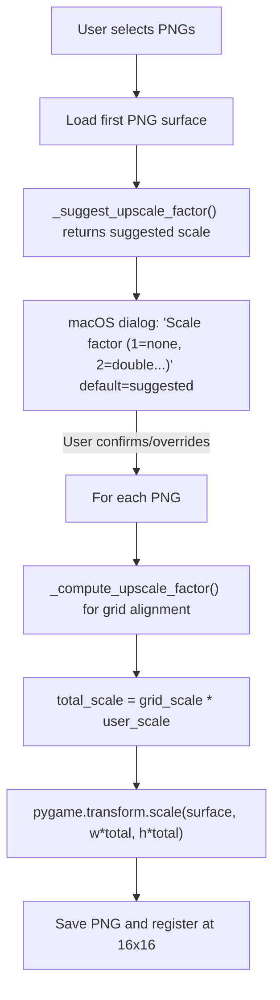

# Tileset Scale Normalization

## Problem

All tilesets are 256px wide with 16x16 tile grids, but different tilesets have different **art scales**. For example, a house in `Outside_2.png` spans ~10x8 tiles, while the same structure in `Sinnoh_Tile_Dump.png` is only ~5x5 tiles. The user needs to upscale smaller-scale tilesets (e.g., 2x nearest-neighbor) so all art matches the `Outside_2.png` standard.

The existing `_compute_upscale_factor` only triggers when image width is not divisible by 16, so it does NOT help here -- both sheets are 256px wide.

## Approach

Two new features in [tools/map_editor.py](tools/map_editor.py):

### 1. Scale prompt during import

Modify `import_tileset_dialog()` to show a **macOS dialog** (via `_macos_dialog_int`) asking the user for a scale factor **before** processing files. The dialog includes an auto-suggested default.

- **Auto-suggest heuristic** (`_suggest_upscale_factor(surface)`): Analyzes the image for uniform NxN pixel blocks. If 85%+ of 2x2 (or 3x3, 4x4) blocks have identical pixels, the art was likely upscaled from a lower resolution and the function suggests that factor. Otherwise defaults to 1. This catches pre-upscaled assets but not art-scale mismatches like Sinnoh, so the user can always override.
- One dialog per import batch (applies the same scale to all selected files).
- The scale is applied **after** the existing `_compute_upscale_factor` grid-alignment step, combining both factors.
- Uses `pygame.transform.scale()` (nearest-neighbor) to preserve pixel art crispness.

**Import flow:**



### 2. Rescale existing tileset command

New method `rescale_tileset_dialog()` triggered by a keyboard shortcut on the currently selected tileset.

- Shows a dialog prompting for scale factor (auto-suggest from the current PNG).
- Loads the tileset PNG, upscales it, saves it in-place (overwrites).
- Clears the sheet/meta caches so the editor reloads the new image.
- **Warns** via `set_status` that any maps already using this tileset will have misaligned tile references and may need repainting.
- Keybinding: `Ctrl+R` (or `R` when in the tileset panel, if not conflicting).

### 3. Auto-suggest function

New standalone function:

```python
def _suggest_upscale_factor(surf: pygame.Surface, max_scale: int = 4) -> int:
```

Samples a portion of the image (for performance) and checks if NxN pixel blocks are uniform. Returns the largest N where 85%+ of blocks match.

## Files changed

- **[tools/map_editor.py](tools/map_editor.py)**: Add `_suggest_upscale_factor()`, modify `import_tileset_dialog()` to prompt for scale, add `rescale_tileset_dialog()` method, add keybinding in the event loop.
- **[tools/map_editor_config.json](tools/map_editor_config.json)**: Add `rescale_tileset` key binding entry.
- **[docs/tracker.md](docs/tracker.md)**: Log FEATURE-MAP-022.
