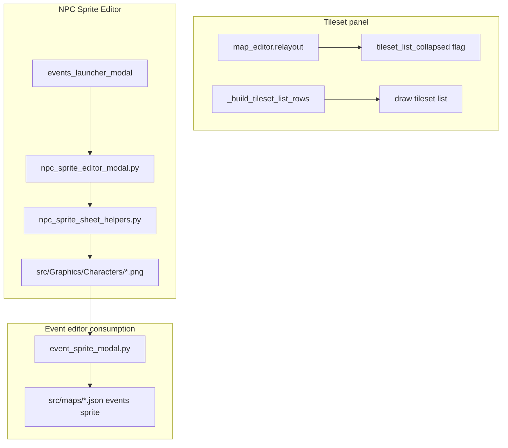

# Tileset Panel + NPC Sprite Editor Plan

## Confirmed requirements (from your answers)

| Topic | Decision |
|-------|----------|
| Tileset UI | Keep **left-column** layout; make the **whole tileset panel collapsible** (not a bottom dock). Nested tilesets stay **indented**; **Unfiled** section becomes collapsible like folders. |
| NPC pages | **4 direction pages** (Down, Left, Right, Up), each with **4 walk frames** (columns 0–3). |
| Right row | **Auto-mirror Left → Right** (editable afterward). |
| Sheet size | Default **128×192** (32×48 cells); **user-configurable** width/height (must divide evenly by 4). |
| Entry point | New button on **[Events launcher](tools/events_launcher_modal.py)** grid. |
| Export | Save PNG to **[src/Graphics/Characters/](src/Graphics/Characters/)** in the same 4×4 layout as [NPC 19.png](src/Graphics/Characters/NPC%2019.png) for [EventSpriteModal](tools/event_sprite_modal.py) / runtime. |
| Tileset layout (final) | **Collapsible left panel only** — no bottom dock. |
| Walk-frame helpers | **All optional:** copy idle (frame 1 → 3), duplicate previous frame, plus Left→Right mirror. |
| Right mirror UX | **"Lock Right to Left mirror" toggle** (default ON); OFF allows free Right edits without overwrite. |
| Launcher layout | **3rd button row:** NPC Sprites (+ reserved slot for future tool). |
| Custom sheet size | **Allowed** if divisible by 4; **warn** in UI when not 128×192 (recommended). |

**Note:** Bottom dock deferred — collapsible left panel is the final tileset layout per plan audit (2026-08-04).

---

## Architecture overview



---

## Part A — Collapsible tileset folder panel

### Current state ([tools/map_editor.py](tools/map_editor.py))

- `tileset_list_rect` is a **vertical strip** between palette and map (`relayout()` ~1942–1957).
- **Folder** collapse exists via `editorTilesetFolders.collapsed`; child tilesets use `TILESET_LIST_CHILD_INDENT_PX` (14px) and hide when parent collapsed.
- **Unfiled** `"section"` rows are **not** collapsible (no chevron/toggle).

### Implementation

1. **Tracker:** `FEATURE-MAP-099` — collapsible tileset panel + section collapse.

2. **Whole-panel collapse**
   - Add `tileset_list_collapsed: bool` (persist in `tools/map_editor_config.json` under e.g. `tilesetList.collapsed`).
   - When collapsed: render a narrow **strip** (~28px) with a `>` expand control and label `"Tilesets"`; set `tileset_list_rect.w` to strip width.
   - When expanded: current width `TILESET_LIST_W` (292px).
   - Update `relayout()` so `map_viewport_rect` **gains horizontal space** when collapsed (`map_x` no longer reserves full list width).
   - Toggle: click strip chevron or keyboard shortcut (e.g. bind in config, default unbound).

3. **Section collapse (Unfiled)**
   - Store `"section:unfiled"` in `editorTilesetFolders.collapsed` (reuse list, namespaced prefix).
   - `_build_tileset_list_rows()`: skip unfiled tilesets when section collapsed; add `collapsed` on section row.
   - `_tileset_list_hit` + draw: chevron + `_toggle_folder_collapse`-style handler for sections.
   - Include section collapse in `_tileset_list_cache_token`.

4. **Indent polish**
   - Keep existing `indent_px` for in-folder tilesets; optionally increase to **20px** if readability is still tight at bottom of long lists.
   - Ensure wrapped tileset names respect indent in `_tileset_id_lines`.

5. **Docs:** [docs/source_doc.md](docs/source_doc.md) (`relayout`, `_build_tileset_list_rows`, collapse flags), [docs/tools_doc.md](docs/tools_doc.md).

### Verification (Part A)

- Automated: `python3 -m unittest discover -s tests -q`; AST parse `map_editor.py`.
- Manual UI matrix:
  - Collapse/expand tileset panel → map canvas widens/narrows.
  - Folder chevron hides/shows children; Unfiled section chevron works.
  - Tileset inside folder is visually indented.
  - Drag/drop, rename, wheel scroll still work when expanded.
  - At ~800×600 and ~1280×800: no clip overlap with footer/status.

---

## Part B — NPC sprite editing engine

### Sheet contract (matches engine)

| Property | Default | Runtime/editor |
|----------|---------|----------------|
| Sheet | 128×192 px | Configurable `sheetWidth` × `sheetHeight` |
| Grid | 4×4 | `EVENT_CHARACTER_SHEET_COLS/ROWS` in [map_editor.py](tools/map_editor.py) |
| Cell | 32×48 px | `sheetW/4`, `sheetH/4` |
| Row 0 | Down | frames 0–3 |
| Row 1 | Left | frames 4–7 |
| Row 2 | Right | frames 8–11 (mirrored from Left on export/sync) |
| Row 3 | Up | frames 12–15 |

Frame index (event JSON): `frame = row * 4 + col` ([event_sprite_modal.py](tools/event_sprite_modal.py), [map_view.cpp](src/map_view.cpp)).

### New modules

**1. [tools/npc_sprite_sheet_helpers.py](tools/npc_sprite_sheet_helpers.py)** (pure helpers, unit-tested)

- `default_sheet_config()` → `{sheet_w: 128, sheet_h: 192, cols: 4, rows: 4}`
- `cell_size(config)`, validate divisibility by 4
- `split_sheet_surface(sheet) -> dict[str, list[pygame.Surface]]` — 4 directions × 4 frames
- `mirror_surface_horizontal(surf)` — for Right row
- `compose_sheet(pages, config) -> pygame.Surface` — stitch Down/Left/Right/Up rows into 4×4 PNG
- `load_sheet_path(path)`, `save_sheet_path(path, surf)` — PNG RGBA to `GRAPHICS_CHARACTERS_DIR`
- `direction_row_index(down|left|right|up)` → 0..3

**2. [tools/npc_sprite_editor_modal.py](tools/npc_sprite_editor_modal.py)** (UI modal, mirrors [wild_encounter_modal.py](tools/wild_encounter_modal.py) patterns)

**Layout (single resizable modal):**

```
┌─────────────────────────────────────────────────────────┐
│ NPC Sprite Editor                    [Save] [Export] [X]│
├──────────────┬──────────────────────────────────────────┤
│ Pages:       │  Reference (optional) │ Active frame edit │
│ Down Left    │  [scaled ref cell]    │ [zoomed pixel grid│
│ Right Up     │                       │  LMB paint        │
│              │                       │  RMB erase        │
├──────────────┴──────────────────────────────────────────┤
│ Colors: [palette] [eyedropper]  Sheet: 128×192 [Apply] │
│ Filename: [NPC_custom_01.png]  Frame: 1/2/3/4 within row│
└─────────────────────────────────────────────────────────┘
```

**Core behaviors:**

- **4 direction tabs**; within each tab, **4 frame slots** (1–4) matching walk columns.
- **Pixel canvas** per active frame: zoom (wheel), pan (middle-drag or shift-drag), paint/erase, optional grid overlay.
- **Color:** primary color + eyedropper from active or reference canvas; small fixed palette row.
- **Reference mode:** dropdown of PNGs from `GRAPHICS_CHARACTERS_DIR`; pick direction + frame (or full-sheet preview); show **scaled reference cell beside** active edit surface.
- **Auto-mirror Right:** when **"Lock Right to Left mirror"** is ON (default), Left row edits mirror into Right row surfaces on edit + export; when OFF, Right is independent until user clicks **"Re-sync from Left"**.
- **Walk-frame helpers (optional buttons per direction):**
  - **Copy idle → frame 3** (frame 1 → frame 3, common stand/walk pattern).
  - **Duplicate previous frame** (copy frame N to N+1 as starting point).
- **New / Open / Save:**
  - **New** — blank transparent cells at configured size.
  - **Open** — load existing PNG from Characters, split into pages.
  - **Save / Export** — `compose_sheet()` → write `src/Graphics/Characters/<filename>.png`; prompt if overwrite.
- **Settings panel:** sheet width/height spinboxes; reallocate blank cells on **Apply** (preserve top-left pixel data where possible). Show **warning banner** when size ≠ 128×192: "Recommended 128×192 for standard NPC proportions."
- **Undo/redo** per frame (small stack, e.g. 32 snapshots of active cell).

**3. Wire into [tools/map_editor.py](tools/map_editor.py)**

- Instantiate `NpcSpriteEditorModal(self)` in `__init__`.
- Add to `_any_blocking_modal_open()`, `draw()`, and `run()` input chains (same pattern as `wild_encounter_modal`).
- Help overlay `back_to` token: `"npc_sprite"`.

**4. [tools/events_launcher_modal.py](tools/events_launcher_modal.py)**

- Add **3rd button row** to launcher body: **"NPC Sprites"** (primary) + reserved empty/placeholder slot for a future tool.
- Button → `ed.npc_sprite_editor_modal.open_modal()`; increase `_LAUNCHER_MIN_H` if needed for third row.
- Keep existing Help full-width row unchanged.

### Tracker & docs

- `FEATURE-MAP-100` — NPC sprite editor modal + export pipeline.
- [docs/tools_doc.md](docs/tools_doc.md): new TOOL entries for modal + helpers.
- [docs/source_doc.md](docs/source_doc.md): sheet layout, mirror rule, export path (only if C++ notes needed — likely tools-only).

### Tests

- **[tests/test_npc_sprite_sheet_helpers.py](tests/test_npc_sprite_sheet_helpers.py)**
  - Default config matches 128×192 / 32×48.
  - `compose_sheet` after `split_sheet` roundtrips NPC 19.png dimensions (headless pygame / dummy SDL).
  - Mirror horizontal flips pixel columns.
  - Invalid sheet size (not divisible by 4) raises/returns error.
- **[tests/test_npc_sprite_editor_modal.py](tests/test_npc_sprite_editor_modal.py)** (lightweight)
  - AST/import smoke; mirror Left→Right updates Right row in page dict.

### Verification (Part B)

- Automated: full `unittest` suite + helper tests above.
- Manual UI matrix:
  - Open from Events launcher → modal blocks map input.
  - Paint pixels on Down frame 1; switch frames/directions; undo/redo.
  - Enable reference (NPC 19.png, Down frame 1); reference visible beside canvas.
  - Edit Left row → Right row mirrors; manual edit on Right still possible.
  - Save as new PNG → file appears in Characters folder.
  - Open Event Engine → Assign Sprite → new file listed; 4×4 grid preview correct.
  - Change sheet size to 128×128 → cells 32×32; export still loads in sprite modal.
  - Resize modal; small window 800×600 — panels not clipped.

---

## Implementation order

1. Log **FEATURE-MAP-099** and **FEATURE-MAP-100** in [docs/tracker.md](docs/tracker.md) (`OPEN` → `IN_PROGRESS` when starting).
2. Part A: collapsible panel + section collapse (smaller, unblocks map space immediately).
3. Part B helpers + tests (compose/split/mirror).
4. Part B modal UI + launcher wiring + map_editor routing.
5. Docs + tracker `DONE` + full test run.

---

## Risks and mitigations

| Risk | Mitigation |
|------|------------|
| [map_editor.py](tools/map_editor.py) already ~7.3k lines | Keep NPC editor in **separate modal file**; minimal hooks in map_editor |
| Configurable sheet size breaks event picker | Validate `% 4 == 0`; store `sheetColumns/Rows: 4` in exported PNG metadata path (event JSON unchanged) |
| Auto-mirror overwrites manual Right edits | **"Lock Right to Left mirror"** toggle (default ON); OFF freezes Right; **"Re-sync from Left"** button when unlocked |
| Non-128×192 sheets look wrong in-game | Allow export with **warning banner**; document recommended size in Help |
| Large pygame surfaces on resize | Reallocate on explicit Apply, not every keystroke |
| Filename collisions | Save dialog with overwrite confirm |

---

## Plan audit (2026-08-04)

### Strengths
- Matches engine contract: 4×4 grid, row-major frames, `GRAPHICS_CHARACTERS_DIR` export path used by [EventSpriteModal](tools/event_sprite_modal.py) and [map_view.cpp](src/map_view.cpp).
- Part A is incremental (collapse + section chevron); folder indent already exists in `_build_tileset_list_rows`.
- NPC editor isolated in new files — avoids bloating [map_editor.py](tools/map_editor.py) beyond modal wiring.
- Verification matrix covers automated tests + manual UI at 800×600.

### Gaps addressed by audit Q&A
- Tileset bottom dock → **rejected**; collapsible left only.
- Walk-frame automation → **all helpers** as optional buttons.
- Right mirror conflict → **lock toggle** (default ON).
- Launcher placement → **3rd row**.
- Custom aspect → **warn-only** for non-128×192.

### Remaining open items (minor — defaults unless you object)
- **Save vs Export:** plan lists both buttons; implement as single **Save** (writes PNG) + **Save As** for new filename.
- **Tracker IDs:** use `FEATURE-MAP-099` (tileset) and `FEATURE-MAP-100` (NPC editor) — IDs are free in [docs/tracker.md](docs/tracker.md).
- **11-modal input chains:** no router refactor in v1; add NPC modal to existing dispatch lists (same as wild/audio modals).
- **Alpha export:** PNG must preserve SRCALPHA transparency (required for character sheets).

## Out of scope (follow-ups)

- Moving tileset panel to **bottom dock** (explicitly declined in audit).
- In-editor animation preview (walk cycle playback).
- C++ runtime changes (existing 4×4 slicing already supports exported PNGs).
- Pokemon icon editor (character sheets only).
