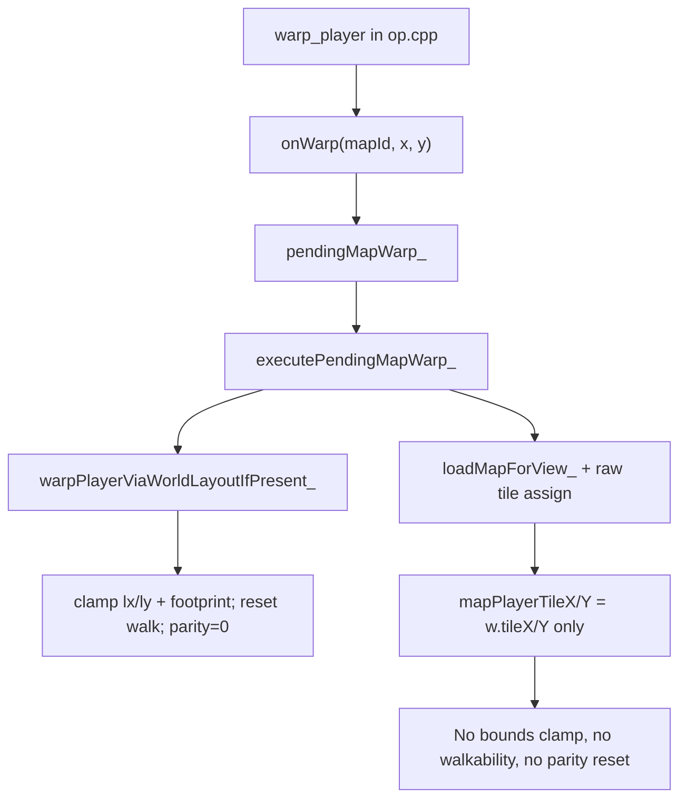
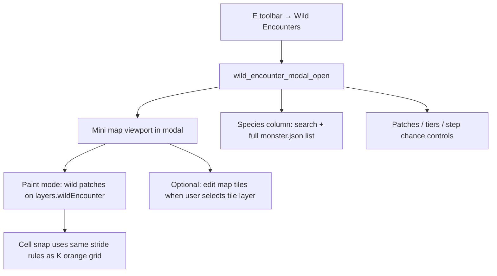
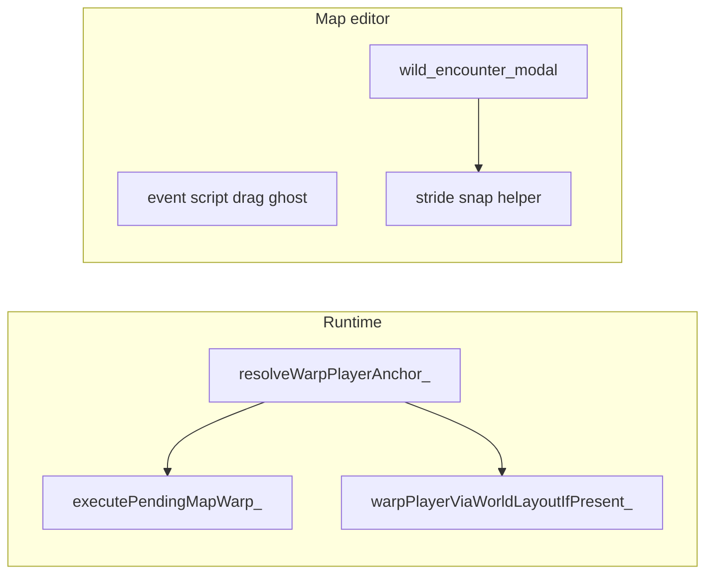

# Map editor fixes — warp, script drag, wild modal, QA

## Global QA rule (all plans)

Add to [`.cursor/skills/planning-rule/SKILL.md`](.cursor/skills/planning-rule/SKILL.md) a **UI and QA verification** section required in every plan:

- Every plan must include an explicit **verification** subsection with automated commands **and** a **UI test matrix** (window sizes, clipping, scroll, keyboard focus, modal resize).
- “Done” means no cut-off panels, popovers, or list rows at minimum **800×600** and typical editor sizes; clamp rects to parent like existing fixes (e.g. E toolbar popover, script modal grip).
- Run relevant `tests/` and validators before marking tracker **DONE**.

This plan follows that rule in **Verification (end)**.

---

## Tracker (log before implementation)

| ID | Type | Title |
|----|------|--------|
| **BUG-MAP-054** | BUG | Warp player lands off-anchor or misaligned after teleport |
| **IMPROVEMENT-MAP-055** | IMPROVEMENT | Event script editor shows full step ghost while dragging |
| **FEATURE-MAP-056** | FEATURE | Wild encounters dedicated modal with mini-map and species search |

---

## Feature 1: Warp / teleport tile correction

### Root cause (current behavior)

- **World warps** ([`src/map_view.cpp`](src/map_view.cpp) `warpPlayerViaWorldLayoutIfPresent_`, ~737–748): clamp, reset walk, `mapWalkStepParity_ = 0`.
- **Standalone map warps** (`executePendingMapWarp_`, ~770–774): raw assign — no clamp, no walkability fallback, no parity reset.

### Proposed fix (C++)

**`Game::resolveWarpPlayerAnchor_(int reqX, int reqY, int mapW, int mapH, int& outX, int& outY) const`**

1. Clamp to `[0, mapW - pw]` × `[0, mapH - ph]`.
2. If footprint blocked, Manhattan-ring search (same order as [`spawnPlayerOnLoadedMap_`](src/map_view.cpp) ~824–837).
3. Callers: `resetMapPlayerWalkState_()`, `mapWalkStepParity_ = 0`, camera sync.

Wire in [`executePendingMapWarp_`](src/map_view.cpp) and [`warpPlayerViaWorldLayoutIfPresent_`](src/map_view.cpp). Declare in [`include/game.h`](include/game.h).

### Docs

- [`docs/source_doc.md`](docs/source_doc.md): new helper + warp paths.
- [`tools/event_script_op_meta.json`](tools/event_script_op_meta.json): note runtime may snap to nearest walkable anchor.

---

## Feature 2: Opcode review + event editor drag preview

IMPROVEMENT-MAP-052: [`tools/audit_event_script_ops.py`](tools/audit_event_script_ops.py) + [`tests/test_event_script_opcode_parity.py`](tests/test_event_script_opcode_parity.py). Re-run during implementation; fix only on regression. Follow [event-script-opcode-docs skill](.cursor/skills/event-script-opcode-docs/SKILL.md) if meta/C++ changes.

### Drag UX ([`tools/map_editor.py`](tools/map_editor.py))

| Drag type | Today | Target |
|-----------|--------|--------|
| **Step reorder** (`_script_drag_row`) | Yellow border only; no drop line | Floating ghost with row `lines`; dim source; gold drop line |
| **Palette → list** | `Drop: {opcode}` tooltip | Ghost card: `N. {op} {args}` via `ess.new_step` + `_event_script_build_step_layouts` |

Add `_event_script_draw_drag_ghost(...)`. Light test for preview string format. Update [`docs/tools_doc.md`](docs/tools_doc.md).

---

## Feature 3: Wild encounters dedicated modal (FEATURE-MAP-056)

### Current behavior

- **E → Wild Encounters** sets `wild_encounter_mode_open` and paints on the **main** canvas with a **right-side** [`_draw_wild_patches_panel`](tools/map_editor.py) (~2797).
- Species picker is a **separate overlay** [`_draw_wild_species_pick_overlay`](tools/map_editor.py) (~2992) opened only when editing tier rows (FEATURE-MAP-053); search filters favorites-first list via [`wild_encounter_editor_helpers.py`](tools/wild_encounter_editor_helpers.py).
- Wild paint uses raw [`map_cell_at_pixel`](tools/map_editor.py) per tile (~8132–8147) — **not** aligned with **K** (`toggle_valid_player_stands_orange`), which draws stride-filtered 2×2 anchors in [`_draw_valid_player_stands_cell_grid_overlay`](tools/map_editor.py) (~1272–1292).

### Target UX

1. **Dedicated modal** (pattern: [`_draw_event_script_editor_modal`](tools/map_editor.py) ~3945): dim background, centered resizable panel, blocks main canvas input while open.
2. **Species column (always visible)**:
   - Search bar filtering **all** species keys from `src/monster.json` (reuse `wild_species_display_list`; favorites ★ persist in `wildEncounterEditor.favoriteSpecies`).
   - Selecting a species applies to the **selected tier row** (or default for new row); no second floating species-only overlay while modal is open.
3. **Mini map** inside modal:
   - Reuse tile blit loop (same data as main map) scaled to fit a fixed inner rect (`cell_px` computed from rect ÷ map size).
   - Pan/zoom optional only if needed for large maps; minimum: fit-to-rect + scroll offsets stored on modal state.
   - **Edit mode toggle**: **Patches** (paint `wild_encounter` grid + overlay colors) vs **Map** (paint active tile layer / walk / etc. — same brush rules as main editor, scoped to mini-map rect).
4. **Patch UI** migrated from `_draw_wild_patches_panel` into modal (patch list, New/Del/Merge, step %, tier tabs, tier rows).
5. **Closing**: Save/dirty behavior consistent with map undo (`_undo_checkpoint` on paint); Esc closes modal (after inner menus), does not lose unsaved map state without confirmation if dirty.

### K-grid snap (must match main editor K)

Extract shared helper, e.g. **`_player_stride_snap_cell(tx, ty) -> (tx, ty) | None`** using the same parameters as orange overlay:

- `pw`, `ph`, `draw_off_x` from `_refresh_overworld_view_player_config()`
- `stride_x = max(1, pw)`, `stride_y = max(1, ph)`, `phase_x = draw_off_x % stride_x`
- Accept cell only if `(tx + phase_x) % stride_x == 0` and `ty % stride_y == 0` (and in bounds).

Use for:

- Wild **patch paint** in modal (and optionally on main canvas wild mode for consistency).
- Optional: show orange stride boxes on mini-map when `show_valid_player_stands_orange` is on **or** always while modal paint mode is Patches (document which).

Do **not** invent a separate snap grid; document that snap equals K orange stride semantics.

### Refactor / state

- New flags: `wild_encounter_modal_open`, modal panel rect, mini-map rect, scroll, edit sub-mode (`patches` | `map`).
- Deprecate or gate old flow: opening modal replaces side panel + main-canvas wild paint; `_open_wild_encounters_mode` opens modal instead of only toggling `wild_encounter_mode_open`.
- Input routing: while modal open, mouse/wheel/keys go to modal first (species search, list scroll, mini-map paint).

### Docs / tests

- [`docs/tools_doc.md`](docs/tools_doc.md): wild modal layout, modes, search, K-aligned snap.
- [`tests/test_wild_species_picker.py`](tests/test_wild_species_picker.py): extend for modal-integrated search (no pygame display).
- New `tests/test_wild_stride_snap.py` (or section in existing test): stride snap parity with overlay math.
- `python3 tools/validate_map_events.py` after JSON/editor behavior touch.

---

## Verification (required — UI + bug testing)

### Automated (all features)

- `make` (C++ warp changes)
- `python3 tools/audit_event_script_ops.py`
- `python3 tools/extract_map_script_ops.py`
- `python3 tools/validate_map_events.py`
- `python3 -m unittest tests/test_event_script_opcode_parity.py tests/test_wild_species_picker.py` (+ new snap test if added)
- `PYTHONDONTWRITEBYTECODE=1 python3 -c "import ast; ast.parse(open('tools/map_editor.py').read())"`

### Manual UI matrix (no cut-off / clipping)

| Area | Cases |
|------|--------|
| **Wild modal** | Open from E menu; resize panel; 800×600 and max window; long species names; empty search; 100+ species scroll; tier tabs; mini-map on 40×30 map; patch paint + erase; toggle Patches vs Map edit |
| **Species search** | Type partial name; clear; ★ favorite; select applies to tier row; keyboard Up/Down/Enter/Esc |
| **K snap** | With K on main editor, stride cells match modal paint cells; paint on non-stride cell snaps to nearest valid stride anchor (define: nearest Manhattan among valid anchors) |
| **Script modal** | Drag step reorder ghost readable; palette ghost shows args; drop line visible; resize grip — footer not clipped |
| **Warp** | `warp_player` at map edge, blocked tile, normal door; sprite not between tiles after warp |

### Bug-focused checks

- Modal rects clamped inside `map_viewport_rect` / window (same pattern as script modal / E popover fixes).
- No input leaks to main map while modal open.
- Undo/redo restores `wild_encounter` and patches after modal edits.
- World workspace (`#`) still disables wild modal as today.

---

## Execution order

1. Update **planning-rule** skill with global UI/QA section.
2. Log tracker entries; implement **BUG-MAP-054** (C++).
3. **IMPROVEMENT-MAP-055** (script drag ghosts).
4. **FEATURE-MAP-056** (wild modal + snap helper + refactor input/draw).
5. Docs (`tools_doc`, `source_doc` as needed).
6. Run full **Verification** block; fix clipping/issues before **DONE**.

