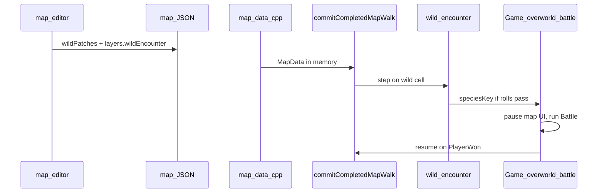

# Wild encounter patches (editor + JSON + runtime)

## Goals

- Paint **1×1 wild encounter tiles** in the map editor (distinct overlay color), opened from the **E (events) toolbar** as a separate mode alongside existing NPC events.
- Support **multiple named patches per map** that can be **grouped** (many tiles → one `patchId`) while keeping **separate tables** per patch.
- Persist data in map JSON for [`src/map_data.cpp`](src/map_data.cpp) / [`include/map_data.h`](include/map_data.h).
- On step in the overworld: **per-patch step chance** roll → tier roll (common 65% / uncommon 30% / rare 5%) → weighted species roll within tier → **wild battle** with overworld paused → on **foe faint (player win)**, return to the same map view (not title).

## JSON schema (map version stays **4**)

Add to each map file (alongside existing `layers` / `events`):

```json
"wildPatches": [
  {
    "id": "route_2_grass_a",
    "stepChancePercent": 10,
    "encounters": {
      "common": [
        { "species": "Bidoof", "weight": 25 },
        { "species": "Pikachu", "weight": 20 },
        { "species": "Buizel", "weight": 45 }
      ],
      "uncommon": [ { "species": "...", "weight": 100 } ],
      "rare": [ { "species": "...", "weight": 100 } ]
    }
  }
],
"layers": {
  "wildEncounter": [[0,0,1,...], ...]
}
```

- `layers.wildEncounter`: `width × height` grid of **non-negative integers**; `0` = no wild tile, `N` = index into `wildPatches` (**1-based** in file, or store string ids in a parallel sparse list—prefer **1-based index** into `wildPatches` array for compact grids).
- Each patch: `id` (stable string), `stepChancePercent` (0–100), `encounters.common|uncommon|rare` arrays of `{species, weight}` (`species` matches keys in [`src/monster.json`](src/monster.json) `Pokemon`).
- **No per-tile script files** for wild grass; runtime uses a fixed C++ path (see below). Optional later: `start_wild_battle` opcode in [`src/op.cpp`](src/op.cpp) — out of scope for MVP unless you want script parity.

Also add to [`src/overworld_view.json`](src/overworld_view.json):

```json
"playerSpeciesKey": "Squirtle"
```

(default documented; used as battle player when no party system exists).

## Encounter math (runtime)

Implement in a small helper (e.g. `src/wild_encounter.cpp` + `include/wild_encounter.h`):

1. If `random(1,100) > stepChancePercent` → no encounter.
2. Tier: weighted pick mapping to `common` / `uncommon` / `rare` with **65% / 30% / 5%** (same as user spec: roll 1–3 with those weights, or equivalent 1–100 partition).
3. Species: weighted pick within chosen tier (`weight` sums need not be 100; normalize by sum of weights).
4. Validate species exists in `pokedb`; on empty tier or invalid entry, skip encounter (log once to stderr).

Effective rate for documentation: `P(tier) * (weight_i / sum_weights_tier)`.

## Map editor ([`tools/map_editor.py`](tools/map_editor.py))

### E toolbar → mode picker

On **LMB** over [`events_btn_rect`](tools/map_editor.py) (currently only toggles NPC events at ~6856):

- Open a small popover: **NPC Events** | **Wild Encounters** (mutually exclusive with world `#` workspace).
- **NPC Events**: existing `events_workspace_open` behavior unchanged.
- **Wild Encounters**: new `wild_encounter_mode_open`; close NPC events workspace; do not require `event` tile layer.

### Wild encounter mode UX

- **Paint**: LMB drag paints active `patchId` index into `wild_encounter` grid; eraser (existing **E** toggle in paint modes or RMB) clears to `0`.
- **Overlay color**: distinct from walk (green/red), transparent (blue), over_player (orange), events (purple)—e.g. **teal/green** `(60, 210, 120, 90)` for unselected cells, brighter when selected patch.
- **Sidebar panel** (mirror [`_draw_events_list_panel`](tools/map_editor.py)):
  - Patch list (id, step %, tile count).
  - **New patch** / **Delete patch** / **Set active patch** (paint target).
  - **Encounter editor** for active patch: three tier tabs (common / uncommon / rare); add/remove rows; species picker from `monster.json` keys (reuse pokemon icon list patterns from events sprite picker where practical); weight spinboxes.
  - Optional **Merge patches** (reassign all cells from patch B → A, remove B) to support “grouping”.
- **LMB on painted tile**: select patch that owns that cell and focus editor (acts as “its own event”).
- **Undo/redo**: include `wild_encounter` grid + `wild_patches` in checkpoint state (same pattern as `map_events` in undo snapshot ~2193).

### Save/load

- Extend [`_write_map_json_to_disk`](tools/map_editor.py) / map load (~3960) to read/write `wildPatches` + `layers.wildEncounter`.
- Allocate `wild_encounter` grid on map resize (like `walk` / `over_player`).

## Validation ([`tools/validate_map_events.py`](tools/validate_map_events.py) or new `validate_map_wild.py`)

- Grid dimensions match `width`/`height`.
- Cell values in `[0, len(wildPatches)]`.
- Each patch has valid `stepChancePercent`, non-empty tier arrays with positive weights and known species keys.
- Warn on patches with zero tiles referenced.

## C++ data layer

- [`include/map_data.h`](include/map_data.h): `WildEncounterEntry`, `WildEncounterPatch`, add `wildEncounterLayer` (`vector<vector<int>>`) and `wildPatches` to `MapData`.
- [`src/map_data.cpp`](src/map_data.cpp): parse/validate on load; default empty if omitted.

## C++ runtime — trigger on step

Hook in [`Game::commitCompletedMapWalk_`](src/map_view.cpp) **after** player tile commit (and not during `mapScriptBlockingWalk_` / existing `mapScript_`):

- Resolve `MapData` + world coords: `ViewMap` → `viewMapData_`; `ViewWorld` → instance under player anchor (same pattern as [`tryStartNearbyMapScript_`](src/map_view.cpp)).
- Read `wildEncounter` at player anchor tile (or any footprint cell—**use anchor top-left tile** for MVP; document in NOTES).
- Lookup patch; run encounter rolls; if species chosen, call `Game::startOverworldWildBattle_(patch, speciesKey)`.

## C++ runtime — overworld battle (pause / resume)

New state on `Game` ([`include/game.h`](include/game.h)):

- `bool overworldBattleActive_` — blocks map WASD/scripts while battle runs.
- `MapUiMode mapUiModeBeforeBattle_` — preserve ViewMap/ViewWorld.
- Optional: `std::string lastWildPatchId_` for future “depleted tile” (not required for MVP).

[`Game::startOverworldWildBattle_`](src/game.cpp):

- `playerKey` from `overworld_view.json` `playerSpeciesKey`.
- `activeBattle_ = std::make_unique<Battle>(pokedb, playerKey, foeKey)`.
- `applyBattleView(*activeBattle_)`; set `overworldBattleActive_ = true`.

**Input routing** in [`Game::run`](src/game.cpp):

- When `overworldBattleActive_`: route Q/W/E/R to `executeTurn` (like title battle); **do not** call `handleMapUiKey_` for movement.
- Still call minimal ticks if needed (or freeze `tickMapPlayerWalk_` / `tickMapScript_` while battle active).

**Render** in [`Game::run`](src/game.cpp) draw branch:

- If `overworldBattleActive_` while `mapUiMode_` is ViewMap/ViewWorld: draw map/world frame **unchanged** (paused), then battle UI on top (reuse `drawBattleBackgroundIfActive`, health bars, move prompt—same as title battle path ~1004–1010).

**On battle end**:

- If `playerWon()` and `overworldBattleActive_`: clear battle, `overworldBattleActive_ = false`, clear battle sprites, **keep** `mapUiMode_` and player position (do **not** call `returnToTitle()`).
- If player lost: MVP = same resume or faint message + heal stub; align with existing battle outcome handling (document choice: resume map with 1 HP or return to title—recommend **stay on map** with battle cleared).

## Fixed “script” behavior

MVP: **no script JSON** for wild tiles; C++ directly starts battle after rolls. Document in [`docs/event_script_ops.md`](docs/event_script_ops.md) as future `start_wild_battle` hook. Tracker entry `FEATURE-MAP-050` (or next free ID).

## Documentation and tracker

- Log **FEATURE** in [`docs/tracker.md`](docs/tracker.md) before implementation.
- Update [`docs/source_doc.md`](docs/source_doc.md) (`map_data`, `map_view`, `game`, new wild encounter helper), [`docs/tools_doc.md`](docs/tools_doc.md) (`map_editor`, validator), nested indentation per Documentation-Rule.

## Architecture (data flow)



## Verification

- Editor: paint tiles, set patch table, save, reload map — grid and tables persist.
- `python3 tools/validate_map_events.py` (extended) passes on saved map.
- `make && ./build/app`: key **3** → map → walk on wild tiles → battle at configured rate → win → still on map, WASD works.
- NPC events (Q talk) still work on non-wild tiles.

## Out of scope (MVP)

- Per-tile step chance override (patch-level only).
- `start_wild_battle` script opcode and extractor pipeline.
- Repel items, shiny rolls, level ranges, double battles.
- World-layout cross-map patch sharing.
