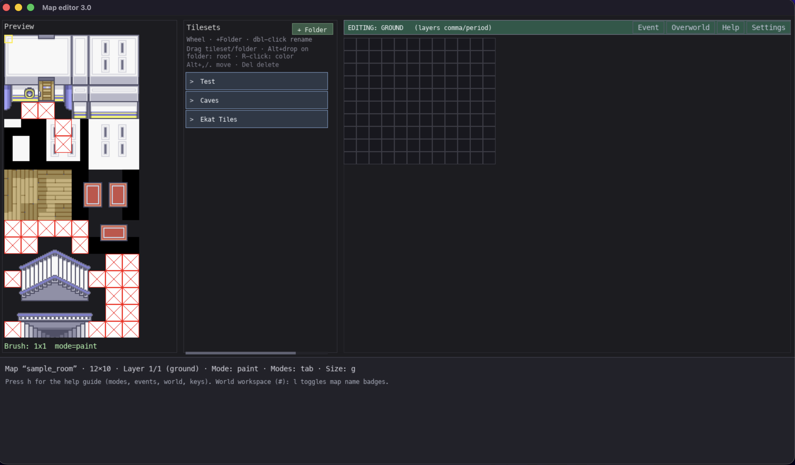
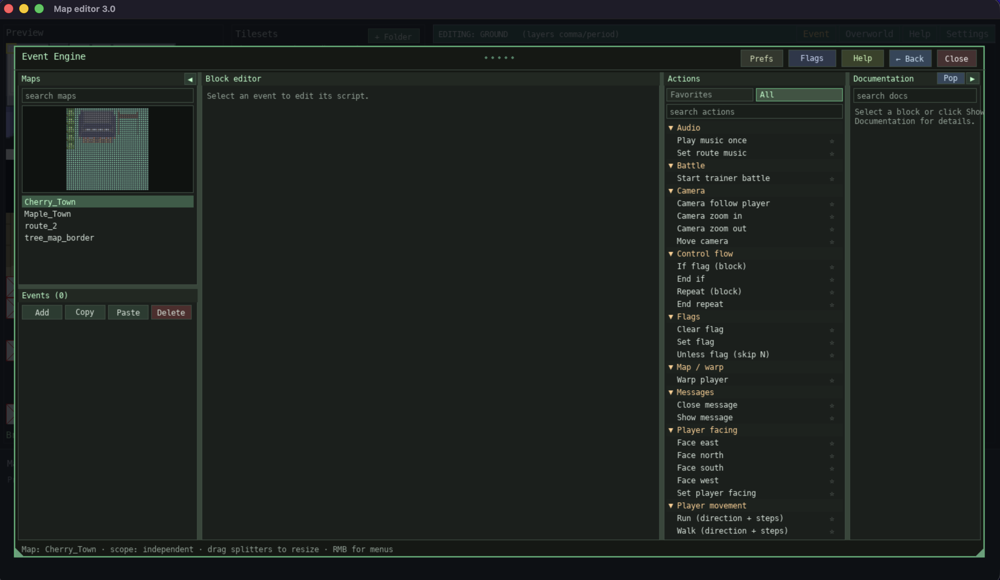
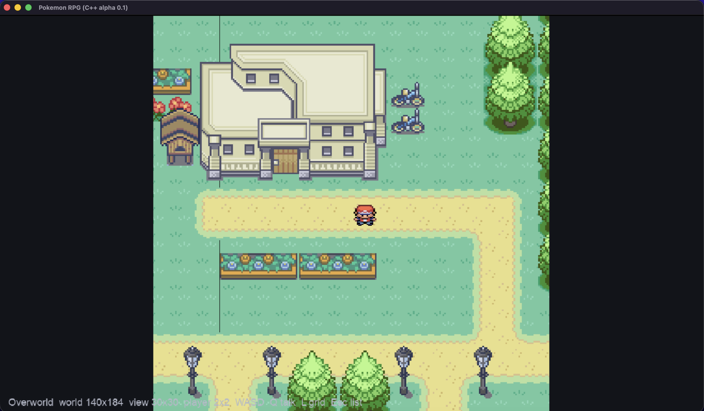
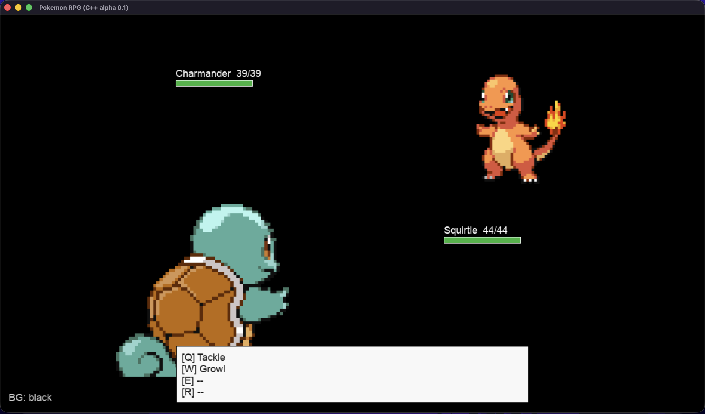

# vibecoded-pokemon-engine

A purely vibecoded pokemon creation engine.

The project has two parts:

- **The game** — a C++17 / SDL2 overworld + battle engine (`src/`, built with the `Makefile`).
- **The map & event editor** — a Python/pygame tool (`tools/map_editor.py`) for building maps, tilesets, NPC events, wild encounters, and script opcodes consumed by the game.

---

## Screenshots

### Map editor — tile painting



Paint tiles, layers, walkability, and connections in **Map editor 3.0** (`python3 tools/map_editor.py`).

### Map editor — world layout



Use the **#** world workspace to place maps, pan/zoom, and wire proximity connections between areas.

### Event Engine — script editing



Open **Event Engine** from the map editor toolbar to author NPC triggers, dialogue, and script opcodes.

### Game — overworld



Run the C++ game (`make run`) to play maps and events authored in the editors.

---

## System Requirements (macOS)

- **macOS** 12 (Monterey) or later, Intel or Apple Silicon.
- **Xcode Command Line Tools** (provides `clang`/`g++` and `make`).
- **Homebrew** (used to install SDL2 libraries).
- **C++17-capable compiler** (`g++`/`clang++`, installed via Command Line Tools).
- **Python 3.9+** with `pip` (for the map/event editor).
- **pygame 2.x** (installed via `pip`, see below).

---

## 1. Setting Up the Game (C++ / SDL2)

### 1.1 Install Xcode Command Line Tools

```bash
xcode-select --install
```

### 1.2 Install Homebrew (if not already installed)

```bash
/bin/bash -c "$(curl -fsSL https://raw.githubusercontent.com/Homebrew/install/HEAD/install.sh)"
```

### 1.3 Install SDL2 dependencies

```bash
brew install sdl2 sdl2_ttf sdl2_image sdl2_mixer
```

`sdl2_mixer` is optional — the Makefile auto-detects it and only links/enables audio (`USE_SDL2_MIXER`) if it is present.

### 1.4 Build the game

From the project root:

```bash
make
```

This compiles all `src/*.cpp` files into `build/app`.

### 1.5 Run the game

```bash
make run
```

or run the built binary directly:

```bash
./build/app
```

### 1.6 Run the C++ unit tests

```bash
make test
```

This builds and runs `test_script_runtime` and `test_game_state` (no SDL required).

### 1.7 Clean build artifacts

```bash
make clean
```

---

## 2. Setting Up the Map & Event Editor (Python / pygame)

The editor lives in `tools/map_editor.py` and edits the map/tileset/event JSON files the game reads from `src/maps/`.

### 2.1 Install Python 3

macOS ships with Python 3, but a Homebrew install is recommended so `pip` is available and up to date:

```bash
brew install python3
```

### 2.2 (Recommended) Create a virtual environment

```bash
python3 -m venv .venv
source .venv/bin/activate
```

### 2.3 Install pygame

```bash
pip3 install pygame
```

### 2.4 Run the map/event editor

```bash
python3 tools/map_editor.py
```

### 2.5 Other useful tools

```bash
# Validate map/event data for consistency errors
python3 docs/cursor_helper_scripts/validate_maps.py
python3 docs/cursor_helper_scripts/validate_map_events.py

# Regenerate the script opcode list used by the editor (after changing src/op.cpp)
make regen-event-ops
```

---

## Project Structure Reference

- `src/`, `include/` — C++ game engine source.
- `Makefile` — build/run/test/clean targets for the game.
- `tools/` — Python/pygame map & event editor and supporting modules (run `python3 tools/map_editor.py`).
- `docs/cursor_helper_scripts/` — validators, opcode extract/audit, migrations, and Cursor workflow scripts.
- `src/maps/` — map, tileset, and event script JSON data consumed by the game and edited by the tools.
- `docs/` — source/tool documentation (`source_doc.md`, `tools_doc.md`), issue tracker (`tracker.md`), and script opcode reference (`event_script_ops.md`).
- `tests/` — C++ and Python unit tests.
